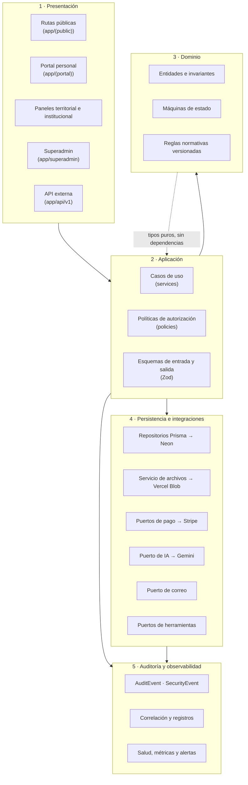
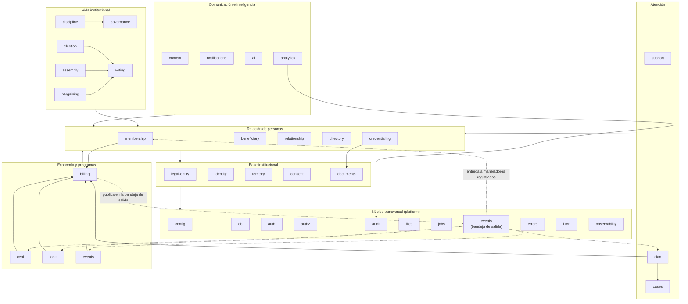
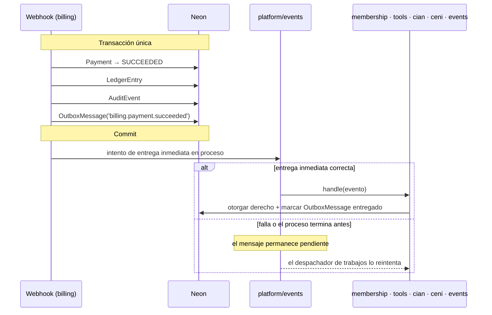
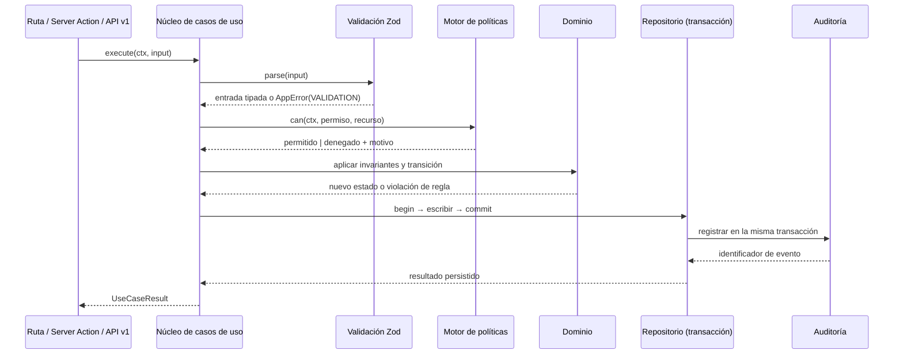
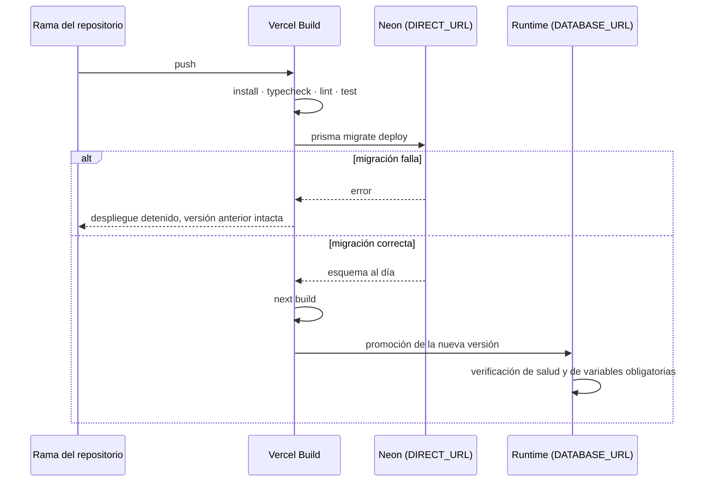
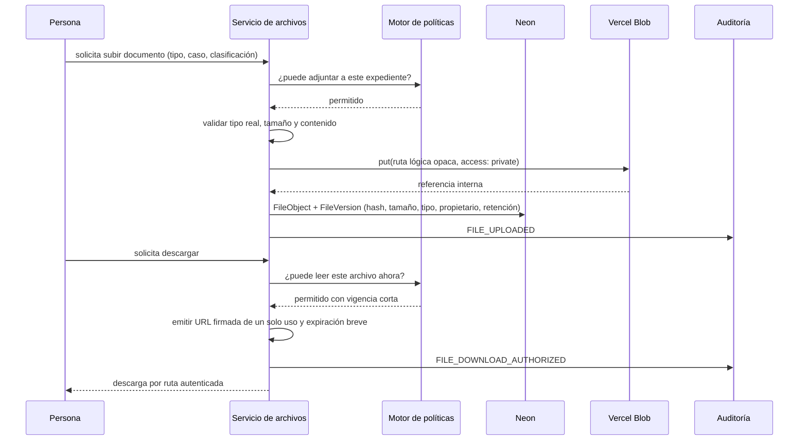
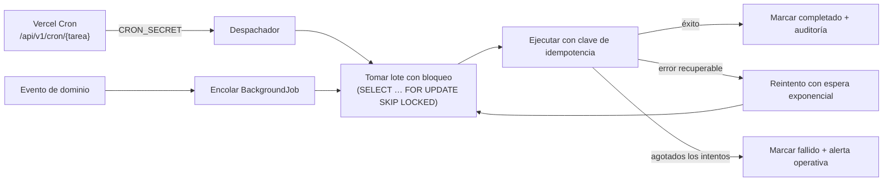

# Arquitectura de la Plataforma Integral Fuerza Índigo

> Entregable de la **Fase 0** (PRD §24). Contrata las capas, el mapa de módulos, la arquitectura de rutas, la estrategia de archivos, la estrategia de auditoría, el plan de migraciones y los trabajos asíncronos que rigen todas las fases posteriores.
>
> Documentos relacionados: [`DATA_MODEL.md`](DATA_MODEL.md), [`PERMISSIONS.md`](PERMISSIONS.md), [`FLOWS.md`](FLOWS.md), [`INTEGRATIONS.md`](INTEGRATIONS.md), [`SECURITY.md`](SECURITY.md), [`TEST_PLAN.md`](TEST_PLAN.md), [`DECISIONS.md`](DECISIONS.md).

---

## 1. Propósito

La plataforma es un **monolito modular desplegado en Vercel**: una sola aplicación Next.js, una sola base de datos Neon PostgreSQL y un conjunto de módulos de dominio con fronteras explícitas. Esta forma se elige porque el ecosistema exige transacciones consistentes entre membresía, pago, credencial, expediente y auditoría, y porque la separación institucional entre Fuerza Índigo y Alianza Índigo es **de datos y permisos**, no de infraestructura (PRD §2.3, ADR-0006).

La arquitectura resuelve, antes de escribir módulos, cinco preguntas que de otro modo obligarían a rediseñar más tarde (PRD §24 Fase 0):

1. **Identidad:** una persona, muchas relaciones, sin duplicidad.
2. **Autorización:** permiso efectivo por rol, entidad, territorio, expediente, relación, consentimiento y vigencia.
3. **Dinero:** entidad jurídica receptora presente desde el primer registro.
4. **Archivos:** privados por omisión, con retención y bloqueo legal.
5. **Evidencia:** auditoría anexable e inmutable desde la interfaz.

---

## 2. Principios rectores

| Principio | Consecuencia concreta |
|---|---|
| Servidor primero | React Server Components por omisión; los componentes cliente existen solo donde hay interacción real (PRD §17.1). |
| Ninguna ruta toca infraestructura | Páginas, Server Actions y Route Handlers invocan **servicios de aplicación**; nunca Prisma, Blob, Stripe o Gemini directamente (PRD §17.2). |
| Autorización en el servidor, siempre | Cada lectura, mutación, descarga y generación evalúa la política. Ocultar un botón no es seguridad (PRD §20.2). |
| Validación en la frontera | Toda entrada se valida con esquemas Zod compartidos; la salida se filtra por permisos de campo (PRD §19.1). |
| Estados explícitos | Enumeraciones y transiciones nombradas; nada de texto libre para estado (PRD §18.11). |
| Evidencia antes que conveniencia | Los actos con efecto jurídico dejan actor, motivo, fecha, objeto y correlación (PRD §20.4). |
| Versionar lo normativo | Estatutos, consentimientos, prompts, evaluaciones, plantillas y precios tienen versión con vigencia (PRD §18.11). |
| Degradación digna | La caída de Stripe, Gemini, correo o una herramienta externa no impide operar el núcleo (PRD §15.5, §24 Fase 7). |
| Sin dependencias innecesarias | Cada paquete nuevo exige una entrada en `DECISIONS.md` (PRD §0.1). |

---

## 3. Vista de capas



**Regla de dirección de dependencias:** Presentación → Aplicación → Dominio. La capa de persistencia e integraciones se inyecta en la de aplicación mediante puertos; el dominio no importa nada de infraestructura. Un `eslint-plugin-boundaries` (o regla equivalente `no-restricted-imports`) hace fallar la compilación si una ruta importa `@prisma/client`, `@vercel/blob`, `stripe` o el SDK de Gemini (Fase 1, tarea `F1-ARQ-004`).

---

## 4. Mapa de módulos y dependencias

Cada módulo posee sus tablas, sus casos de uso y sus políticas. Un módulo solo puede depender de los que están **por debajo** en el grafo, y siempre a través de su interfaz pública (`src/modules/<m>/index.ts`).



Las flechas punteadas **no** son dependencias de código: `billing` no importa a `membership`, y `membership` no importa a `billing` para recibir el aviso. Ambos dependen de `platform/events`, que está por debajo de los dos. Ver §4.3.

### 4.1 Inventario de módulos

| Módulo | Responsabilidad | Entidades principales | Fase que lo introduce |
|---|---|---|---|
| `platform/config` | Validación y tipado de variables de entorno; arranque fallido comprensible. | — | 1 |
| `platform/db` | Cliente Prisma, transacciones, unidad de trabajo, concurrencia optimista. | — | 1 |
| `platform/auth` | Sesión, rotación, contexto de actor, Superadmin por entorno. | `User`, `Credential`, `Session`, `PasswordReset` | 1 |
| `platform/authz` | Motor de políticas por rol y atributos; filtrado de filas y campos. | `Role`, `Permission`, `RoleAssignment`, `TerritorialScope` | 1 |
| `platform/audit` | Bitácora anexable, encadenada y correlacionada. | `AuditEvent`, `SecurityEvent` | 1 |
| `platform/files` | Carga, descarga firmada, versiones, retención y bloqueo legal. | `FileObject`, `FileVersion`, `RetentionPolicy`, `LegalHold` | 1 |
| `platform/jobs` | Cola de trabajos idempotentes con bloqueo y reintentos. | `BackgroundJob` | 1 |
| `platform/events` | Bandeja de salida transaccional y registro de manejadores de eventos de dominio. | `OutboxMessage` | 1 |
| `platform/errors` | Errores con código estable, mensaje comprensible y correlación. | — | 1 |
| `platform/i18n` | Catálogos de mensajes, formatos y zonas horarias. | — | 2 |
| `platform/observability` | Correlación, salud, métricas y alertas. | — | 1 |
| `legal-entity` | Fuerza Índigo, Alianza Índigo y futuras entidades; separación jurídica. | `LegalEntity` | 1 |
| `identity` | Registro maestro de persona, contactos, domicilio, cuentas. | `Person`, `User`, `Organization`, `OrganizationUser` | 1 |
| `territory` | Jerarquía nacional, estatal, municipal, secciones y delegaciones. | `TerritorialUnit` | 1 |
| `consent` | Consentimientos granulares versionados y revocables. | `Consent`, `ConsentVersion` | 1 |
| `documents` | Plantillas, generación, firma y numeración documental. | `DocumentTemplate`, `GeneratedDocument`, `SignatureRecord` | 4 |
| `membership` | Tipos, solicitudes, revisión, membresías, vigencias y estados. | `MembershipType`, `MembershipApplication`, `Membership`, … | 4 |
| `beneficiary` | Beneficiarios protegidos, con o sin cuenta digital. | `ProtectedBeneficiary` | 4 |
| `relationship` | Relaciones familiares y de cuidado con alcance y vigencia. | `CareRelationship` | 4 |
| `directory` | Directorio interno y publicación pública opt-in. | `ProfessionalProfile`, `DirectoryPreference`, `DirectoryPublication` | 4 |
| `credentialing` | Credenciales, QR firmado y verificación pública. | `MemberCredential`, `CredentialVerification` | 4 |
| `governance` | Órganos, cargos, periodos, suplencias y poderes. | `UnionBody`, `OfficeDefinition`, `OfficeTerm`, `PowerGrant` | 5 |
| `assembly` | Convocatorias, orden del día, padrón congelado, quórum y actas. | `Assembly`, `AssemblyCall`, `AgendaItem`, `Attendance`, `Resolution` | 5 |
| `voting` | Procesos de votación, elegibilidad, boletas y acuses. | `VoteProcess`, `Ballot`, `VoteEligibility`, `VoteReceipt` | 5 |
| `election` | Comisión Electoral, planillas, jornada, escrutinio e incidencias. | `Election`, `CandidateSlate`, `ElectionIncident` | 5 |
| `bargaining` | Contratos colectivos, revisión, consultas y conflictos colectivos. | reutiliza `VoteProcess`, `GeneratedDocument` | 5 |
| `discipline` | Régimen disciplinario con audiencia, resolución y recurso. | `DisciplinaryCase`, `DisciplinaryEvidence`, `DisciplinaryDecision`, `Appeal` | 5 |
| `support` | Entrada única de ayuda y clasificación informativa. | `SupportRequest`, `EmergencyFlag` | 6 |
| `cases` | Expediente de caso, participantes, tareas, mensajes y derivaciones. | `Case`, `CaseParticipant`, `CaseAssignment`, `CaseEvent`, `CaseTask`, `CaseMessage`, `Referral` | 6 |
| `cian` | Admisión, agenda, episodios, planes y notas restringidas. | `CianIntake`, `CianAppointment`, `CianCarePlan`, … | 8 |
| `billing` | Catálogo, Stripe por entidad, pagos, becas, libro auxiliar y patrimonio. | `CatalogProduct`, `Payment`, `LedgerEntry`, `AssetRegister`, … | 3 |
| `ceni` | Organizaciones, programas, evaluaciones, certificados y distintivos. | `CeniProgram`, `AssessmentVersion`, `CeniCertificate`, … | 9 |
| `tools` | Catálogo, elegibilidad, derechos de acceso y lanzamiento firmado. | `ToolDefinition`, `ToolEntitlement`, `ToolLaunch`, … | 7 |
| `events` | Eventos, capacitación, registros, asistencia y constancias. | `Event`, `EventRegistration` | 11 |
| `knowledge` | Fuentes autorizadas, fragmentación e índice vectorial para la búsqueda semántica. | `KnowledgeSource`, `KnowledgeChunk` | 10 |
| `content` | CMS versionado, páginas públicas, SEO y redirecciones. | `ContentPage`, `ContentVersion` | 2 |
| `notifications` | Centro interno, correo, notificaciones web y plantillas. | `Notification`, `NotificationTemplate`, `DeliveryAttempt` | 1 (correo y plantillas) · 11 (centro, web y campañas) |
| `ai` | Servicio Gemini, prompts versionados, generaciones y revisión humana. | `AiPrompt`, `AiGeneration`, `AiReview`, `KnowledgeSource` | 10 |
| `analytics` | Indicadores agregados con umbrales de privacidad. | vistas derivadas | 11 |

### 4.2 Reglas de frontera

1. Un módulo **no importa** archivos internos de otro; solo su `index.ts`.
2. Un módulo **no escribe** en tablas de otro módulo; solicita la operación a su servicio.
3. La lectura entre módulos se hace por **proyecciones de solo lectura** declaradas en la interfaz pública, nunca por consultas Prisma cruzadas.
4. Las dependencias circulares están prohibidas; cuando dos módulos se necesitan, se introduce un evento de dominio o un módulo de coordinación superior.
5. `cases` y `cian` comparten personas, pero **no** comparten notas: la separación de expedientes es una regla de dominio, no una convención de interfaz (PRD §10.3, §13.3).

### 4.3 Cómo un cobro otorga un derecho sin romper el grafo

Un pago confirmado debe activar una membresía, un derecho de herramienta, un servicio CIAN o un programa CENI. Pero `billing` está **por debajo** de esos módulos en el grafo: si los invocara directamente, introduciría la dependencia circular que la regla 4 prohíbe. Este es el conflicto que la primera redacción dejó sin resolver (defecto `D-F0-006`).

La solución es una **bandeja de salida transaccional** en `platform/events`, del que dependen tanto quien publica como quien consume:



**Propiedades:**

1. **Atomicidad donde importa.** El pago, el asiento contable, la auditoría y la **intención** de otorgar el derecho se escriben en una sola transacción. No existe un estado en el que el pago conste y la orden de otorgamiento se haya perdido.
2. **Entrega inmediata como camino normal.** Tras confirmar la transacción, el mismo proceso intenta despachar en memoria. En operación normal el derecho se otorga en el mismo instante; la cola es la red de seguridad, no el camino habitual.
3. **Exactamente una vez en efecto.** La entrega es al menos una vez, pero cada manejador es idempotente por `(outboxMessageId, handler)`, de modo que reintentar no duplica membresías ni derechos.
4. **Sin dependencia circular.** `billing` publica un nombre de evento y una carga; no conoce a sus consumidores. `membership` registra un manejador; no conoce a `billing`. Ambos dependen de `platform/events`.
5. **Observable.** Un mensaje sin entregar tras agotar reintentos genera alerta y aparece en el panel de salud, junto a los webhooks sin conciliar.

**Qué se pierde.** La activación deja de ser síncrona en sentido estricto. Es un costo real y por eso la interfaz de retorno de Stripe ya muestra un estado de confirmación en curso (`FLOWS.md` F-05), que es lo correcto de todos modos: el PRD §11.4 prohíbe expresamente activar derechos desde la página de retorno del navegador.

**Alternativa descartada.** Un módulo coordinador por encima de `billing` y de los módulos de derechos, que hospedara el manejador del webhook y ejecutara todo en una transacción. Funciona, pero concentra en un solo lugar el conocimiento de todos los módulos de derechos: cada herramienta, programa o servicio nuevo obligaría a modificarlo, que es justo lo que la extensibilidad del PRD §24 Fase 7 pide evitar.

---

## 5. Estructura de directorios

```text
fuerza_indigo/
├── app/                                # Next.js App Router — solo presentación
│   ├── (public)/                       # Sitio institucional
│   ├── (auth)/                         # Inicio de sesión, activación, recuperación
│   ├── (portal)/mi/                    # Portal personal
│   ├── (territorial)/territorio/       # Panel de delegaciones y secciones
│   ├── (institucional)/institucional/  # Órganos de gobierno
│   ├── superadmin/                     # Ruta independiente de Superadmin
│   ├── verificar/                      # Verificador público de QR
│   └── api/v1/                         # Contratos externos versionados
├── src/
│   ├── modules/<modulo>/
│   │   ├── domain/                     # Entidades, invariantes, transiciones
│   │   ├── application/                # Casos de uso, políticas, esquemas
│   │   ├── infrastructure/             # Repositorios Prisma y adaptadores
│   │   ├── ui/                         # Componentes propios del módulo
│   │   └── index.ts                    # Interfaz pública del módulo
│   ├── platform/                       # Núcleo transversal (§4.1)
│   └── design-system/                  # Tokens, primitivas y patrones (Fase 2)
├── prisma/
│   ├── schema/                         # Esquema multiarchivo por dominio
│   ├── migrations/                     # Migraciones versionadas en el repositorio
│   └── seed/                           # Datos semilla idempotentes y no sensibles
├── tests/{unit,integration,e2e,a11y,fixtures}/
├── docs/                               # Documentación viva
├── scripts/                            # Utilidades de fase y operación
└── public/                             # Recursos estáticos y manifiesto PWA
```

---

## 6. Contratos de los servicios de aplicación

Todo caso de uso comparte una firma uniforme. Esta uniformidad es lo que permite centralizar permisos, validación, auditoría y errores.

```ts
type ActorContext = {
  actorId: string;                 // Siempre presente: referencia a Actor (§DATA_MODEL 4)
  actorKind: 'PERSON' | 'ROOT_SUPERADMIN' | 'SYSTEM';
  userId: string | null;           // Solo cuando actorKind === 'PERSON'
  jobType: string | null;          // Solo cuando actorKind === 'SYSTEM'
  sessionId: string | null;
  roles: RoleAssignmentSnapshot[]; // Solo nombramientos vigentes
  legalEntityScope: string[];
  territorialScope: TerritorialScopeSnapshot[];
  compartments: Set<Compartment>;  // Vacío para el Superadmin raíz
  reason: string | null;           // Exigido por los permisos que lo marcan
  correlationId: string;
  ip: string | null;
  userAgent: string | null;
  locale: string;
  timeZone: string;
};

type UseCaseResult<T> =
  | { ok: true; data: T; warnings?: DomainWarning[] }
  | { ok: false; error: AppError };

interface UseCase<Input, Output> {
  readonly name: string;                 // p. ej. 'membership.approveApplication'
  readonly permission: PermissionCode;   // Verificado antes de ejecutar
  readonly input: ZodType<Input>;        // Validación en servidor
  readonly idempotent: boolean;          // Mutaciones críticas: true
  execute(ctx: ActorContext, input: Input): Promise<UseCaseResult<Output>>;
}
```

Cada ejecución atraviesa la misma tubería:



**Auditoría transaccional:** el evento de auditoría se escribe **dentro de la misma transacción** que el cambio. Si la transacción falla, no queda evidencia de un acto que no ocurrió; si el acto ocurre, la evidencia existe siempre (ADR-0011).

### 6.1 Errores

```ts
type AppErrorCode =
  | 'VALIDATION' | 'UNAUTHENTICATED' | 'FORBIDDEN' | 'NOT_FOUND'
  | 'CONFLICT' | 'PRECONDITION_FAILED' | 'RULE_VIOLATION'
  | 'CONSENT_REQUIRED' | 'RATE_LIMITED' | 'DEPENDENCY_UNAVAILABLE'
  | 'INTERNAL';
```

Cada error lleva `code` estable, `message` en lenguaje claro para la persona, `details` por campo cuando aplica y `correlationId`. Los errores **nunca** revelan la existencia de registros ajenos: un expediente no autorizado responde `NOT_FOUND` en superficies públicas y `FORBIDDEN` con motivo auditado en superficies internas (PRD §20.5).

---

## 7. Arquitectura de rutas

### 7.1 Superficies de interfaz

| Grupo | Prefijo | Audiencia | Autenticación |
|---|---|---|---|
| Público | `/` | Cualquier persona | No |
| Autenticación | `/acceso`, `/activar`, `/recuperar` | Personas con cuenta | Parcial |
| Portal personal | `/mi/*` | Toda persona con cuenta | Sí |
| Panel territorial | `/territorio/[unidad]/*` | Delegaciones y secciones | Sí + alcance territorial |
| Panel institucional | `/institucional/*` | Órganos de gobierno | Sí + cargo vigente |
| Panel CIAN | `/cian/*` | Profesionales y coordinación CIAN | Sí + asignación |
| Panel CENI | `/ceni/*` | Organizaciones, evaluadores y coordinación | Sí + organización o asignación |
| Superadmin | `/superadmin/*` | Superadmin raíz | Sesión independiente |
| Verificación | `/verificar/*` | Público | No |

### 7.2 Rutas públicas (PRD §6.1)

```text
/                                   Inicio
/que-es-fuerza-indigo               Qué es Fuerza Índigo
/sindicato-y-derechos               Sindicato y derechos
/alianza-indigo                     Alianza Índigo y acción social
/afiliate/agremiado                 Afíliate como agremiado
/afiliate/honoraria                 Afiliación honoraria
/solicitar-apoyo                    Solicitar protección o apoyo
/directorio                         Directorio público opt-in
/delegaciones                       Delegaciones y presencia territorial
/herramientas                       Herramientas tecnológicas
/herramientas/[slug]                ADIA · NEXO · NeuroPlan
/cian                               Centro Integral de Atención Neurodivergente
/ceni                               Certificación de Entornos Neuroinclusivos
/ceni/organizaciones                Organizaciones con certificación vigente
/eventos                            Cursos, eventos y convocatorias públicas
/eventos/[slug]                     Detalle de evento
/transparencia                      Transparencia pública autorizada
/noticias                           Noticias y recursos
/noticias/[slug]                    Detalle de nota
/contacto                           Contacto
/verificar                          Verificador de credenciales y distintivos
/verificar/credencial/[codigo]      Verificación de credencial
/verificar/ceni/[codigo]            Verificación de distintivo CENI
/legales/privacidad                 Aviso de privacidad por entidad
/legales/terminos                   Términos
/legales/accesibilidad              Declaración de accesibilidad
/legales/derechos-datos             Canal de derechos de datos personales
```

### 7.3 Portal personal (PRD §6.2)

```text
/mi                                 Inicio personalizado por prioridades reales
/mi/perfil                          Identidad, contacto, domicilio y preferencias
/mi/relacion                        Mi relación con Fuerza Índigo
/mi/solicitudes                     Solicitudes y documentos
/mi/credenciales                    Credenciales vigentes e históricas
/mi/pagos                           Cuotas, membresías, comprobantes y portal Stripe
/mi/beneficios                      Beneficios activos y su origen
/mi/herramientas                    Herramientas y vigencia de acceso
/mi/apoyo                           Solicitudes de apoyo y casos propios
/mi/cian                            Citas, plan y documentos autorizados
/mi/ceni                            Actividad CENI cuando aplica
/mi/asambleas                       Convocatorias, asistencia y acuerdos
/mi/votaciones                      Votaciones abiertas para quien tiene derecho
/mi/eventos                         Registros, asistencia y constancias
/mi/notificaciones                  Centro de notificaciones
/mi/privacidad                      Consentimientos, revocación y derechos
/mi/directorio                      Preferencias de publicación e indexación
/mi/seguridad                       Contraseña, sesiones activas y cierre remoto
```

### 7.4 Paneles territorial, institucional, CIAN, CENI y Superadmin

```text
/territorio/[unidad]                Resumen, padrón, solicitudes, casos, actividades,
                                    documentos, indicadores, comunicaciones, reportes

/institucional/asamblea             Convocatorias, sesiones, quórum y actas
/institucional/comite               Comité Ejecutivo Nacional
/institucional/secretarias/[cartera] Facultades por secretaría
/institucional/vigilancia           Comisión de Vigilancia y Fiscalización
/institucional/electoral            Comisión Electoral y procesos
/institucional/territorio           Delegaciones y secciones
/institucional/padron               Padrón sindical y padrones separados
/institucional/obligaciones         Obligaciones y reportes ante autoridad
/institucional/actas                Actas, acuerdos y archivo histórico
/institucional/representacion       Representación y conflictos
/institucional/finanzas             Finanzas, libro auxiliar y rendición de cuentas
/institucional/disciplina           Régimen disciplinario

/cian/bandeja  /cian/agenda  /cian/expedientes  /cian/planes  /cian/calidad
/ceni/organizaciones  /ceni/evaluaciones  /ceni/certificaciones  /ceni/directorio

/superadmin/login                   Acceso raíz independiente (PRD §4.4)
/superadmin                         Estado general del sistema
/superadmin/entidades               Entidades jurídicas
/superadmin/personas                Personas, cuentas y roles
/superadmin/modulos                 Configuración de módulos
/superadmin/catalogo                Catálogo y Stripe
/superadmin/cian  /superadmin/ceni  Configuración de programas
/superadmin/herramientas            Herramientas e integraciones
/superadmin/ia                      Gemini, modelos, prompts y límites
/superadmin/contenido               Contenido público
/superadmin/plantillas              Plantillas de documentos y mensajes
/superadmin/trabajos                Trabajos programados y webhooks
/superadmin/archivos                Archivos y políticas de retención
/superadmin/auditoria               Auditoría y seguridad
/superadmin/salud                   Salud técnica, versiones y migraciones
```

### 7.5 API externa versionada (PRD §19.2)

Las operaciones internas usan Server Actions. La API pública existe para integraciones, verificación, webhooks y trabajos programados. Toda familia contratada por el PRD queda reservada aquí; se implementa cuando su fase la habilita, y ninguna se publica sin autorización, validación, documentación y pruebas.

| Familia | Propósito | Autenticación | Fase |
|---|---|---|---|
| `/api/v1/auth/` | Sesión, cierre, rotación y verificación de estado. | Cookie de sesión | 1 |
| `/api/v1/public/directory/` | Directorio público derivado de autorizaciones expresas. | Pública, con límite de tasa | 4 |
| `/api/v1/verify/credentials/` | Verificación de credencial por identificador opaco firmado. | Pública, con límite de tasa | 4 |
| `/api/v1/verify/ceni/` | Verificación de certificado y distintivo CENI. | Pública, con límite de tasa | 9 |
| `/api/v1/memberships/` | Consulta y operación de membresías para integraciones autorizadas. | Token de servicio | 4 |
| `/api/v1/support-requests/` | Alta de solicitudes de apoyo desde canales autorizados. | Token de servicio | 6 |
| `/api/v1/cases/` | Consulta de estado de caso por la persona titular. | Cookie de sesión | 6 |
| `/api/v1/payments/` | Estado de pagos y comprobantes. | Cookie de sesión o token | 3 |
| `/api/v1/tools/` | Emisión de enlaces firmados y validación de derechos. | Cookie de sesión + firma | 7 |
| `/api/v1/cian/` | Operaciones de agenda y expediente para personal asignado. | Cookie de sesión | 8 |
| `/api/v1/ceni/` | Operaciones de organización, evidencia y evaluación. | Cookie de sesión | 9 |
| `/api/v1/assemblies/` | Convocatorias, asistencia y acuerdos publicables. | Cookie de sesión | 5 |
| `/api/v1/elections/` | Padrón electoral, jornada y resultados publicables. | Cookie de sesión | 5 |
| `/api/v1/webhooks/stripe/` | Recepción por cuenta: `/api/v1/webhooks/stripe/{account}`. | Firma de Stripe | 3 |
| `/api/v1/integrations/` | Entrada y salida por proveedor: `/api/v1/integrations/{provider}/*`. | Firma del proveedor | 7 |
| `/api/v1/cron/` | Disparo de trabajos programados por Vercel Cron. | `CRON_SECRET` | 1 |

Convenciones: paginación por cursor, filtros y ordenamientos por lista explícita, mutaciones críticas idempotentes mediante cabecera `Idempotency-Key`, y correlación mediante `X-Request-Id` propagada a auditoría y registros (PRD §19.1).

---

## 8. Estrategia de datos y plan de migraciones

### 8.1 Conexiones

| Uso | Variable | Tipo de conexión |
|---|---|---|
| Ejecución serverless | `DATABASE_URL` | Conexión agrupada de Neon |
| Migraciones y semillas | `DIRECT_URL` | Conexión directa de Neon |

### 8.2 Reglas de migración (PRD §17.3)

1. Toda modificación de esquema produce una migración versionada dentro del repositorio.
2. Producción ejecuta `prisma migrate deploy` desde el proceso de despliegue; el despliegue se detiene si una migración falla.
3. Ningún despliegue depende de ejecutar SQL manual en el panel del proveedor.
4. `prisma db push` no se usa en producción.
5. Una migración **aplicada en un ambiente compartido** (vista previa o producción) no se edita nunca; se agrega una migración correctiva explícita. Mientras el esquema solo se ha aplicado a una base de desarrollo local, rehacer la migración inicial es parte normal del diseño: lo que la regla protege es el historial que otros ya ejecutaron, no el borrador de quien lo escribe.
6. Los scripts de datos son idempotentes, auditables y versionados.
7. Cada fase prueba **instalación sobre base vacía** y **actualización desde la fase anterior** (`F<n>-QA-MIG`).

### 8.3 Secuencia de despliegue



### 8.4 Cambios de esquema con datos vivos

Los cambios destructivos se ejecutan en el patrón **expandir → migrar → contraer**: primero se agrega la estructura nueva, después un trabajo idempotente traslada los datos, y solo cuando la nueva estructura está en uso se retira la anterior en una migración posterior. Ninguna migración borra columnas con datos históricos en el mismo despliegue que las deja de usar.

### 8.5 Convenciones de esquema

Definidas en detalle en [`DATA_MODEL.md`](DATA_MODEL.md) §3. En síntesis: identificadores internos UUIDv7, identificadores públicos opacos independientes, fechas en UTC, dinero en unidades menores con moneda explícita, enumeraciones para estados, borrado lógico donde hay obligación de conservar, versión de fila para concurrencia optimista y `actorId` en toda entidad crítica.

---

## 9. Estrategia de archivos (Vercel Blob)



**Reglas (PRD §17.4):**

- Los archivos son **privados por omisión**; no existe almacén público salvo recursos institucionales explícitamente marcados como públicos.
- La base guarda metadatos, propietario, entidad responsable, clasificación de sensibilidad, hash, tamaño, tipo, ruta lógica, versión y política de retención.
- El nombre original **nunca** es el identificador público; se conserva como metadato para mostrarlo.
- No se almacenan binarios en PostgreSQL.
- No se confía en una URL difícil de adivinar: cada descarga vuelve a evaluar la política.
- No se borra un archivo sin verificar retención, bloqueo legal y referencias vivas.
- Las exportaciones sensibles llevan marca de agua con actor, fecha y correlación cuando corresponde (PRD §10.3).

Clasificaciones: `PUBLIC`, `INTERNAL`, `RESTRICTED`, `SENSITIVE_PERSONAL`, `CLINICAL`, `LEGAL_PRIVILEGED`. La clasificación determina caducidad de la URL firmada, si admite vista previa en el navegador y si exige motivo para descargar.

---

## 10. Estrategia de auditoría

Dos bitácoras separadas por naturaleza y retención:

| Bitácora | Qué registra | Retención |
|---|---|---|
| `AuditEvent` | Actos institucionales y de negocio: admisiones, resoluciones, pagos, publicaciones, credenciales, decisiones CENI, consentimientos, exportaciones, acciones del Superadmin. | Larga, conforme a obligación documental |
| `SecurityEvent` | Autenticación, intentos fallidos, límites de tasa, cambios de rol, sesiones, accesos denegados, anomalías. | Media, con minimización de datos |

**Propiedades:**

1. **Anexable, no editable:** ninguna ruta de la interfaz permite actualizar o borrar eventos. El usuario de base de datos de la aplicación no tiene `UPDATE` ni `DELETE` sobre esas tablas (se concede en la migración de Fase 1).
2. **Encadenada:** cada evento guarda el hash del anterior dentro de su partición lógica, lo que hace evidente cualquier supresión posterior.
3. **Correlacionada:** todo evento comparte `correlationId` con la petición que lo originó.
4. **Minimizada:** se registran identificadores y códigos, nunca contraseñas, tokens, diagnósticos completos ni contenido documental (PRD §20.3).
5. **Con motivo:** las acciones críticas y las del Superadmin exigen `reason` capturado por la persona, no generado por el sistema.
6. **Consultable con permisos:** el visor de auditoría filtra por alcance del actor; un auditor ve su ámbito definido, no todo el sistema.

El catálogo cerrado de acciones auditables vive en `src/platform/audit/actions.ts` y se documenta en [`SECURITY.md`](SECURITY.md) §6.

---

## 11. Trabajos asíncronos y programación



Trabajos contratados por el PRD §17.5: recordatorios, renovaciones, conciliación de pagos, reintento de webhooks, expiración de credenciales, tareas de retención, generación diferida de documentos y verificación de integraciones. A ellos se suman: revocación automática de accesos por vencimiento de nombramiento (PRD §4.3), cierre de vigencias de derechos de herramientas, y recálculo de indicadores agregados.

Cada trabajo tiene bloqueo, contador de intentos, próxima ejecución, error, resultado y alerta al agotar reintentos. Un trabajo nunca produce efectos dobles: la clave de idempotencia es única por `(tipo, claveDeNegocio)`.

---

## 12. Observabilidad y salud

- **Correlación:** `X-Request-Id` entrante o generado; presente en respuesta, registros, auditoría y trabajos derivados.
- **Registros estructurados:** JSON con nivel, módulo, caso de uso, resultado, duración y correlación. Prohibido registrar contraseñas, tokens, diagnósticos, contenido de documentos o datos de menores (PRD §20.3).
- **Salud:** `/api/v1/cron/health` verifica base de datos, Blob, configuración de Stripe por cuenta, disponibilidad de Gemini y trabajos atascados; el panel `/superadmin/salud` muestra versión desplegada, migración aplicada y último resultado de cada verificación.
- **Alertas:** webhooks sin conciliar, trabajos fallidos, picos de acceso denegado, intentos de acceso a expedientes ajenos y errores de firma de webhook.

---

## 13. Internacionalización, tiempo y dinero

- Idioma inicial **es-MX**, con catálogos de mensajes por módulo y arquitectura preparada para más idiomas y para presencia en Latinoamérica (PRD §5.2, ADR-0015).
- Todas las marcas de tiempo se **almacenan en UTC** y se presentan en la zona horaria de la persona o del territorio de la unidad, resuelta en el servidor para que el contenido renderizado en servidor no dependa del reloj del navegador.
- El dinero se guarda como entero en unidades menores con moneda ISO explícita; no existe aritmética de punto flotante sobre importes (PRD §18.11).

---

## 14. Aplicación web progresiva

Manifiesto, iconos, metadatos y comportamiento móvil; caché de recursos públicos y de la carcasa de navegación. **Ningún expediente, documento, nota clínica ni respuesta de API con datos personales se guarda en cachés persistentes del navegador** (PRD §17.6). Las acciones que requieren conexión lo indican de forma explícita antes de intentarse, y el trabajador de servicio se limita a estrategias de red primero para todo lo autenticado.

---

## 15. Configuración de despliegue en Vercel

| Elemento | Definición |
|---|---|
| Región de ejecución | Cercana a la región de Neon para minimizar latencia; declarada en `vercel.json`. |
| Entornos | Desarrollo local, Vista previa por rama y Producción, con bases de datos separadas (PRD §20.3). |
| Comando de construcción | `prisma migrate deploy && next build`. |
| Runtime | Node.js para autenticación, Prisma, Stripe, Blob y Gemini. El middleware se limita a comprobaciones sin acceso a base de datos. |
| Cron | Declarado en `vercel.json`, autenticado con `CRON_SECRET`. |
| Cabeceras de seguridad | Definidas en [`SECURITY.md`](SECURITY.md) §7. |

---

## 16. Extensibilidad

1. **Nueva entidad jurídica:** alta en `LegalEntity` más su configuración de Stripe, sus avisos y sus responsables. Ningún módulo requiere cambio de código.
2. **Nueva herramienta tecnológica:** alta en `ToolDefinition` con su modalidad de integración; el núcleo de membresías no cambia (PRD §24 Fase 7).
3. **Nueva línea CENI:** alta de `CeniProgram` con su plantilla de evaluación versionada.
4. **Nueva secretaría o comisión:** alta de `OfficeDefinition` con su conjunto de permisos; el nombre del cargo no concede acceso por sí mismo (PRD §9.2).
5. **Nueva regla estatutaria:** nueva versión normativa con vigencia; las asambleas y elecciones anteriores conservan la versión con la que se celebraron (PRD §9.3).

---

## 17. Trazabilidad con el PRD

| Sección del PRD | Dónde queda resuelta |
|---|---|
| §17.1 Plataforma | §2, §5, §15 y `DECISIONS.md` ADR-0001 a ADR-0008 |
| §17.2 Capas | §3, §4, §6 |
| §17.3 Migraciones | §8 |
| §17.4 Archivos | §9 |
| §17.5 Trabajos asíncronos | §11 |
| §17.6 PWA | §14 |
| §19 API y contratos | §6, §7.5 |
| §20.4 Auditoría | §10 y `SECURITY.md` §6 |
| §2.3 Separación obligatoria | §4.1 (`legal-entity`), `DATA_MODEL.md` §4, `PERMISSIONS.md` §5 |
