# Modelo de datos — Plataforma Integral Fuerza Índigo

> Entregable de la **Fase 0** (PRD §24). Modela las **130 entidades contratadas** por el PRD §18.1 a §18.10, sus enumeraciones, sus máquinas de estado, sus índices y sus reglas de integridad. Ninguna entidad del PRD queda sin modelar.
>
> El modelo resultante tiene **163 tablas**: las 130 del PRD, 7 entidades de apoyo exigidas por el articulado o por la corrección de defectos (`Actor`, `NormativeRuleSet`, `BargainingFile`, `ComplianceObligation`, `SpentVoteCredential`, `KnowledgeChunk`, `OutboxMessage`) y 26 tablas de relación (§13.bis). Todas las ampliaciones y consolidaciones están justificadas en §14.
>
> El esquema Prisma que materializa este documento se escribe en la **Fase 1** (`prisma/schema/`), dominio por dominio, con la migración inicial versionada en el repositorio.

---

## 1. Alcance y lectura

| Familia del PRD | Entidades | Sección |
|---|---|---|
| §18.1 Identidad y acceso | 12 + `Actor` | [§4](#4-identidad-y-acceso-prd-181) |
| §18.2 Membresías y padrones | 13 | [§5](#5-membresías-y-padrones-prd-182) |
| §18.3 Gobierno y territorio | 22 | [§6](#6-gobierno-y-territorio-prd-183) |
| §18.4 Casos y atención social | 11 | [§7](#7-casos-y-atención-social-prd-184) |
| §18.5 Finanzas | 15 | [§8](#8-finanzas-prd-185) |
| §18.6 Archivos y documentos | 7 | [§9](#9-archivos-y-documentos-prd-186) |
| §18.7 Herramientas | 7 | [§10](#10-herramientas-prd-187) |
| §18.8 CIAN | 11 | [§11](#11-cian-prd-188) |
| §18.9 CENI | 14 | [§12](#12-ceni-prd-189) |
| §18.10 IA, contenido y operación | 18 | [§13](#13-ia-contenido-y-operación-prd-1810) |

Notación de cada campo: `nombre` *tipo* — definición. Se marcan `PK` clave primaria, `FK` clave foránea, `U` único, `U?` único parcial, `IX` indexado, `NULL` opcional.

---

## 2. Decisiones estructurales que gobiernan todo el esquema

1. **Una persona, un registro.** `Person` es el único registro maestro de un ser humano. Toda relación con el ecosistema —agremiado, honorario, beneficiario, profesional CIAN, representante CENI, delegado— es una fila adicional referida a esa persona, nunca una persona nueva (PRD §3.1).
2. **La entidad jurídica es una columna, no una convención.** `legalEntityId` está presente desde el primer día en membresías, pagos, casos, documentos, consentimientos, archivos y auditoría, aunque inicialmente se opere una sola cuenta de cobro (PRD §2.3, §11.2).
3. **El estado con efecto jurídico no se edita: se transiciona.** Cada cambio produce una fila de evento con actor, motivo y fecha; la fila actual solo refleja el resultado (PRD §3.6).
4. **Lo normativo se versiona.** Estatutos, consentimientos, prompts, plantillas de evaluación, precios y plantillas documentales conservan la versión con la que se ejecutó cada acto, de modo que una reforma posterior no altera retrospectivamente lo ya ocurrido (PRD §9.3, §9.4).
5. **El vínculo entre persona y boleta nunca se persiste.** La credencial de voto se firma y se entrega a la persona, pero no se almacena al emitirse; solo se registra su huella al consumirse, en una fila sin identidad ni tiempo. La elegibilidad y la emisión se prueban; la correspondencia entre persona y boleta no existe en ninguna tabla, ni siquiera para quien tenga acceso total a la base (PRD §9.5, ADR-0012).
6. **Lo clínico vive aparte.** Las notas CIAN no comparten tabla, ni permiso, ni ruta de descarga con los expedientes sindicales (PRD §10.3, §13.3).

---

## 3. Convenciones de esquema (PRD §18.11)

| Regla | Materialización |
|---|---|
| Identificadores opacos no secuenciales | `id` *uuid* v7 como clave primaria interna, salvo `Ballot` y `SpentVoteCredential`, que usan **UUIDv4** porque un identificador ordenable en el tiempo revelaría el momento del depósito (§6). Toda entidad expuesta públicamente añade `publicId` *string(22)* base32 aleatorio, sin relación con el `id`. Los folios legibles (`folio`, `memberNumber`, `certificateNumber`) son series controladas por entidad y año, y nunca son el identificador de una URL. |
| Fechas en UTC | `timestamptz` siempre; presentación en la zona de la persona o del territorio. Sufijo `At` para instantes, `On` o tipo `date` para fechas civiles sin hora. Excepción deliberada: `Ballot` y `SpentVoteCredential` **no tienen ninguna columna temporal**, ni siquiera `createdAt`. |
| Dinero en unidades menores | `amountMinor` *bigint* + `currency` *char(3)* ISO 4217. Prohibida la aritmética de punto flotante sobre importes. |
| Estados controlados | Enumeraciones PostgreSQL; jamás texto libre para estado. Los catálogos extensibles por operación (tipos de caso, carteras, líneas CENI) son tablas de catálogo con `code` único. |
| Borrado lógico donde hay obligación de conservar | `archivedAt`, `archivedById`, `archiveReason`. El borrado físico solo procede al vencer una `RetentionPolicy` sin `LegalHold` activo. |
| Versionado | Par entidad/versión (`AiPrompt`/`AiPromptVersion`, `ContentPage`/`ContentVersion`, `AssessmentTemplate`/`AssessmentVersion`, `Consent`/`ConsentVersion`, `FileObject`/`FileVersion`). |
| Integridad referencial obligatoria | Toda `FK` declarada con acción explícita: `RESTRICT` por omisión; `CASCADE` solo entre una entidad y sus hijos estrictamente dependientes. |
| Índices reales | Índice por cada filtro del directorio, del padrón, de la bandeja de casos, de la agenda CIAN y de la conciliación financiera (§15). |
| Unicidad parcial o lógica | Índices únicos parciales para impedir duplicidades vivas (p. ej. una sola membresía activa por persona y categoría). |
| Metadatos mínimos | `json` solo para instantáneas inmutables y respuestas de formularios versionados; nunca como sustituto de una relación. |
| Trazabilidad de fila | `createdAt`, `createdByActorId`, `updatedAt`, `updatedByActorId`, `rowVersion` *int* para concurrencia optimista en toda entidad crítica. La autoría referencia `Actor`, que cubre persona, Superadmin raíz, trabajo programado y migración. |

**Campos base.** Salvo indicación contraria, cada entidad incluye `id`, `createdAt`, `updatedAt`, `createdByActorId` FK→`Actor`, `updatedByActorId` FK→`Actor` y `rowVersion`. La autoría apunta a `Actor`, no a `User`, porque el Superadmin raíz y los trabajos programados ejecutan actos y no tienen cuenta de usuario (§4, defecto `D-F0-005`). Las entidades inmutables por diseño (`AuditEvent`, `SecurityEvent`, `Ballot`, `SpentVoteCredential`, `MembershipStatusEvent`, `CaseEvent`, `LedgerEntry`, `AssetMovement`, `ToolLaunch`, `CredentialVerification`, `DeliveryAttempt`, `StripeWebhookEvent`, `IntegrationEvent`, `AiGeneration`) omiten `updatedAt`, `updatedById` y `rowVersion` porque nunca se actualizan. `Ballot` y `SpentVoteCredential` omiten **además** `createdAt` y todo campo de autoría: conservarlos permitiría reconstruir el orden y el momento del depósito.

---

## 4. Identidad y acceso (PRD §18.1)

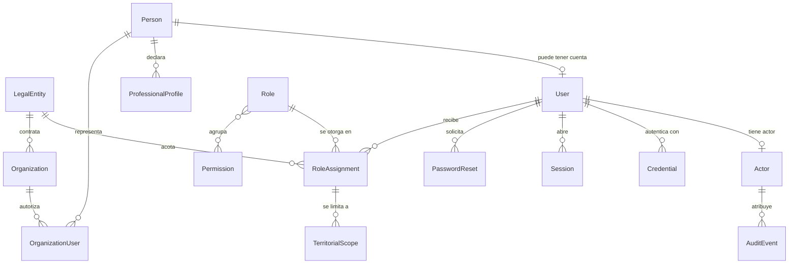

**`LegalEntity`** — Entidad jurídica responsable. Semilla: Fuerza Índigo (sindicato) y Alianza Índigo Neurodivergente A.C.
`id` PK · `code` *enum* U (`FUERZA_INDIGO`, `ALIANZA_INDIGO`) · `legalName` · `shortName` · `kind` *enum* (`UNION`, `CIVIL_ASSOCIATION`) · `taxId` NULL · `registryNumber` NULL — registro ante autoridad laboral · `address` · `contactEmail` · `privacyNoticeUrl` · `documentSeriesPrefix` U — prefijo de numeración documental · `isActive` *bool*.
Regla: ninguna consulta de negocio omite el filtro por `legalEntityId` cuando el recurso pertenece a una entidad.

**`Actor`** — Sujeto al que se atribuye un acto. Existe porque no todo acto lo ejecuta una cuenta de persona (defecto `D-F0-005`).
`id` PK · `kind` *enum* U? (`PERSON`, `ROOT_SUPERADMIN`, `SYSTEM_JOB`, `MIGRATION`) IX · `userId` NULL FK→`User` U? — presente solo cuando `kind = PERSON` · `label` — nombre legible: el de la persona, `Superadmin raíz`, el tipo de trabajo programado o la migración · `isActive` *bool*.

Reglas:

- Se crea **una** fila por cada `User` al activarse la cuenta, **una** fila permanente para el Superadmin raíz, y **una** por tipo de trabajo programado.
- La fila del Superadmin raíz **no es una credencial ni una fuente de permisos**: no guarda contraseña, no concede nada y borrarla no le quita el acceso ni crearla se lo da. Su autenticación y sus permisos siguen viniendo íntegramente de las variables de entorno y de la lista cerrada de concesión (PRD §4.4, `PERMISSIONS.md` §5.1). Es un asidero de atribución, no un sujeto de autorización.
- Es la referencia de `createdByActorId`, `updatedByActorId` y de todo campo de autoría del modelo.

Sin esta entidad, un acto ejecutado por el Superadmin raíz o por un trabajo programado dejaría `createdById` en nulo —perdiendo la atribución— o exigiría inventar cuentas de usuario ficticias, que es peor: una cuenta ficticia puede recibir permisos por error.

**`Person`** — Registro maestro del ser humano (PRD §3.1).
`id` PK · `publicId` U · `givenName` · `middleName` NULL · `familyName` · `secondFamilyName` NULL · `preferredName` NULL · `birthDate` NULL · `genderIdentity` *enum* (`WOMAN`, `MAN`, `NON_BINARY`, `OTHER`, `UNDISCLOSED`) — insumo de la proporcionalidad estatutaria (PRD §9.3) · `nationality` NULL · `nationalIdRef` NULL FK→`FileObject` · `primaryEmail` NULL IX · `primaryPhone` NULL · `alternateContact` NULL · `addressLine` NULL · `postalCode` NULL · `countryCode` · `stateCode` NULL · `municipalityCode` NULL · `territorialUnitId` NULL FK→`TerritorialUnit` IX · `timeZone` · `locale` · `accessibilityPreferences` *json* — preferencias sensoriales persistentes (PRD §5.3) · `matchKey` IX — nombre normalizado sin acentos y en minúsculas, **escrito por un disparador** y no por la aplicación, para que «Muñoz» y «Munoz» se encuentren (ADR-0070) · `isMinor` *bool derivado* · `deceasedAt` NULL · `mergedIntoPersonId` NULL FK→`Person` — resolución de duplicidad sin borrar historial · `archivedAt` NULL.
Índice único parcial: `(primaryEmail)` donde `mergedIntoPersonId IS NULL AND archivedAt IS NULL`.

**`User`** — Cuenta de acceso. Una persona puede no tener cuenta (beneficiario protegido sin medios digitales, PRD §3.4).
`id` PK · `personId` FK→`Person` U · `email` U IX · `emailVerifiedAt` NULL · `status` *enum* (`INVITED`, `ACTIVE`, `LOCKED`, `DISABLED`) · `lastLoginAt` NULL · `failedAttempts` *int* · `lockedUntil` NULL · `mustChangePassword` *bool* · `sessionVersion` *int* — su incremento revoca todas las sesiones.
El Superadmin raíz **no** tiene fila aquí: se define por variables de entorno (PRD §4.4).

**`Credential`** — Material de autenticación de una cuenta.
`id` PK · `userId` FK→`User` IX · `type` *enum* (`PASSWORD`, `RECOVERY_CODE`) · `secretHash` — Argon2id · `algorithmParams` *json* — memoria, iteraciones y paralelismo documentados · `usedAt` NULL · `expiresAt` NULL · `revokedAt` NULL.
Nunca se registra ni se devuelve el valor en claro.

**`Session`** — Sesión activa o histórica.
`id` PK · `userId` NULL FK→`User` IX · `actorKind` *enum* (`PERSON`, `ROOT_SUPERADMIN`) · `tokenHash` U — solo el hash · `issuedAt` · `lastSeenAt` · `expiresAt` IX · `revokedAt` NULL · `revokedReason` NULL *enum* (`LOGOUT`, `PASSWORD_CHANGE`, `ADMIN_ACTION`, `EXPIRY`, `SESSION_VERSION_BUMP`) · `ipHash` NULL · `userAgentSummary` NULL · `deviceLabel` NULL.
Sustenta el listado y la revocación de sesiones propias (PRD §20.1).

**`PasswordReset`** — Recuperación segura de acceso.
`id` PK · `userId` FK→`User` IX · `tokenHash` U · `requestedAt` · `expiresAt` · `consumedAt` NULL · `requestIpHash` NULL · `invalidatedAt` NULL.
La respuesta al solicitante es idéntica exista o no la cuenta, para impedir enumeración (PRD §20.5).

**`Role`** — Rol base del PRD §4.2.
`id` PK · `code` *enum* U · `name` · `description` · `scopeKind` *enum* (`GLOBAL`, `LEGAL_ENTITY`, `TERRITORIAL`, `ASSIGNMENT`, `ORGANIZATION`) · `requiresOfficeTerm` *bool* — el rol solo existe mientras haya nombramiento vigente · `isSystem` *bool*.

**`Permission`** — Permiso atómico verificable.
`id` PK · `code` U — `modulo.recurso.accion` · `module` IX · `resource` · `action` · `sensitivity` *enum* (`NORMAL`, `SENSITIVE`, `CRITICAL`) · `requiresReason` *bool* · `description`.
Tabla puente `RolePermission(roleId, permissionId, PK compuesta)`.

**`RoleAssignment`** — Otorgamiento de un rol a una cuenta, con alcance y vigencia (PRD §4.3).
`id` PK · `userId` FK→`User` IX · `roleId` FK→`Role` · `legalEntityId` NULL FK→`LegalEntity` IX · `organizationId` NULL FK→`Organization` · `officeTermId` NULL FK→`OfficeTerm` — vincula el acceso al nombramiento · `grantedById` FK→`User` · `grantReason` · `startsAt` · `endsAt` NULL IX · `revokedAt` NULL · `revokeReason` NULL.
Regla: el permiso efectivo se calcula solo con asignaciones donde `startsAt ≤ ahora < coalesce(endsAt, revokedAt, ∞)`. El vencimiento revoca el acceso sin borrar el historial.

**`TerritorialScope`** — Delimitación territorial de una asignación.
`id` PK · `roleAssignmentId` FK→`RoleAssignment` IX · `territorialUnitId` FK→`TerritorialUnit` IX · `includesDescendants` *bool*.
Una asignación sin filas de alcance es nacional solo si su `Role.scopeKind` lo permite.

**`Organization`** — Empresa, escuela, institución u organización civil (contraparte CENI o convenio).
`id` PK · `publicId` U · `legalName` · `tradeName` NULL · `taxId` NULL IX · `kind` *enum* (`COMPANY`, `SCHOOL`, `PUBLIC_INSTITUTION`, `CIVIL_SOCIETY`, `OTHER`) · `sector` NULL · `sizeBand` *enum* NULL · `countryCode` · `territorialUnitId` NULL FK · `website` NULL · `status` *enum* (`PROSPECT`, `ACTIVE`, `SUSPENDED`, `CLOSED`) · `legalEntityId` FK→`LegalEntity` — entidad que la atiende · `archivedAt` NULL.

**`OrganizationUser`** — Persona autorizada a actuar por una organización.
`id` PK · `organizationId` FK IX · `personId` FK→`Person` IX · `role` *enum* (`OWNER`, `ADMIN`, `CONTACT`, `EVIDENCE_UPLOADER`, `READ_ONLY`) · `jobTitle` NULL · `startsAt` · `endsAt` NULL · `revokedAt` NULL.
Único parcial `(organizationId, personId)` donde `revokedAt IS NULL`. Una organización nunca accede a otra (PRD §24 Fase 9).

---

## 5. Membresías y padrones (PRD §18.2)

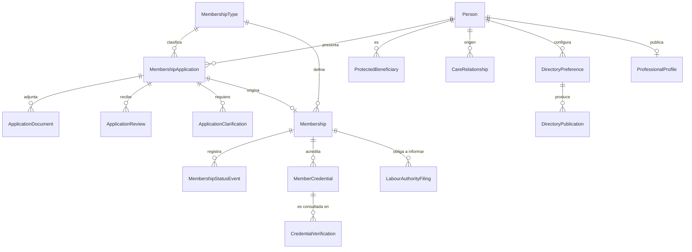

**`MembershipType`** — Catálogo de calidades y sus derechos.
`id` PK · `code` U · `name` · `category` *enum* (`UNION_MEMBER`, `HONORARY_AFFILIATE`) · `legalEntityId` FK · `grantsPoliticalRights` *bool* — verdadero solo para agremiados · `countsForQuorum` *bool* · `appearsInAuthorityRoster` *bool* — solo el padrón sindical remitido a autoridades · `requiresHumanReview` *bool* · `requiresPayment` *bool* · `durationMonths` NULL · `renewable` *bool* · `catalogProductId` NULL FK→`CatalogProduct` · `benefitsSummary` · `effectiveFrom` · `effectiveTo` NULL · `isActive`.
Invariante de dominio verificada en pruebas: `category = HONORARY_AFFILIATE ⇒ grantsPoliticalRights = false ∧ countsForQuorum = false ∧ appearsInAuthorityRoster = false` (PRD §3.3).

**`MembershipApplication`** — Solicitud de afiliación (agremiado u honoraria).
`id` PK · `folio` U — serie por entidad y año · `personId` FK→`Person` IX · `membershipTypeId` FK IX · `legalEntityId` FK · `status` *enum* `ApplicationStatus` IX · `submittedAt` NULL · `territorialUnitId` NULL FK IX · `occupation` NULL — especialidad, oficio o profesión · `workRelationKind` NULL *enum* (`SUBORDINATE`, `INDEPENDENT`, `AUTONOMOUS`, `SELF_EMPLOYED`) · `neurodivergentContactStatement` NULL *text* — cómo se relaciona su actividad con personas neurodivergentes (PRD §8.1.4) · `otherUnionMembership` NULL *enum* (`NONE`, `SAME_TRADE`, `DIFFERENT_TRADE`) · `otherUnionClarification` NULL *text* (PRD §8.1.5) · `honoraryProfile` NULL *enum* (`NEURODIVERGENT_PERSON`, `FAMILY_MEMBER`, `CAREGIVER`) · `acceptedStatuteVersionId` FK→`NormativeRuleSet` · `originalSummary` *json* — instantánea inmutable de lo enviado; la revisión nunca altera la solicitud original (PRD §8.1.9) · `autosavedDraft` *json* NULL — recuperación de borrador (PRD §5.3) · `clarificationDueAt` NULL · `resolutionAt` NULL · `resolutionReason` NULL · `resolvedById` NULL FK→`User` · `paymentId` NULL FK→`Payment` · `archivedAt` NULL.

**Campos condicionales por categoría (defecto `D-F0-004`).** Los cuatro campos laborales son anulables en el esquema y **obligatorios por dominio solo para la categoría que los necesita**. La restricción se expresa como comprobación en base y como invariante probada:

| Categoría de `MembershipType` | Campos obligatorios | Campos que deben ser nulos |
|---|---|---|
| `UNION_MEMBER` | `occupation`, `workRelationKind`, `neurodivergentContactStatement`, `otherUnionMembership` | `honoraryProfile` |
| `HONORARY_AFFILIATE` | `honoraryProfile` | `occupation`, `workRelationKind`, `otherUnionMembership` |

`neurodivergentContactStatement` es opcional para la afiliación honoraria: una persona neurodivergente, un familiar o una persona cuidadora no tiene que justificar un vínculo laboral con la neurodivergencia. Exigírselo, como hacía la primera redacción, convertía un trámite de pertenencia comunitaria en un interrogatorio laboral improcedente.

El formulario refleja la misma regla: quien elige afiliación honoraria **nunca ve** los campos laborales, no los ve deshabilitados ni marcados como opcionales.

**`ApplicationDocument`** — Evidencia adjunta a una solicitud.
`id` PK · `applicationId` FK IX · `fileObjectId` FK→`FileObject` · `documentKind` *enum* (`IDENTITY`, `WORK_PROOF`, `CERTIFICATE`, `REFERENCE`, `STATEMENT`, `CLARIFICATION`, `OTHER`) · `status` *enum* (`SUBMITTED`, `ACCEPTED`, `REJECTED`, `SUPERSEDED`) · `reviewNote` NULL · `reviewedById` NULL FK · `reviewedAt` NULL.

**`ApplicationReview`** — Actuación de revisión humana. Siempre hay al menos una antes de resolver (PRD §3.2).
`id` PK · `applicationId` FK IX · `reviewerId` FK→`User` · `reviewerOfficeTermId` NULL FK→`OfficeTerm` · `action` *enum* (`ASSIGNED`, `INFORMATION_REQUESTED`, `INTERVIEW_SCHEDULED`, `RECOMMENDED_APPROVAL`, `RECOMMENDED_REJECTION`, `APPROVED`, `REJECTED`) · `rationale` *text* — fundamento y motivo · `dueAt` NULL · `createdAt`.
Inmutable una vez creada.

**`ApplicationClarification`** — Aclaración requerida durante la revisión, con plazo (PRD §8.1.10; ADR-0081).
`id` PK · `applicationId` FK IX · `request` *text* — lo que se pide, en las palabras que la persona va a leer · `requestedById` FK→`User` · `requestedAt` · `dueAt` IX · `answer` NULL *text* · `answeredAt` NULL · `answeredById` NULL FK→`User` · `notifiedAt` NULL — cuándo se avisó; el aviso se encuentra por `Notification.relatedKind`/`relatedId` · `remindedAt` NULL — recordatorio de vencimiento, una sola vez · `closedAt` NULL · `closeReason` NULL.

Vive aparte de `ApplicationReview` porque es otra cosa: la actuación de revisión es un asiento de una cara e inmutable; la aclaración es un intercambio de dos, con respuesta escrita por la persona solicitante.

**El estado no se guarda: se deduce.** `PENDING`, `OVERDUE`, `ANSWERED` y `CLOSED` salen de `dueAt`, `answeredAt` y `closedAt`. Una columna de estado junto a las fechas que la determinan es una columna que puede mentir.

Garantías en base: `dueAt > requestedAt`; los tres campos de la respuesta van juntos o ninguno; cerrar sin respuesta exige motivo de quince caracteres; contestada y cerrada son excluyentes; único parcial de **una sola aclaración abierta por solicitud**; disparador que hace la respuesta, la petición y el plazo inmodificables; y privilegios por columna que solo dejan escribir lo que ocurre después de pedirla.

**Un plazo vencido no cambia el estado de la solicitud** (ADR-0080). Se hace visible y se recuerda una vez; seguir sin la aclaración exige que una persona la cierre explicando por qué.

**`Membership`** — Relación viva de la persona con la entidad.
`id` PK · `publicId` U · `memberNumber` U — serie por categoría; obligatorio, porque una membresía nace activa y antes de activarse lo que hay es una solicitud (ADR-0066) · `personId` FK IX · `membershipTypeId` FK · `legalEntityId` FK IX · `applicationId` NULL FK U? · `status` *enum* `MembershipStatus` IX · `startedAt` · `expiresAt` NULL IX · `territorialUnitId` NULL FK IX · `sectionId` NULL FK→`TerritorialUnit` · `politicalRightsSuspendedUntil` NULL — suspensión de derechos por proceso disciplinario o cuotas · `currentSubscriptionId` NULL FK→`Subscription` · `endedAt` NULL · `endReason` NULL *enum* (`VOLUNTARY_WITHDRAWAL`, `EXPULSION`, `INACTIVITY`, `DECEASED`, `ADMIN_CORRECTION`, `DUPLICATE`, `CONVERSION`, `EXPIRY`).

`CONVERSION` y `EXPIRY` se añaden en la Fase 4 (ADR-0083): el modelo exige que toda membresía terminada diga por qué —`("endedAt" IS NULL) = ("endReason" IS NULL)`—, y sin ellos una conversión tendría que anotarse como corrección administrativa y un vencimiento como inactividad. Las dos afirmarían una decisión que nadie tomó. `EXPIRY` lo escribe solo el trabajo de vencimiento y **no** se ofrece en el formulario de baja.
Único parcial: una sola membresía en estado activo por `(personId, membershipTypeId.category)`.

**`LabourAuthorityFiling`** — Expediente de cumplimiento ante la autoridad laboral (PRD §8.1.14, §9.7; ADR-0084).
`id` PK · `publicId` U · `legalEntityId` FK IX · `membershipId` FK IX · `personId` FK · `kind` *enum* (`ROSTER_ADDITION`, `ROSTER_REMOVAL`) · `status` *enum* (`PENDING`, `PREPARED`, `SUBMITTED`, `ACKNOWLEDGED`, `NOT_REQUIRED`) · `occurredAt` IX — cuándo ocurrió el hecho, no cuándo alguien se acordó · `preparedAt` NULL · `submittedAt` NULL · `acknowledgedAt` NULL · `authorityReference` NULL · `notes` NULL · `evidenceFileId` NULL FK.

Se abre **dentro de la transacción del alta o de la baja**, solo para calidades con `appearsInAuthorityRoster`. Único parcial `(membershipId, kind)`: un movimiento se informa una vez.

Garantías en base: cada estado exige su fecha; `NOT_REQUIRED` exige quince caracteres de explicación; `ACKNOWLEDGED` exige referencia de la autoridad; y privilegios por columna que impiden reescribir el hecho —qué membresía, de quién, qué movimiento y cuándo— o borrar la fila.

**`MembershipStatusEvent`** — Bitácora de transición de estado (PRD §3.6). Inmutable.
`id` PK · `membershipId` FK IX · `fromStatus` NULL · `toStatus` · `reason` *text* · `actorUserId` NULL FK→`User` · `actorId` FK→`Actor` — el sujeto de atribución, que ya lleva su propio `kind` (ADR-0026), de modo que no hace falta repetirlo aquí · `evidenceFileId` NULL FK→`FileObject` · `occurredAt` IX.
El enlace al documento de resolución llega con `GeneratedDocument`, en la fase que crea esa tabla: una clave foránea a algo que no existe no es una preparación, es una columna rota.

**`ProtectedBeneficiary`** — Calidad de beneficiario protegido, sin afiliación ni cuota (PRD §3.4).
`id` PK · `publicId` U · `personId` FK IX · `legalEntityId` FK — entidad responsable de la atención · `originKind` *enum* (`SELF`, `FAMILY_OR_CAREGIVER`, `UNION_MEMBER`, `DELEGATE`, `SOCIAL_STAFF`, `CIAN`, `EXTERNAL_REFERRAL`) · `registeredById` NULL FK→`User` · `initialNeed` *text* · `urgencyLevel` *enum* (`ROUTINE`, `PRIORITY`, `URGENT`) · `territorialUnitId` NULL FK IX · `responsiblePersonId` NULL FK→`Person` — representación de personas menores de edad o que la requieren · `hasDigitalAccount` *bool* · `status` *enum* (`REGISTERED`, `IN_ATTENTION`, `REFERRED`, `CLOSED`, `ARCHIVED`) · `privacyLevel` *enum* (`STANDARD`, `REINFORCED`) — por omisión reforzado para menores · `closedAt` NULL · `closeReason` NULL.
Reglas: no concede derechos electorales, no genera cuota automáticamente, no se incorpora al padrón remitido a autoridades y puede coexistir con otras calidades.

**`CareRelationship`** — Relación familiar o de cuidado, muchos a muchos (PRD §3.5).
`id` PK · `fromPersonId` FK→`Person` IX · `toPersonId` FK→`Person` IX · `kind` *enum* (`PARENT_OR_GUARDIAN`, `CHILD`, `SPOUSE_OR_PARTNER`, `RELATIVE`, `PRIMARY_CAREGIVER`, `SECONDARY_CAREGIVER`, `AUTHORIZED_REPRESENTATIVE`, `EMERGENCY_CONTACT`, `RESPONSIBLE_PROFESSIONAL`) · `scope` *json* — módulos y expedientes alcanzados · `consentId` NULL FK→`Consent` · `evidenceFileId` NULL FK→`FileObject` · `startsAt` · `endsAt` NULL · `revokedAt` NULL · `revokeReason` NULL.
Invariante: **una relación familiar no otorga por sí sola acceso a expedientes**; el acceso exige además consentimiento vigente y política que lo permita.

**`ProfessionalProfile`** — Perfil profesional de una persona para el directorio y para CIAN o CENI.
`id` PK · `personId` FK U · `headline` · relación `ProfessionalSpecialty` → `SpecialtyCatalog` · `credentialsSummary` NULL · `yearsOfExperience` NULL · `serviceModes` *enum[]* (`IN_PERSON`, `REMOTE`) · `availability` *enum* (`AVAILABLE`, `LIMITED`, `UNAVAILABLE`) · `professionalEmail` NULL · `professionalPhone` NULL · `verifiedSkills` *json* — habilidades y certificaciones verificadas por la plataforma · `verifiedById` NULL FK · `verifiedAt` NULL.

**`DirectoryPreference`** — Consentimiento granular de aparición pública (PRD §7.3).
`id` PK · `personId` FK U · `visibility` *enum* (`HIDDEN`, `NAME_AND_TERRITORY`, `PROFESSIONAL_PROFILE`) · `showPhoto` *bool* · `showProfessionalContact` *bool* · `allowSearchEngineIndexing` *bool* · `consentVersionId` FK→`ConsentVersion` · `grantedAt` · `revokedAt` NULL.
Por omisión `HIDDEN`. Beneficiarios protegidos no son publicables por omisión y las personas menores de edad exigen base y autorización específicas aprobadas institucionalmente.

**`DirectoryPublication`** — Instantánea publicada, derivada exclusivamente de una preferencia vigente.
`id` PK · `personId` FK IX · `slug` U · `publishedFields` *json* — únicamente los campos autorizados · `indexable` *bool* · `publishedAt` · `withdrawnAt` NULL IX · `sourcePreferenceId` FK→`DirectoryPreference`.
Al revocar el consentimiento se marca `withdrawnAt`, se invalida la caché y se emite la señal de no indexación; la fila permanece como evidencia de qué estuvo publicado y cuándo.

> **Directorio público (ADR-0086, ADR-0087).** `DirectoryPublication` se deriva de `DirectoryPreference` y nunca al revés: no hay forma de editar una ficha publicada. Los campos publicados son una instantánea, no una lectura en vivo del perfil. Al retirar la autorización, la preferencia se revoca, la ficha se marca `withdrawnAt` con `indexable` en falso —la fila permanece como evidencia— y el caso de uso devuelve las direcciones para que la capa web invalide su caché.

**`MemberCredential`** — Credencial digital e imprimible con QR (PRD §7.4).

**`status` no dice todo lo que la credencial vale.** Recoge solo lo que le pasa al documento en sí —`ACTIVE`, `REVOKED`, `REPLACED`—. Que esté `SUSPENDED` o `EXPIRED` **se deriva al leerla**, de su vigencia y del estado de la membresía que acredita, y nunca se escribe: un estado guardado por un trabajo abriría una ventana en la que el verificador público dice que vale algo que ya no vale (ADR-0092, control `C-F4-02`).

**`renderedFileId` se queda vacía a propósito.** El dibujo de la credencial se compone al descargarla y no se archiva: un archivo guardado conserva el diseño de hace dos años y una vigencia que ya pasó. Lo que hay que poder demostrar es el código —firmado e inmutable por privilegios de columna—, no la imagen (ADR-0091).
`id` PK · `publicCode` U — identificador opaco contenido en el QR, sin datos personales · `signingKeyId` IX — identificador de la clave con la que se firmó, para permitir rotación sin invalidación simultánea (defecto `D-F0-012`) · `signature` · `membershipId` NULL FK IX · `personId` FK IX · `credentialKind` *enum* (`UNION_MEMBER`, `HONORARY_AFFILIATE`, `OFFICE_OR_REPRESENTATION`, `AUTHORIZED_PROFESSIONAL`) · `officeTermId` NULL FK · `displayName` — nombre autorizado a mostrar · `photoFileId` NULL FK→`FileObject` · `territoryLabel` NULL · `status` *enum* (`ACTIVE`, `SUSPENDED`, `REVOKED`, `EXPIRED`, `REPLACED`) IX · `issuedAt` · `expiresAt` NULL IX · `revokedAt` NULL · `revokeReason` NULL · `replacedByCredentialId` NULL FK · `renderedFileId` NULL FK→`FileObject`.
La revocación surte efecto de inmediato en el verificador: la consulta lee siempre el estado vivo, nunca una caché con vigencia mayor a la revocación.

**Columnas que esperan a su tabla.** Tres referencias de este apartado apuntan a entidades de fases posteriores y **no** se crean todavía: `ApplicationReview.reviewerOfficeTermId` y `MemberCredential.officeTermId` esperan a `OfficeTerm` (Fase 5), y `CredentialVerification.ceniCertificateId` espera a `CeniCertificate` (Fase 9). Una clave foránea a una tabla que no existe no es una preparación: es una columna rota que además impide migrar. Se añaden en la fase que crea su destino, igual que `Subscription.membershipId` se declaró en la Fase 3 y se convirtió en clave foránea aquí.

**`CredentialVerification`** — Registro agregado de consultas al verificador. Inmutable.
`id` PK · `credentialId` NULL FK IX · `ceniCertificateId` NULL FK→`CeniCertificate` · `queriedCode` — código consultado, incluso si no existe · `result` *enum* (`VALID`, `SUSPENDED`, `EXPIRED`, `REVOKED`, `NOT_FOUND`) · `occurredAtHour` — truncado a la hora · `countryCodeHint` NULL · `userAgentClass` NULL *enum* (`MOBILE`, `DESKTOP`, `BOT`, `UNKNOWN`).
No se almacenan IP ni identificadores de quien escanea: la medición es agregada y no construye perfiles (PRD §7.4).

---

## 6. Gobierno y territorio (PRD §18.3)

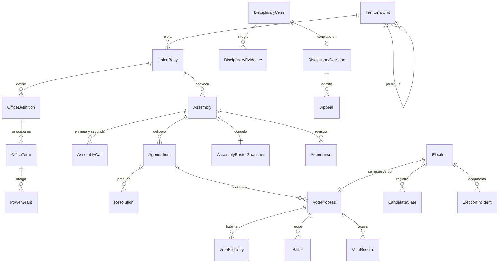

**`TerritorialUnit`** — Unidad territorial u organizativa (PRD §9.1).
`id` PK · `publicId` U · `code` U · `name` · `type` *enum* (`NATIONAL`, `FOREIGN_COUNTRY`, `STATE`, `MUNICIPALITY`, `SECTION`, `DELEGATION`, `OFFICE`, `VIRTUAL_THEMATIC`) IX · `parentId` NULL FK→`TerritorialUnit` IX · `path` *text* U IX — ruta materializada `/nacional/mx/jal/guadalajara/seccion-3`, con índice `text_pattern_ops` para el prefijo (decisión cerrada en ADR-0027) · `countryCode` · `stateCode` NULL · `municipalityCode` NULL · `status` *enum* (`PLANNED`, `ACTIVE`, `SUSPENDED`, `DISSOLVED`) · `createdOn` *date* · `enablingResolutionId` NULL FK→`Resolution` — acuerdo habilitante · `dissolvedOn` NULL · `contactEmail` NULL.

**`UnionBody`** — Órgano de gobierno (PRD §9.2).
`id` PK · `code` U · `name` · `kind` *enum* (`GENERAL_ASSEMBLY`, `NATIONAL_EXECUTIVE_COMMITTEE`, `OVERSIGHT_COMMISSION`, `ELECTORAL_COMMISSION`, `SECTION_DELEGATION`, `TEMPORARY_COMMISSION`) · `territorialUnitId` FK IX · `legalEntityId` FK · `normativeRuleSetId` FK→`NormativeRuleSet` · `status` *enum* (`ACTIVE`, `INACTIVE`, `DISSOLVED`) · `installedOn` NULL · `dissolvedOn` NULL.

**`OfficeDefinition`** — Cargo o cartera con sus facultades.
`id` PK · `code` U · `name` · `unionBodyId` FK IX · `kind` *enum* (`SECRETARY_GENERAL`, `SECRETARY_ORGANIZATION`, `SECRETARY_LABOR_DISPUTES`, `SECRETARY_FINANCE`, `SECRETARY_MINUTES`, `SECRETARY_NEUROINCLUSION`, `SECRETARY_GENDER_EQUITY`, `SECRETARY_PRESS`, `ADDITIONAL_SECRETARY`, `OVERSIGHT_MEMBER`, `ELECTORAL_MEMBER`, `SECTION_DELEGATE`, `COMMISSION_MEMBER`) · `termMonths` *int* — 48 para el Comité Ejecutivo Nacional · `reelectionAllowed` *bool* · `seats` *int* — 3 para Vigilancia y Electoral · relación `OfficeIncompatibility` — cargos incompatibles entre sí · `permissionSetId` FK — permisos que confiere el cargo, nunca acceso ilimitado (PRD §9.2) · `normativeRuleSetId` FK.

**`OfficeTerm`** — Ocupación histórica de un cargo por una persona.
`id` PK · `officeDefinitionId` FK IX · `personId` FK→`Person` IX · `membershipId` FK→`Membership` — solo agremiados en pleno goce de derechos · `territorialUnitId` NULL FK · `designationMethod` *enum* (`ELECTION`, `ASSEMBLY_APPOINTMENT`, `SUBSTITUTION`, `INTERIM`) · `electionId` NULL FK→`Election` · `evidenceDocumentId` NULL FK→`GeneratedDocument` · `startsOn` · `endsOn` IX · `substitutedTermId` NULL FK→`OfficeTerm` · `endedEarlyOn` NULL · `endReason` NULL.
Al llegar `endsOn` un trabajo programado revoca las `RoleAssignment` derivadas; el historial permanece intacto (PRD §4.3).

**`PowerGrant`** — Poder o representación documentada.
`id` PK · `officeTermId` FK IX · `granteePersonId` FK→`Person` · `scope` *text* — alcance documentado · `powerKind` *enum* (`LEGAL_REPRESENTATION`, `BANKING`, `LABOR_AUTHORITY`, `ADMINISTRATIVE`, `SPECIAL`) · `documentId` FK→`GeneratedDocument` · `notaryReference` NULL · `startsOn` · `endsOn` NULL · `revokedOn` NULL · `revokeReason` NULL.

**`Assembly`** — Sesión de asamblea (PRD §9.4).
`id` PK · `publicId` U · `unionBodyId` FK IX · `territorialUnitId` FK · `type` *enum* (`ORDINARY`, `EXTRAORDINARY`, `SECTIONAL`) · `convenedByOfficeTermId` NULL FK · `convenedByPetition` *bool* — solicitud escrita del porcentaje estatutario · `scheduledAt` IX · `modality` *enum* (`IN_PERSON`, `REMOTE`, `HYBRID`) · `venue` NULL · `status` *enum* `AssemblyStatus` IX · `normativeRuleSetId` FK — reglas de quórum y mayorías vigentes al convocar · `quorumDeclaredById` NULL FK→`User` · `quorumDeclaredAt` NULL · `quorumBase` *int* NULL · `quorumPresent` *int* NULL · `callUsedId` NULL FK→`AssemblyCall` · `minutesDocumentId` NULL FK→`GeneratedDocument` · `publicationLevel` *enum* (`RESERVED`, `MEMBERS_ONLY`, `PUBLIC_REDACTED`) · `closedAt` NULL.

**`AssemblyCall`** — Convocatoria; primera y segunda (PRD §9.4).
`id` PK · `assemblyId` FK IX · `ordinal` *enum* (`FIRST`, `SECOND`) · `issuedAt` · `validFrom` · `noticeDays` *int* — anticipación exigida por la versión normativa · `quorumRule` *enum* (`HALF_PLUS_ONE`, `THOSE_PRESENT`) · `publishedChannels` *string[]* · `documentId` NULL FK→`GeneratedDocument`.
Único `(assemblyId, ordinal)`.

**`AgendaItem`** — Punto del orden del día.
`id` PK · `assemblyId` FK IX · `position` *int* · `title` · `description` · `kind` *enum* (`INFORMATIVE`, `DELIBERATIVE`, `ELECTIVE`, `STATUTE_REFORM`, `FINANCIAL_REPORT`, `DISSOLUTION`) · `requiredMajority` *enum* (`SIMPLE`, `QUALIFIED_TWO_THIRDS`, `QUALIFIED_STATUTORY`) · relación `AgendaItemDocument` · `status` *enum* (`PENDING`, `IN_DISCUSSION`, `VOTED`, `DEFERRED`, `WITHDRAWN`).
Único `(assemblyId, position)`.

**`AssemblyRosterSnapshot`** — Padrón congelado de la sesión. Inmutable (PRD §9.4).
`id` PK · `assemblyId` FK U · `frozenAt` · `frozenById` FK→`User` · `criteria` *json* — reglas de elegibilidad aplicadas · `entryCount` *int* · `hash` — huella verificable del contenido · `entries` — tabla hija `AssemblyRosterEntry(rosterId, membershipId, memberNumber, territorialUnitId, hasVoice, hasVote)`.
Nunca se recalcula tras concluir la asamblea.

**`Attendance`** — Registro de asistencia.
`id` PK · `assemblyId` FK IX · `membershipId` FK IX · `personId` FK · `registeredAt` · `method` *enum* (`QR_CREDENTIAL`, `MANUAL`, `REMOTE_SESSION`) · `hasVoice` *bool* · `hasVote` *bool* · `registeredById` NULL FK · `leftAt` NULL.
Único `(assemblyId, membershipId)`.

**`Resolution`** — Acuerdo o resolución adoptada.
`id` PK · `publicId` U · `assemblyId` FK IX · `agendaItemId` NULL FK · `number` U? — serie por órgano y año · `text` *text* · `outcome` *enum* (`APPROVED`, `REJECTED`, `DEFERRED`) · `voteProcessId` NULL FK→`VoteProcess` · `effectiveFrom` NULL · `followUpOwnerId` NULL FK→`User` · `followUpDueAt` NULL · `followUpStatus` *enum* (`NOT_REQUIRED`, `PENDING`, `IN_PROGRESS`, `COMPLETED`, `OVERDUE`) IX · `publicationLevel` *enum*.

**`VoteProcess`** — Proceso de votación reutilizable por asambleas, elecciones y consultas contractuales.
`id` PK · `publicId` U · `context` *enum* (`ASSEMBLY_ITEM`, `ELECTION`, `COLLECTIVE_CONSULTATION`, `DISCIPLINARY_APPEAL`) IX · `assemblyId` NULL FK · `agendaItemId` NULL FK · `electionId` NULL FK · `bargainingFileId` NULL FK→`BargainingFile` · `title` · `method` *enum* (`SECRET`, `OPEN_ROLL_CALL`) · `options` *json* — opciones inmutables al abrir · `rosterSnapshotId` FK→`AssemblyRosterSnapshot` · `opensAt` · `closesAt` IX · `status` *enum* (`SCHEDULED`, `OPEN`, `CLOSED`, `TALLIED`, `CERTIFIED`, `ANNULLED`) · `talliedAt` NULL · `results` *json* NULL — conteo por opción · `resultDocumentId` NULL FK→`GeneratedDocument` · `certifiedById` NULL FK→`User`.

**`VoteEligibility`** — Derecho a votar de una persona en un proceso. Prueba elegibilidad y emisión de credencial, **sin** vínculo alguno con una boleta.
`id` PK · `voteProcessId` FK IX · `membershipId` FK IX · `eligible` *bool* · `reasonIfNot` NULL *enum* (`NO_POLITICAL_RIGHTS`, `SUSPENDED`, `DUES_ARREARS`, `NOT_IN_ROSTER`, `HONORARY_AFFILIATE`, `PROTECTED_BENEFICIARY`) · `credentialIssued` *bool* — se emitió la credencial de voto · `credentialIssuedOn` NULL *date* — **solo la fecha civil**, nunca la hora.
Único `(voteProcessId, membershipId)`. Impide la doble emisión de credencial.

Esta tabla **no** guarda el valor de la credencial, ni su huella, ni la hora de emisión, ni referencia a boleta alguna. Guardar la huella permitiría unir esta fila con la boleta que la consumió; guardar la hora permitiría correlacionar por proximidad temporal. Ambas cosas se eliminan por diseño (ADR-0012).

**`Ballot`** — Boleta depositada. Inmutable, **sin identidad y sin tiempo** (PRD §9.5).
`id` PK **UUIDv4** — aleatorio puro; la excepción documentada a la convención UUIDv7 de §3, porque un identificador ordenable en el tiempo revelaría el momento del depósito · `voteProcessId` FK IX · `selection` *json* — sentido del voto · `nullifiedReason` NULL *enum* (`BLANK`, `INVALID`) · `verificationCode` U — código aleatorio que la persona votante conserva para comprobar que su boleta fue contada.

La tabla **no** contiene `membershipId`, `personId`, `castAt`, dirección IP, agente de usuario, ni referencia a la credencial que la habilitó. No tiene ninguna columna temporal: `createdAt` se omite deliberadamente, a diferencia de toda otra entidad del modelo.

**`SpentVoteCredential`** — Credencial de voto ya utilizada. Impide el doble depósito sin identificar a nadie.
`id` PK **UUIDv4** · `voteProcessId` FK IX · `credentialHash` U — `sha256` de la credencial presentada al depositar.
Se inserta **en la misma transacción** que la boleta y, como ella, carece de columna temporal y de referencia a persona. Es la única fila que existe por credencial consumida: la credencial **nunca se almacenó al emitirse**.

**`VoteReceipt`** — Acuse de **emisión de credencial**, entregado a la persona electora.
`id` PK · `voteProcessId` FK IX · `membershipId` FK IX · `receiptCode` U · `issuedOn` *date* — solo la fecha civil.
Único `(voteProcessId, membershipId)`. Se crea **al emitir la credencial**, no al depositar la boleta: crearlo en el depósito produciría dos filas nacidas en la misma transacción —una identificada y otra no— cuyo orden de inserción físico permitiría emparejarlas.

La comprobación de que la boleta fue contada la hace la persona con el `verificationCode` que solo ella conserva, cotejándolo contra la lista de códigos escrutados que publica el acta. La lista publica los códigos contados, **no** el sentido asociado a cada uno: así la persona verifica la inclusión de su voto sin poder demostrar ante nadie por quién votó, lo que cerraría la puerta a la coacción.

**`Election`** — Proceso electoral (PRD §9.5).
`id` PK · `publicId` U · `unionBodyId` FK · `territorialUnitId` FK IX · `name` · `calendar` *json* — etapas con fechas · `callDocumentId` NULL FK→`GeneratedDocument` · relación `ElectionCommissionMember` — integrantes sin candidatura incompatible · `rosterPublishedAt` NULL · `status` *enum* (`PLANNED`, `CALL_ISSUED`, `REGISTRATION_OPEN`, `CAMPAIGN`, `VOTING`, `TALLYING`, `RESULTS_DECLARED`, `CHALLENGED`, `CLOSED`, `ANNULLED`) IX · `resultDocumentId` NULL FK · `normativeRuleSetId` FK.

**`CandidateSlate`** — Planilla o candidatura.
`id` PK · `electionId` FK IX · `name` · `registeredAt` · `status` *enum* (`SUBMITTED`, `UNDER_REVIEW`, `VALIDATED`, `REJECTED`, `WITHDRAWN`) · `rejectionReason` NULL · `genderComposition` *json* — instantánea del cálculo de proporcionalidad · `complianceWarnings` *json* — alertas mostradas antes de registrar (PRD §9.3) · `validatedById` NULL FK · `members` — tabla hija `SlateMember(slateId, personId, officeDefinitionId, position, isSubstitute)`.
La determinación formal de cumplimiento corresponde al órgano competente; el sistema alerta, no decide.

**`ElectionIncident`** — Incidencia o impugnación interna.
`id` PK · `electionId` FK IX · `reportedById` FK→`User` · `reportedAt` · `kind` *enum* (`PROCEDURAL`, `ELIGIBILITY`, `TECHNICAL`, `CONDUCT`, `CHALLENGE`) · `description` *text* · relación `ElectionIncidentEvidence` · `status` *enum* (`OPEN`, `UNDER_REVIEW`, `RESOLVED`, `DISMISSED`, `ESCALATED`) · `resolution` NULL *text* · `resolvedById` NULL FK · `resolvedAt` NULL.

**`DisciplinaryCase`** — Procedimiento disciplinario (PRD §9.8).
`id` PK · `folio` U · `membershipId` FK IX · `personId` FK · `reportedAt` · `reportedById` NULL FK · `allegedFacts` *text* · `normativeRuleSetId` FK · `instructingBodyId` FK→`UnionBody` · `conflictOfInterestChecks` *json* — control de conflicto de interés de quienes instruyen · `status` *enum* `DisciplinaryStatus` IX · `notifiedAt` NULL · `hearingScheduledAt` NULL · `hearingHeldAt` NULL · `memberAccessGrantedAt` NULL — acceso del agremiado a su propio expediente · `closedAt` NULL · `confidentiality` *enum* (`RESERVED`) — siempre reservado.

**`DisciplinaryEvidence`** — Prueba ofrecida y su valoración.
`id` PK · `caseId` FK IX · `offeredBy` *enum* (`INSTRUCTING_BODY`, `MEMBER`, `THIRD_PARTY`) · `kind` *enum* (`DOCUMENT`, `TESTIMONY`, `RECORD`, `OTHER`) · `description` · `fileObjectId` NULL FK · `offeredAt` · `admitted` *bool* NULL · `admissionRationale` NULL · `assessedById` NULL FK · `assessedAt` NULL.

**`DisciplinaryDecision`** — Resolución fundada.
`id` PK · `caseId` FK U · `decidedByBodyId` FK→`UnionBody` · `decidedAt` · `outcome` *enum* (`NO_LIABILITY`, `WARNING`, `SUSPENSION_OF_RIGHTS`, `EXPULSION`, `OTHER_STATUTORY`) · `sanctionStartsOn` NULL · `sanctionEndsOn` NULL · `rationale` *text* · `documentId` FK→`GeneratedDocument` · `appealDeadlineAt` NULL · `executedAt` NULL.
Ninguna inteligencia artificial impone sanciones ni recomienda culpabilidad (PRD §9.8, §15.4).

**`Appeal`** — Recurso ante la Asamblea.
`id` PK · `decisionId` FK IX · `filedById` FK→`User` · `filedAt` · `grounds` *text* · `status` *enum* (`FILED`, `ADMITTED`, `INADMISSIBLE`, `RESOLVED_CONFIRMED`, `RESOLVED_MODIFIED`, `RESOLVED_REVOKED`) · `resolvedByAssemblyId` NULL FK→`Assembly` · `resolvedAt` NULL · `resolutionText` NULL · `rightsRestoredAt` NULL.

### 6.1 Entidades de apoyo del dominio institucional

Estas entidades no aparecen nombradas en el PRD §18 pero son exigidas por el articulado (§9.3, §9.6, §9.7) y se declaran aquí para que ninguna regla quede sin soporte.

**`NormativeRuleSet`** — Versión vigente de las reglas estatutarias. **Se migra y se siembra en la Fase 1**, no en la Fase 5: la aceptación de estatutos de la solicitud de afiliación (Fase 4) la exige de forma obligatoria, y una referencia obligatoria hacia una fase posterior impediría cerrar la Fase 4 (control `C-COH-03`).
`id` PK · `version` U · `effectiveFrom` · `effectiveTo` NULL · `approvedByAssemblyId` NULL FK · `rules` *json* — periodo del Comité (48 meses), reelección, integrantes de Vigilancia y Electoral (3), umbral de convocatoria por petición, anticipación mínima, quórum de primera y segunda convocatoria, mayorías simples y calificadas, reglas de proporcionalidad de género · `documentId` NULL FK→`GeneratedDocument` · `status` *enum* (`DRAFT`, `IN_FORCE`, `SUPERSEDED`).
Todo acto guarda el `normativeRuleSetId` con el que se ejecutó.

**`BargainingFile`** — Expediente de contrato colectivo, revisión o conflicto colectivo (PRD §9.6).
`id` PK · `folio` U · `kind` *enum* (`COLLECTIVE_AGREEMENT_NEGOTIATION`, `CONTRACT_REVIEW`, `WAGE_REVIEW`, `COLLECTIVE_DISPUTE`, `STRIKE_PROCEDURE`) · `counterpartOrganizationId` NULL FK→`Organization` · `territorialUnitId` FK · relación `BargainingCommissionMember` · `affectedRosterSnapshotId` NULL FK→`AssemblyRosterSnapshot` · `consultationVoteProcessId` NULL FK→`VoteProcess` · `enablingResolutionId` NULL FK→`Resolution` — el acuerdo humano es requisito; ninguna automatización inicia un procedimiento de huelga · `status` *enum* (`OPEN`, `NEGOTIATION`, `CONSULTATION`, `CONCILIATION`, `STRIKE_PROCEDURE`, `CONCLUDED`, `ARCHIVED`) · `authorityCaseNumber` NULL · `closedAt` NULL.
Tabla hija `BargainingProposal(fileId, version, documentId, submittedAt, submittedBy)`.

**`ComplianceObligation`** — Obligación frente a autoridad laboral (PRD §9.7).
`id` PK · `legalEntityId` FK · `kind` *enum* (`MEMBER_REGISTRY_UPDATE`, `LEADERSHIP_CHANGE`, `STATUTE_AMENDMENT`, `FINANCIAL_REPORT`, `OTHER`) · `triggerEventRef` — acto que la origina · `dueAt` IX · `status` *enum* (`PENDING`, `PREPARED`, `SUBMITTED`, `ACKNOWLEDGED`, `OBSERVED`, `CLOSED`) · `submittedAt` NULL · `authorityReference` NULL · relación `ComplianceObligationDocument`.

---

## 7. Casos y atención social (PRD §18.4)

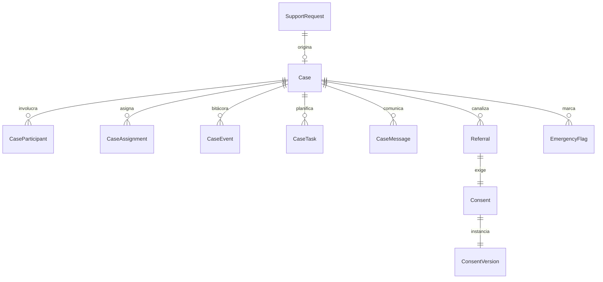

**`SupportRequest`** — Entrada única de ayuda y contacto (PRD §10.1). **Implementada desde la Fase 2.**
`id` PK · `folio` U · `legalEntityId` FK IX — a quién se dirige · `personId` NULL FK→`Person` — puede iniciarse sin cuenta · `submittedByPersonId` NULL FK · `contactName` · `contactEmail` NULL · `contactPhone` NULL · `preferredChannel` *enum* (`EMAIL`, `PHONE`) · `requestType` *enum* (`GENERAL_CONTACT`, `INDIVIDUAL_LABOR_DISPUTE`, `COLLECTIVE_DISPUTE`, `DISCRIMINATION_OR_ADJUSTMENTS`, `EDUCATION_ACCESS`, `HEALTH_ACCESS`, `ACCESSIBILITY`, `FAMILY_GUIDANCE`, `CIAN_ATTENTION`, `PSYCHOSOCIAL_RISK`, `VIOLENCE_OR_URGENCY`, `TRAINING_OR_INSTITUTIONAL_SUPPORT`, `OTHER`) IX · `subject` · `narrative` *text* — preguntas de información, no jurídicas; **inmutable** · `territoryHint` NULL — texto libre hasta la Fase 5 · `territorialUnitId` NULL FK IX · `suggestedRouting` *json* NULL — propuesta del sistema, nunca ejecutada sin confirmación humana · `suggestedByAiGenerationId` NULL FK→`AiGeneration` · `confirmedRoutingLegalEntityId` NULL FK · `confirmedById` NULL FK→`User` · `status` *enum* (`RECEIVED`, `TRIAGE`, `CONVERTED_TO_CASE`, `REFERRED_EXTERNALLY`, `HANDLED`, `CLOSED_NO_ACTION`, `DUPLICATE`) IX · `urgency` *enum* (`ROUTINE`, `PRIORITY`, `URGENT`) · `handledByActorId` NULL FK→`Actor` · `handledAt` NULL · `handlingNote` NULL — nota interna, nunca visible para quien escribió · `consentId` NULL FK→`Consent` · `privacyNoticeVersionId` FK→`ConsentVersion` · `acceptedAt` · `originFingerprint` — huella con clave del origen, nunca la dirección · `receivedAt` IX.

Lo que la Fase 2 implementa y lo que queda para la Fase 6:

| Columna | Fase 2 | Fase 6 |
|---|---|---|
| `folio`, `contactName`, `contactEmail`, `contactPhone`, `preferredChannel`, `requestType`, `subject`, `narrative`, `territoryHint`, `privacyNoticeVersionId`, `acceptedAt`, `originFingerprint`, `receivedAt` | Se escriben desde el formulario público | — |
| `status` | `RECEIVED` → `HANDLED` o `CLOSED_NO_ACTION`, con nota obligatoria | `TRIAGE`, `CONVERTED_TO_CASE`, `REFERRED_EXTERNALLY`, `DUPLICATE` |
| `urgency` | No se toca: queda en `ROUTINE`. Lo que la persona declaró vive en `requestType` y no se confunde con una valoración de la organización | La fija la valoración humana |
| `personId`, `consentId`, `territorialUnitId`, `suggestedRouting`, `suggestedByAiGenerationId`, `confirmedRouting*`, `submittedByPersonId` | No se escriben | Sí |

Tres decisiones y sus motivos:

1. **`consentId` es nulo, no obligatorio.** El documento lo contrataba obligatorio, pero `Consent` cuelga de `Person` y esta misma entrada declara que puede iniciarse sin cuenta: exigirlo obligaría a crear una persona del padrón por cada mensaje recibido, y llenaría el padrón de registros que nadie pidió y nadie puede corregir. Lo que sí consta desde el primer envío es `privacyNoticeVersionId`: qué versión exacta del aviso se aceptó y cuándo. El consentimiento granular lo exige la Fase 6 antes de canalizar.
2. **`GENERAL_CONTACT` se añade al catálogo del PRD §10.1.** El formulario de contacto y el de solicitud de apoyo son el mismo acto —alguien escribe desde fuera— y separarlos en dos tablas haría que una de las dos se quedara atrás. Lo que cambia es qué tipos ofrece cada pantalla.
3. **`HANDLED` se añade a la máquina de estados.** Cubre lo que la Fase 2 puede hacer de verdad: alguien lo leyó, contestó y lo dejó anotado. Los tres estados de la Fase 6 existen en el enumerado porque la máquina está contratada, y ninguna ruta de esta fase los escribe.

El motor impone la inmutabilidad del relato: la migración retira `UPDATE` sobre toda la tabla al rol de la aplicación y lo devuelve solo sobre las columnas de proceso. Cambiar `narrative` falla con «permiso denegado» aunque un descuido futuro lo intente. `DELETE` se conserva para que las políticas de retención puedan purgar.

**`Case`** — Expediente de caso (PRD §10.2).
`id` PK · `folio` U · `publicId` U · `supportRequestId` NULL FK U? · `legalEntityId` FK IX — entidad responsable · `domain` *enum* (`UNION_DEFENSE`, `SOCIAL_ATTENTION`, `CIAN`) IX — determina el compartimento de acceso · `caseType` *enum* — mismo catálogo que `SupportRequest.requestType` · `priority` *enum* (`LOW`, `NORMAL`, `HIGH`, `CRITICAL`) IX · `territorialUnitId` NULL FK IX · `originalSummary` *text* — inalterable · `humanAssessment` *text* NULL — valoración humana · `status` *enum* `CaseStatus` IX · `openedAt` · `firstResponseAt` NULL — insumo del indicador de primera respuesta · `dueAt` NULL · `closedAt` NULL · `closeOutcome` NULL *enum* (`RESOLVED`, `PARTIALLY_RESOLVED`, `REFERRED`, `WITHDRAWN_BY_PERSON`, `NOT_COMPETENT`, `NO_CONTACT`) · `closeReason` NULL *text* · `reopenedFromCaseId` NULL FK→`Case` · `reopenCount` *int*.

**`CaseParticipant`** — Persona relacionada y su calidad en el caso.
`id` PK · `caseId` FK IX · `personId` NULL FK IX · `externalName` NULL — contraparte sin registro · `role` *enum* (`APPLICANT`, `AFFECTED_PERSON`, `REPRESENTATIVE`, `FAMILY_OR_CAREGIVER`, `WITNESS`, `COUNTERPART`, `EXTERNAL_INSTITUTION`) · `membershipQuality` NULL *enum* (`UNION_MEMBER`, `HONORARY_AFFILIATE`, `PROTECTED_BENEFICIARY`, `NONE`) · `canViewCase` *bool* · `consentId` NULL FK→`Consent` · `addedAt` · `removedAt` NULL.

**`CaseAssignment`** — Responsable y equipo.
`id` PK · `caseId` FK IX · `userId` FK→`User` IX · `assignmentRole` *enum* (`OWNER`, `SUPPORT`, `SUPERVISOR`, `OBSERVER`) · `assignedById` FK · `assignedAt` · `unassignedAt` NULL · `unassignReason` NULL.
El acceso al expediente se concede por asignación y necesidad legítima, nunca por pertenecer al área (PRD §10.3).

**`CaseEvent`** — Bitácora del expediente. Inmutable.
`id` PK · `caseId` FK IX · `kind` *enum* (`CREATED`, `ASSIGNED`, `STATUS_CHANGED`, `PRIORITY_CHANGED`, `PARTICIPANT_ADDED`, `DOCUMENT_ADDED`, `MESSAGE_SENT`, `REFERRAL_CREATED`, `REFERRAL_ACCEPTED`, `TASK_COMPLETED`, `VIEWED_SENSITIVE`, `EXPORTED`, `CLOSED`, `REOPENED`) IX · `actorId` NULL FK · `summary` · `payload` *json* — minimizado · `occurredAt` IX · `auditEventId` NULL FK→`AuditEvent`.

**`CaseTask`** — Tarea con plazo y próximo paso.
`id` PK · `caseId` FK IX · `title` · `description` NULL · `assigneeId` NULL FK→`User` IX · `dueAt` NULL IX · `status` *enum* (`PENDING`, `IN_PROGRESS`, `BLOCKED`, `DONE`, `CANCELLED`) · `completedAt` NULL · `completedById` NULL FK · `blockerNote` NULL.

**`CaseMessage`** — Comunicación trazable dentro del caso.
`id` PK · `caseId` FK IX · `authorId` NULL FK→`User` · `audience` *enum* (`PERSON_AND_TEAM`, `TEAM_ONLY`, `SUPERVISION_ONLY`) — las notas reservadas nunca se muestran a la persona ni al área receptora de una canalización · `body` *text* · relación `CaseMessageAttachment` · `sentAt` IX · `readReceipts` *json* · `editedAt` NULL — solo correcciones antes del primer acuse, con registro.

**`Referral`** — Canalización entre entidades o áreas (PRD §10.4).
`id` PK · `caseId` FK IX · `fromLegalEntityId` FK · `toLegalEntityId` FK IX · `toModule` *enum* (`UNION_DEFENSE`, `SOCIAL_ATTENTION`, `CIAN`, `CENI`, `EXTERNAL`) · `externalRecipient` NULL · `reason` *text* · `explanationShownToPerson` *text* — explicación comprensible previa al consentimiento · `consentId` FK→`Consent` · `sharedFields` *string[]* — selección explícita de datos que se transfieren · relación `ReferralSharedFile` · `status` *enum* (`PROPOSED`, `AWAITING_CONSENT`, `SENT`, `ACCEPTED`, `REJECTED`, `RETURNED`, `CLOSED`) IX · `acceptedById` NULL FK · `acceptedAt` NULL · `returnReason` NULL · `targetCaseId` NULL FK→`Case`.
Invariante: sin `Consent` vigente que cubra exactamente los campos y archivos listados, la canalización no puede pasar de `AWAITING_CONSENT`.

**`Consent`** — Consentimiento otorgado por una persona.
`id` PK · `personId` FK IX · `consentVersionId` FK→`ConsentVersion` IX · `purpose` *enum* (`MEMBERSHIP`, `DIRECTORY_PUBLICATION`, `CASE_PROCESSING`, `INTER_ENTITY_REFERRAL`, `CIAN_CARE`, `CLINICAL_DATA_SHARING`, `AI_ASSISTANCE`, `TOOL_IDENTITY_EXCHANGE`, `MARKETING_COMMUNICATIONS`, `EVENT_PARTICIPATION`, `MINOR_REPRESENTATION`) IX · `scope` *json* — módulos, entidades, campos y archivos alcanzados · `grantedById` FK→`Person` — quien otorga, que puede ser la representante · `representationRelationshipId` NULL FK→`CareRelationship` · `grantedAt` · `expiresAt` NULL · `revokedAt` NULL IX · `revokeReason` NULL · `evidence` *json* — texto exacto aceptado, versión, marca de tiempo y medio.
La revocación surte efecto inmediato hacia el futuro y no borra la evidencia de lo ya consentido.

**`ConsentVersion`** — Texto versionado de un consentimiento o aviso.
`id` PK · `code` IX · `version` *int* · `legalEntityId` FK · `title` · `bodyMarkdown` *text* · `plainLanguageSummary` *text* — versión en lenguaje claro exigida por la accesibilidad cognitiva · `requiredFor` *enum[]* · `effectiveFrom` · `effectiveTo` NULL · `publishedById` FK · `status` *enum* (`DRAFT`, `PUBLISHED`, `RETIRED`).
Único `(code, version)`.

**`EmergencyFlag`** — Marca de riesgo inmediato (PRD §10.3).
`id` PK · `caseId` NULL FK IX · `supportRequestId` NULL FK IX · `personId` NULL FK · `raisedBy` *enum* (`PERSON`, `STAFF`, `AUTOMATED_KEYWORD`) · `raisedAt` IX · `riskKind` *enum* (`VIOLENCE`, `SELF_HARM`, `CHILD_PROTECTION`, `HEALTH_EMERGENCY`, `OTHER`) · `protocolShownId` FK→`ContentPage` — protocolo humano visible; la plataforma nunca se presenta como servicio de emergencia · `acknowledgedById` NULL FK · `acknowledgedAt` NULL · `resolution` NULL *text* · `closedAt` NULL.

---

## 8. Finanzas (PRD §18.5)

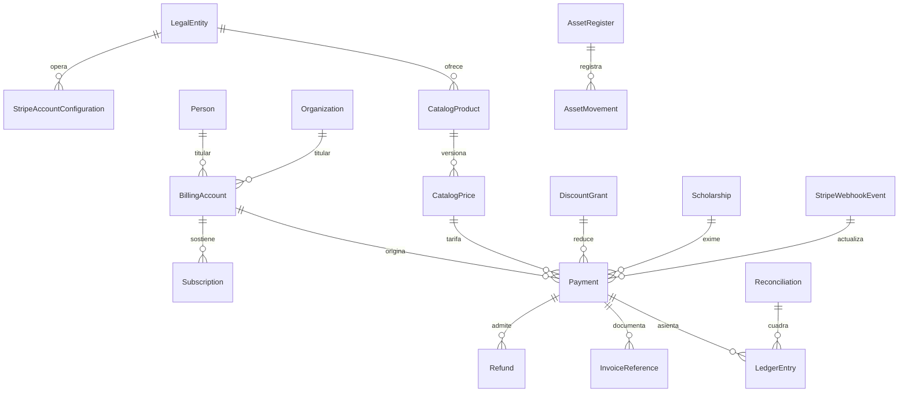

**`StripeAccountConfiguration`** — Configuración de cobro por entidad jurídica (PRD §11.2).
`id` PK · `legalEntityId` FK U · `accountKey` *enum* U (`FUERZA`, `ALIANZA`) — selecciona el par de variables de entorno; las claves nunca se guardan en base · `stripeAccountId` NULL · `webhookPath` U — `/api/v1/webhooks/stripe/{account}` · `defaultCurrency` *char(3)* · `statementDescriptor` · `customerPortalEnabled` *bool* · `isActive` *bool* · `activatedAt` NULL.
Si al inicio se opera una sola cuenta, la entidad receptora ya está registrada en cada movimiento y la separación posterior no reconstruye el historial.

**`CatalogProduct`** — Concepto cobrable versionado (PRD §11.1).
`id` PK · `code` U · `name` · `description` · `legalEntityId` FK IX — entidad receptora · `kind` *enum* (`ENROLLMENT_FEE`, `UNION_DUE_ORDINARY`, `UNION_DUE_EXTRAORDINARY`, `HONORARY_MEMBERSHIP`, `SERVICE_SUBSCRIPTION`, `COURSE`, `CIAN_SERVICE`, `CENI_PROGRAM`, `CENI_ASSESSMENT`, `CENI_CERTIFICATION`, `RENEWAL`, `DONATION`) · `stripeProductId` NULL · `billingMode` *enum* (`ONE_TIME`, `RECURRING`) · `moduleBinding` *enum* NULL — qué derecho activa al pagarse · `requiresAuthorizingResolutionId` NULL FK→`Resolution` — las cuotas extraordinarias exigen acuerdo · `isActive` *bool* · `archivedAt` NULL.
Los precios y conceptos nunca están codificados en el frontend.

**`CatalogPrice`** — Precio vigente de un producto.
`id` PK · `productId` FK IX · `version` *int* · `amountMinor` *bigint* · `currency` *char(3)* · `interval` NULL *enum* (`MONTH`, `QUARTER`, `SEMESTER`, `YEAR`) · `stripePriceId` NULL U? · `effectiveFrom` IX · `effectiveTo` NULL · `isDefault` *bool*.
Único `(productId, version)`. Un pago conserva el `catalogPriceId` con el que se cobró.

**`BillingAccount`** — Titular económico.
`id` PK · `holderKind` *enum* (`PERSON`, `ORGANIZATION`) · `personId` NULL FK IX · `organizationId` NULL FK IX · `legalEntityId` FK IX · `stripeCustomerId` NULL U? · `billingEmail` · `taxProfile` *json* NULL — datos de facturación externa · `status` *enum* (`ACTIVE`, `DELINQUENT`, `CLOSED`).
Único parcial por `(holderKind, personId|organizationId, legalEntityId)`.

**`Subscription`** — Suscripción recurrente.
`id` PK · `billingAccountId` FK IX · `catalogPriceId` FK · `stripeSubscriptionId` NULL U? · `status` *enum* (`INCOMPLETE`, `TRIALING`, `ACTIVE`, `PAST_DUE`, `GRACE_PERIOD`, `CANCELED`, `UNPAID`) IX · `currentPeriodStart` · `currentPeriodEnd` IX · `gracePeriodEndsAt` NULL · `cancelAtPeriodEnd` *bool* · `canceledAt` NULL · `cancelReason` NULL · `membershipId` NULL FK→`Membership` · `toolEntitlementId` NULL FK→`ToolEntitlement`.

**`Payment`** — Movimiento de cobro, con o sin Stripe.
`id` PK · `publicId` U · `billingAccountId` FK IX · `legalEntityId` FK IX · `catalogPriceId` NULL FK · `stripeAccountKey` *enum* · `stripePaymentIntentId` NULL U? · `stripeCheckoutSessionId` NULL U? · `subscriptionId` NULL FK IX · `amountMinor` *bigint* · `currency` *char(3)* · `netAmountMinor` NULL *bigint* · `feeAmountMinor` NULL *bigint* · `status` *enum* `PaymentStatus` IX · `method` *enum* (`STRIPE_CHECKOUT`, `STRIPE_SUBSCRIPTION`, `MANUAL_TRANSFER`, `MANUAL_CASH`, `EXEMPTION`) · `paidAt` NULL IX · `failureCode` NULL · `discountGrantId` NULL FK · `scholarshipId` NULL FK · `manualEvidenceFileId` NULL FK→`FileObject` · `manualRegisteredById` NULL FK→`User` · `manualApprovedById` NULL FK→`User` — doble control obligatorio en pagos manuales · `appliesToKind` *enum* · `appliesToId` NULL · `idempotencyKey` U.
Ningún derecho se activa por la página de retorno del navegador: la activación proviene del webhook (PRD §11.4).

**`Refund`** — Devolución autorizada.
`id` PK · `paymentId` FK IX · `amountMinor` *bigint* · `currency` · `reason` *text* · `stripeRefundId` NULL U? · `status` *enum* (`REQUESTED`, `APPROVED`, `PROCESSING`, `SUCCEEDED`, `FAILED`, `REJECTED`) · `requestedById` FK · `approvedById` NULL FK — distinto de quien solicita · `processedAt` NULL.

**`InvoiceReference`** — Vínculo con el comprobante fiscal externo.
`id` PK · `paymentId` FK IX · `externalSystem` · `externalId` · `series` NULL · `folio` NULL · `issuedAt` NULL · `fileObjectId` NULL FK · `status` *enum* (`PENDING`, `ISSUED`, `CANCELLED`).
La plataforma vincula comprobantes; no sustituye un sistema contable autorizado (PRD §26).

**`DiscountGrant`** — Cupón, descuento o convenio aplicable.
`id` PK · `code` U? · `name` · `legalEntityId` FK · `kind` *enum* (`PERCENTAGE`, `FIXED_AMOUNT`, `FULL_WAIVER`) · `value` *int* · `stripeCouponId` NULL · relación `DiscountGrantProduct` · `maxRedemptions` NULL *int* · `redemptions` *int* · `validFrom` · `validTo` NULL · `agreementDocumentId` NULL FK · `authorizedById` FK · `revokedAt` NULL.

**`Scholarship`** — Beca o exención documentada.
`id` PK · `personId` FK IX · `legalEntityId` FK · `programKind` *enum* (`MEMBERSHIP`, `CIAN_SERVICE`, `COURSE`, `TOOL_ACCESS`) · `coveragePercent` *int* · `justification` *text* · relación `ScholarshipEvidence` · `approvedById` FK · `approvedAt` · `validFrom` · `validTo` NULL · `revokedAt` NULL · `revokeReason` NULL.

**`LedgerEntry`** — Asiento del libro auxiliar. Inmutable (PRD §11.5).
`id` PK · `legalEntityId` FK IX · `entryDate` IX · `direction` *enum* (`DEBIT`, `CREDIT`) · `accountCode` — catálogo auxiliar interno · `amountMinor` *bigint* · `currency` · `sourceKind` *enum* (`PAYMENT`, `REFUND`, `MANUAL_ADJUSTMENT`, `ASSET_MOVEMENT`, `EXEMPTION`) · `sourceId` · `description` · `reason` NULL — obligatorio en ajustes · `createdByActorId` FK→`Actor` — un asiento puede originarlo el manejador de un webhook, no solo una persona · `reviewedById` NULL FK→`User` · `approvedById` NULL FK→`User` — el doble control exige personas, nunca el sistema · `reconciliationId` NULL FK IX · `reversalOfEntryId` NULL FK→`LedgerEntry` — una corrección es un asiento nuevo, jamás una edición.

**`Reconciliation`** — Corte de conciliación por entidad y periodo.
`id` PK · `legalEntityId` FK IX · `periodStart` · `periodEnd` · `stripeAccountKey` *enum* · `expectedTotalMinor` *bigint* · `observedTotalMinor` *bigint* · `differenceMinor` *bigint* · `status` *enum* (`OPEN`, `BALANCED`, `WITH_DIFFERENCES`, `CLOSED`) IX · relación `ReconciliationException` · `closedById` NULL FK · `closedAt` NULL · `reportFileId` NULL FK.

**`AssetRegister`** — Registro patrimonial (PRD §11.5).
`id` PK · `legalEntityId` FK IX · `assetKind` *enum* (`REAL_ESTATE`, `VEHICLE`, `EQUIPMENT`, `FURNITURE`, `BANK_ACCOUNT`, `INTANGIBLE`, `OTHER`) · `name` · `description` · `acquisitionMode` *enum* (`PURCHASE`, `DONATION`, `TRANSFER`, `OTHER`) · `acquiredOn` · `documentedValueMinor` *bigint* · `currency` · `location` NULL · `custodianPersonId` NULL FK · relación `AssetDocument` · `status` *enum* (`ACTIVE`, `IN_REPAIR`, `TRANSFERRED`, `DISPOSED`, `LOST`) · `authorizingResolutionId` NULL FK→`Resolution`.

**`AssetMovement`** — Movimiento patrimonial. Inmutable.
`id` PK · `assetId` FK IX · `movementKind` *enum* (`REGISTERED`, `REVALUED`, `TRANSFERRED`, `ASSIGNED`, `DISPOSED`, `WRITTEN_OFF`) · `occurredOn` · `fromCustodianId` NULL FK · `toCustodianId` NULL FK · `amountMinor` NULL *bigint* · `authorizingResolutionId` NULL FK · relación `AssetMovementEvidence` · `registeredById` FK.
Los actos que requieren aprobación institucional no pueden marcarse como concluidos sin el acuerdo adjunto.

**`StripeWebhookEvent`** — Evento recibido de Stripe. Inmutable y anterior a cualquier procesamiento (PRD §11.4).
`id` PK · `stripeAccountKey` *enum* IX · `stripeEventId` U — garantiza idempotencia · `eventType` IX · `apiVersion` · `payload` *json* — recibido íntegro · `signatureVerified` *bool* · `receivedAt` IX · `processedAt` NULL · `processingStatus` *enum* (`RECEIVED`, `PROCESSING`, `PROCESSED`, `FAILED`, `IGNORED`, `UNRECONCILED`) IX · `attempts` *int* · `lastError` NULL · `resultingPaymentId` NULL FK.

---

## 9. Archivos y documentos (PRD §18.6)

**`FileObject`** — Objeto lógico almacenado en Vercel Blob.
`id` PK · `publicId` U · `legalEntityId` FK IX · `ownerPersonId` NULL FK IX · `ownerOrganizationId` NULL FK · `classification` *enum* (`PUBLIC`, `INTERNAL`, `RESTRICTED`, `SENSITIVE_PERSONAL`, `CLINICAL`, `LEGAL_PRIVILEGED`) IX · `contextKind` *enum* (`APPLICATION`, `CASE`, `CIAN`, `CENI`, `GOVERNANCE`, `FINANCE`, `CONTENT`, `CREDENTIAL`, `SYSTEM`) IX · `contextId` NULL IX · `originalFileName` — metadato de presentación, nunca identificador · `mimeType` · `sizeBytes` *bigint* · `currentVersionId` NULL FK→`FileVersion` · `retentionPolicyId` NULL FK · `legalHoldId` NULL FK IX · `archivedAt` NULL · `deletedAt` NULL — borrado lógico previo a la eliminación física verificada.

**`FileVersion`** — Versión concreta del contenido. Inmutable.
`id` PK · `fileObjectId` FK IX · `version` *int* · `blobPathname` U — ruta lógica opaca, privada · `sha256` IX — detección de duplicados y verificación de integridad · `sizeBytes` *bigint* · `uploadedById` FK→`User` · `uploadedAt` · `scanStatus` *enum* (`PENDING`, `CLEAN`, `REJECTED`) · `scanDetail` NULL — validación de tipo real y contenido.
Único `(fileObjectId, version)`.

**`DocumentTemplate`** — Plantilla versionada de documento institucional.
`id` PK · `code` IX · `version` *int* · `legalEntityId` FK · `name` · `kind` *enum* (`MEMBERSHIP_RESOLUTION`, `CREDENTIAL`, `ASSEMBLY_MINUTES`, `CALL_NOTICE`, `ELECTION_RESULT`, `DISCIPLINARY_DECISION`, `POWER_GRANT`, `RECEIPT`, `CERTIFICATE`, `ATTENDANCE_CONSTANCY`, `REPORT`) · `bodyTemplate` *text* · `variables` *json* — variables permitidas · `numberingSeries` NULL · `status` *enum* (`DRAFT`, `PUBLISHED`, `RETIRED`) · `publishedById` NULL FK.
Único `(code, version)`.

**`GeneratedDocument`** — Documento emitido a partir de una plantilla.
`id` PK · `publicId` U · `templateId` FK IX · `templateVersion` *int* · `legalEntityId` FK IX · `series` · `folio` U? — serie documental por entidad · `subjectKind` *enum* · `subjectId` IX · `renderedFileId` FK→`FileObject` · `variablesSnapshot` *json* — inmutable · `issuedAt` · `issuedById` FK · `status` *enum* (`ISSUED`, `SUPERSEDED`, `CANCELLED`) · `supersededById` NULL FK→`GeneratedDocument` · `cancelReason` NULL.

**`SignatureRecord`** — Firma o certificación de un documento.
`id` PK · `documentId` FK IX · `signerPersonId` FK IX · `signerOfficeTermId` NULL FK · `signatureKind` *enum* (`HANDWRITTEN_SCANNED`, `ELECTRONIC_SIMPLE`, `CERTIFIED_COPY`) · `signedAt` · `evidence` *json* — sesión, correlación y huella del documento firmado · `fileObjectId` NULL FK · `revokedAt` NULL.

**`RetentionPolicy`** — Política de conservación por tipo de dato.
`id` PK · `code` U · `name` · `appliesToClassification` *enum[]* · `appliesToContextKind` *enum[]* · `retentionMonths` *int* · `basis` *text* — fundamento de la conservación · `actionOnExpiry` *enum* (`ANONYMIZE`, `DELETE`, `ARCHIVE_COLD`) · `reviewedById` FK · `effectiveFrom` · `effectiveTo` NULL.

**`LegalHold`** — Bloqueo legal que suspende cualquier eliminación.
`id` PK · `scopeKind` *enum* (`PERSON`, `CASE`, `FILE`, `LEGAL_ENTITY`, `DISCIPLINARY_CASE`, `BARGAINING_FILE`) · `scopeId` IX · `reason` *text* · `orderedBy` · `startedAt` · `releasedAt` NULL · `releasedById` NULL FK.
Mientras exista un bloqueo activo, ningún trabajo de retención elimina, anonimiza ni archiva en frío los objetos alcanzados.

---

## 10. Herramientas (PRD §18.7)

**`ToolDefinition`** — Herramienta del ecosistema (NeuroPlan, ADIA, NEXO y futuras).
`id` PK · `code` U · `name` · `description` · `logoFileId` NULL FK · `brandTokens` *json* · `legalEntityId` FK IX — entidad responsable · `audience` *enum[]* (`UNION_MEMBER`, `HONORARY_AFFILIATE`, `PROTECTED_BENEFICIARY`, `ORGANIZATION`, `PROFESSIONAL`) · `eligibilityRules` *json* — reglas declarativas evaluadas por el motor de elegibilidad · `integrationMode` *enum* (`NATIVE_MODULE`, `AUTHENTICATED_DEEP_LINK`, `SIGNED_SHORT_LIVED_LOGIN`, `API_INTEGRATION`, `EXTERNAL_NO_IDENTITY`) · `launchUrl` NULL · `privacyNoticeUrl` NULL · `termsUrl` NULL · `supportContact` NULL · `operationalStatus` *enum* (`PLANNED`, `ACTIVE`, `DEGRADED`, `MAINTENANCE`, `RETIRED`) IX · `publishedMetrics` *string[]*.

**`ToolPlan`** — Plan o beneficio que incluye una herramienta.
`id` PK · `toolId` FK IX · `code` U? · `name` · `accessMode` *enum* (`INCLUDED_IN_MEMBERSHIP`, `UNION_BENEFIT`, `SOCIAL_PROGRAM`, `SCHOLARSHIP`, `INDIVIDUAL_PURCHASE`, `ORGANIZATION_PURCHASE`, `CIAN_ASSIGNMENT`, `CAMPAIGN`, `ADMIN_GRANT`) · `catalogProductId` NULL FK · `seatLimit` NULL *int* · `durationMonths` NULL *int* · `isActive`.

**`ToolEntitlement`** — Derecho de acceso concreto de una persona u organización.
`id` PK · `toolId` FK IX · `toolPlanId` FK · `personId` NULL FK IX · `organizationId` NULL FK IX · `sourceKind` *enum* — mismo catálogo que `accessMode` · `sourceRef` NULL — membresía, beca, pago, asignación CIAN o autorización · `grantedById` NULL FK · `startsAt` · `endsAt` NULL IX · `revokedAt` NULL · `revokeReason` NULL · `consentId` NULL FK→`Consent` — exigido cuando hay intercambio de identidad.
La persona ve **por qué** tiene acceso, hasta cuándo y qué ocurre al vencer (PRD §12.3).

**`ToolLaunch`** — Lanzamiento registrado. Inmutable.
`id` PK · `entitlementId` FK IX · `personId` FK IX · `launchedAt` IX · `mode` *enum* · `tokenJti` U — identificador del enlace firmado de corta duración · `expiresAt` · `consumedAt` NULL · `resultStatus` *enum* (`ISSUED`, `CONSUMED`, `EXPIRED`, `DENIED`).
No se almacena el contenido utilizado dentro de la herramienta ni se transmiten datos sensibles por parámetros de URL (PRD §12.2).

**`ExternalIdentityLink`** — Vínculo de identidad con un sistema externo.
`id` PK · `personId` FK IX · `provider` IX · `externalSubject` — identificador en el sistema externo · `linkedAt` · `consentId` FK→`Consent` · `scopes` *string[]* · `revokedAt` NULL.
Único `(provider, externalSubject)`.

**`IntegrationCredentialReference`** — Referencia a credenciales de integración. **Nunca contiene el secreto**.
`id` PK · `provider` U? · `environment` *enum* (`DEVELOPMENT`, `PREVIEW`, `PRODUCTION`) · `envVarName` — nombre de la variable que guarda el secreto · `keyFingerprint` NULL — huella para detectar rotación · `rotatedAt` NULL · `expiresAt` NULL · `owner` · `notes` NULL.

**`IntegrationEvent`** — Evento entrante o saliente de una integración distinta de Stripe. Inmutable.
`id` PK · `provider` IX · `direction` *enum* (`INBOUND`, `OUTBOUND`) · `externalEventId` NULL U? · `eventType` · `payload` *json* — minimizado · `signatureVerified` *bool* · `occurredAt` IX · `processingStatus` *enum* (`RECEIVED`, `PROCESSED`, `FAILED`, `IGNORED`) · `attempts` *int* · `lastError` NULL · `correlationId`.

---

## 11. CIAN (PRD §18.8)

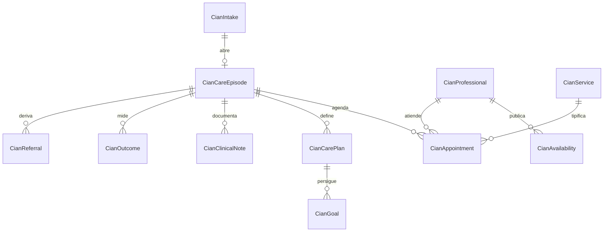

**`CianIntake`** — Admisión y entrevista inicial.
`id` PK · `folio` U · `personId` FK IX · `requestedByPersonId` NULL FK · `sourceKind` *enum* (`SELF`, `FAMILY`, `UNION_REFERRAL`, `SOCIAL_REFERRAL`, `EXTERNAL`) · `supportRequestId` NULL FK · `caseId` NULL FK→`Case` · `needsAssessment` *text* — valoración de necesidades, sin diagnóstico · `interviewedById` NULL FK→`User` · `interviewAt` NULL · `triageStatus` *enum* (`RECEIVED`, `TRIAGE`, `WAITLISTED`, `ACCEPTED`, `REFERRED_OUT`, `DECLINED`, `CLOSED`) IX · `triageById` NULL FK — el triage es humano · `priority` *enum* (`ROUTINE`, `PRIORITY`, `URGENT`) · `consentId` FK→`Consent` · `scholarshipId` NULL FK · `waitlistPosition` NULL *int* · `closedAt` NULL.

**`CianProfessional`** — Profesional habilitado para atender.
`id` PK · `personId` FK U · `professionalProfileId` FK→`ProfessionalProfile` · `licenseReference` NULL · `licenseFileId` NULL FK · relación `CianProfessionalDiscipline` → `SpecialtyCatalog` · relación `CianProfessionalService` · `capacityPerWeek` *int* · `acceptsRemote` *bool* · `status` *enum* (`ACTIVE`, `ON_LEAVE`, `INACTIVE`) IX · `verifiedById` NULL FK · `verifiedAt` NULL.

**`CianService`** — Servicio ofrecido.
`id` PK · `code` U · `name` · `description` · `modality` *enum* (`IN_PERSON`, `REMOTE`, `BOTH`) · `durationMinutes` *int* · `catalogProductId` NULL FK · `requiresReferral` *bool* · `isActive`.

**`CianAvailability`** — Disponibilidad publicada.
`id` PK · `professionalId` FK IX · `startsAt` IX · `endsAt` · relación `CianAvailabilityService` · `modality` *enum* · `slotMinutes` *int* · `recurrenceRule` NULL · `blockedReason` NULL · `isBlocked` *bool*.

**`CianAppointment`** — Cita.
`id` PK · `publicId` U · `episodeId` NULL FK IX · `personId` FK IX · `professionalId` FK IX · `serviceId` FK · `startsAt` IX · `endsAt` · `modality` *enum* · `location` NULL · `meetingLinkRef` NULL — referencia, no enlace con datos en la URL · `status` *enum* (`SCHEDULED`, `CONFIRMED`, `RESCHEDULED`, `COMPLETED`, `CANCELLED_BY_PERSON`, `CANCELLED_BY_CENTER`, `NO_SHOW`) IX · `rescheduledFromId` NULL FK · `cancelReason` NULL · `paymentId` NULL FK · `attendanceNote` NULL · `reminderJobId` NULL FK→`BackgroundJob`.

**`CianCareEpisode`** — Episodio de atención (contenedor del expediente).
`id` PK · `folio` U · `personId` FK IX · `intakeId` FK U? · `legalEntityId` FK — siempre Alianza Índigo · `leadProfessionalId` FK→`CianProfessional` IX · `openedAt` · `status` *enum* (`OPEN`, `ACTIVE`, `ON_HOLD`, `DISCHARGED`, `REFERRED_OUT`, `CLOSED`) IX · `closedAt` NULL · `closeKind` NULL *enum* (`DISCHARGE`, `EXTERNAL_REFERRAL`, `ABANDONMENT`, `ADMINISTRATIVE`) · `familyCoordinationConsentId` NULL FK→`Consent`.

**`CianCarePlan`** — Plan individual o familiar, versionado.
`id` PK · `episodeId` FK IX · `version` *int* · `scope` *enum* (`INDIVIDUAL`, `FAMILY`) · `summary` *text* · `authoredById` FK→`CianProfessional` · `authoredAt` · `sharedWithFamily` *bool* · `status` *enum* (`DRAFT`, `ACTIVE`, `SUPERSEDED`, `CLOSED`) · `neuroPlanEntitlementId` NULL FK→`ToolEntitlement`.
Único `(episodeId, version)`.

**`CianGoal`** — Objetivo del plan con actividades y seguimiento.
`id` PK · `carePlanId` FK IX · `title` · `description` · `targetDate` NULL · `measure` NULL · `status` *enum* (`PROPOSED`, `ACTIVE`, `ACHIEVED`, `PARTIALLY_ACHIEVED`, `DISCONTINUED`) · `progressNotes` *json* · `updatedByActorId` NULL FK→`Actor`.

**`CianClinicalNote`** — Nota profesional de acceso restringido.
`id` PK · `episodeId` FK IX · `appointmentId` NULL FK · `authorId` FK→`CianProfessional` IX · `noteKind` *enum* (`SESSION`, `ASSESSMENT`, `FOLLOW_UP`, `COORDINATION`, `CLOSURE`) · `body` *text* · `writtenAt` · `amendedFromNoteId` NULL FK — las correcciones crean una nota nueva que referencia la anterior; el contenido original nunca se sobrescribe · `visibility` *enum* (`AUTHOR_AND_COORDINATION`, `CARE_TEAM`) — el personal sindical y el administrativo sin función asistencial nunca aparecen aquí.
Ninguna nota se reutiliza con fines sindicales, comerciales o CENI sin consentimiento específico y base autorizada (PRD §13.3).

**`CianOutcome`** — Resultado y experiencia medidos.
`id` PK · `episodeId` FK IX · `measuredAt` · `instrument` *enum* (`EXPERIENCE_SURVEY`, `GOAL_ATTAINMENT`, `FOLLOW_UP_CHECK`) · `score` NULL *int* · `responses` *json* — despersonalizadas para el tablero · `recordedById` NULL FK · `sharedForAggregateMetrics` *bool*.

**`CianReferral`** — Canalización a especialidad externa o interna.
`id` PK · `episodeId` FK IX · `direction` *enum* (`INTERNAL`, `EXTERNAL`) · `targetKind` *enum* (`NEUROLOGY`, `PSYCHIATRY`, `PSYCHOLOGY`, `EDUCATION`, `SOCIAL_PROGRAM`, `LEGAL_DEFENSE`, `OTHER`) — la canalización a evaluación diagnóstica es siempre a una persona profesional, nunca automática · `targetProfessionalId` NULL FK · `externalTarget` NULL · `reason` *text* · `consentId` FK→`Consent` · relación `CianReferralSharedFile` · `status` *enum* (`PROPOSED`, `SENT`, `ACCEPTED`, `COMPLETED`, `DECLINED`) · `sentAt` NULL · `closedAt` NULL.

---

## 12. CENI (PRD §18.9)

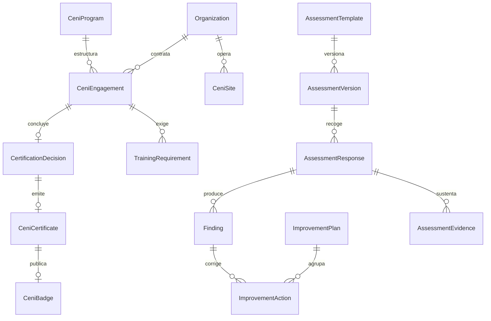

**`CeniProgram`** — Línea CENI configurable (CENI Laboral, CENI Espacios y las que se agreguen).
`id` PK · `code` U · `name` · `description` · `legalEntityId` FK · `assessmentTemplateId` FK IX · `catalogProductId` NULL FK · `validityMonths` *int* · `levels` *json* — niveles y umbrales · `renewalWindowDays` *int* · `isActive`.

**`CeniSite`** — Sede o centro de trabajo alcanzado.
`id` PK · `organizationId` FK IX · `name` · `address` · `territorialUnitId` NULL FK IX · `headcountBand` *enum* NULL · `contactPersonId` NULL FK · `isActive`.

**`CeniEngagement`** — Contratación y ciclo de una organización.
`id` PK · `folio` U · `organizationId` FK IX · `programId` FK IX · relación `CeniEngagementSite` — alcance contratado · `status` *enum* `CeniEngagementStatus` IX · `contractDocumentId` NULL FK · `paymentId` NULL FK · `subscriptionId` NULL FK · `startedAt` · `diagnosticCompletedAt` NULL · `assessmentCompletedAt` NULL · relación `CeniEngagementAssessor` · `coordinatorId` NULL FK→`User` · `closedAt` NULL · `closeReason` NULL.

**`AssessmentTemplate`** — Instrumento de evaluación.
`id` PK · `code` U · `name` · `programId` NULL FK · `currentVersionId` NULL FK→`AssessmentVersion` · `isActive`.

**`AssessmentVersion`** — Versión inmutable del instrumento.
`id` PK · `templateId` FK IX · `version` *int* · `sections` *json* — criterios, preguntas, tipos de evidencia exigida · `weights` *json* — ponderaciones · `scoringRules` *json* · `levelThresholds` *json* · `publishedById` FK · `publishedAt` · `status` *enum* (`DRAFT`, `PUBLISHED`, `RETIRED`).
Único `(templateId, version)`. Cerrar una evaluación preserva su versión y su evidencia.

**`AssessmentResponse`** — Respuestas de una organización a una versión concreta.
`id` PK · `engagementId` FK IX · `assessmentVersionId` FK IX · `siteId` NULL FK · `answers` *json* · `submittedById` NULL FK · `submittedAt` NULL · `status` *enum* (`DRAFT`, `SUBMITTED`, `IN_REVIEW`, `CORRECTIONS_REQUESTED`, `CLOSED`) IX · `reviewedById` NULL FK · `closedAt` NULL · `score` NULL *int* · `computedLevel` NULL.
Una evaluación cerrada no se altera; una reevaluación crea una respuesta nueva sobre la versión vigente.

**`AssessmentEvidence`** — Evidencia documental, fotográfica o de enlace.
`id` PK · `responseId` FK IX · `criterionCode` IX · `evidenceKind` *enum* (`DOCUMENT`, `PHOTO`, `LINK`, `STATEMENT`) · `fileObjectId` NULL FK · `url` NULL · `description` · `uploadedById` FK · `uploadedAt` · `reviewStatus` *enum* (`PENDING`, `ACCEPTED`, `INSUFFICIENT`, `REJECTED`) · `reviewerComment` NULL · `reviewedById` NULL FK · `reviewedAt` NULL.

**`Finding`** — Hallazgo de la evaluación.
`id` PK · `responseId` FK IX · `criterionCode` · `severity` *enum* (`OBSERVATION`, `MINOR`, `MAJOR`, `CRITICAL`) IX · `statement` *text* · `recommendation` *text* · `raisedById` FK · `raisedAt` · `status` *enum* (`OPEN`, `IN_PROGRESS`, `RESOLVED`, `ACCEPTED_RISK`, `VOIDED`).

**`ImprovementPlan`** — Plan de mejora acordado.
`id` PK · `engagementId` FK IX · `version` *int* · `summary` · `agreedAt` NULL · `agreedByOrganizationUserId` NULL FK · `status` *enum* (`DRAFT`, `AGREED`, `IN_PROGRESS`, `COMPLETED`, `OVERDUE`, `CANCELLED`) IX · `dueAt` NULL.

**`ImprovementAction`** — Acción con responsable y fecha.
`id` PK · `planId` FK IX · `findingId` NULL FK IX · `title` · `description` · `responsiblePersonId` NULL FK · `dueOn` IX · `status` *enum* (`PENDING`, `IN_PROGRESS`, `DONE`, `BLOCKED`, `CANCELLED`) · `completedAt` NULL · relación `ImprovementActionEvidence` · `verifiedById` NULL FK · `verifiedAt` NULL.

**`TrainingRequirement`** — Capacitación exigida por el programa. **No depende del módulo de eventos** (defecto `D-F0-008`).
`id` PK · `engagementId` FK IX · `eventId` NULL FK→`Event` — enlace **opcional** que solo se usa cuando el módulo de eventos existe; la acreditación por evidencia documental es suficiente y es la vía con la que CENI cierra su propia fase · `title` · `requiredParticipants` *int* · `completedParticipants` *int* · `dueOn` NULL · `status` *enum* (`PENDING`, `SCHEDULED`, `COMPLETED`, `WAIVED`) · relación `TrainingRequirementEvidence` · `waiverReason` NULL.

**`CertificationDecision`** — Decisión humana de certificación (PRD §14.3.11).
`id` PK · `engagementId` FK U · `decidedById` FK→`User` — persona, nunca automatismo ni modelo · `decidedAt` · `outcome` *enum* (`CERTIFIED`, `CERTIFIED_WITH_CONDITIONS`, `NOT_CERTIFIED`, `DEFERRED`) · `level` NULL · `rationale` *text* · `conflictOfInterestDeclared` *bool* · `reviewedById` NULL FK · `supportingResponseId` FK→`AssessmentResponse`.

**`CeniCertificate`** — Certificado emitido.
`id` PK · `certificateNumber` U · `publicCode` U — contenido opaco del QR · `signingKeyId` IX · `signature` · `decisionId` FK U · `organizationId` FK IX · `programId` FK · relación `CeniCertificateSite` · `level` · `issuedOn` · `validUntil` IX · `status` *enum* (`VALID`, `SUSPENDED`, `EXPIRED`, `REVOKED`, `RENEWED`) IX · `suspendedReason` NULL · `revokedReason` NULL · `renewedFromCertificateId` NULL FK · `documentId` FK→`GeneratedDocument`.
El verificador público distingue con claridad vigencia, suspensión, vencimiento y revocación.

**`CeniBadge`** — Distintivo publicable derivado de un certificado vigente.
`id` PK · `certificateId` FK U · `assetFileId` FK→`FileObject` · `embedCode` · `publicDirectoryVisible` *bool* · `publishedAt` · `withdrawnAt` NULL.

---

## 13. IA, contenido y operación (PRD §18.10)

**`AiProviderConfiguration`** — Configuración del proveedor (Gemini, único proveedor inicial).
`id` PK · `provider` *enum* (`GEMINI`) U · `defaultModel` · `allowedModels` *string[]* · `maxTokensPerRequest` *int* · `maxRequestsPerUserPerDay` *int* · `maxMonthlyCostMinor` *bigint* · `currency` · `apiKeyEnvVarName` — el secreto vive solo en variables de entorno · `trainingOptOut` *bool* · `isEnabled` *bool* · `degradedModeMessageId` NULL FK→`ContentPage`.

**`AiPrompt`** — Prompt administrable, nunca disperso en el código (PRD §15.3).
`id` PK · `code` U · `purpose` · `module` IX · `criticality` *enum* (`STANDARD`, `CRITICAL`) — la publicación de un prompt crítico exige revisión humana · `currentVersionId` NULL FK→`AiPromptVersion` · `isActive`.

**`AiPromptVersion`** — Versión concreta del prompt.
`id` PK · `promptId` FK IX · `version` *int* · `systemText` *text* · `allowedVariables` *string[]* · `model` · `parameters` *json* · relación `AiPromptVersionSource` — fuentes permitidas · `outputSchema` *json* · `limits` *json* · `status` *enum* (`DRAFT`, `TESTING`, `PUBLISHED`, `RETIRED`) IX · `authorId` FK · `reviewerId` NULL FK · `reviewedAt` NULL · `publishedAt` NULL · `revertedFromVersionId` NULL FK.
Único `(promptId, version)`.

**`AiConversation`** — Hilo de asistencia.
`id` PK · `personId` NULL FK IX · `module` IX · `purpose` *enum* · `legalEntityId` NULL FK · `consentId` NULL FK→`Consent` · `startedAt` · `endedAt` NULL · `messageCount` *int* · `retentionPolicyId` NULL FK.

**`AiGeneration`** — Ejecución concreta del modelo. Inmutable (PRD §15.5).
`id` PK · `conversationId` NULL FK IX · `promptVersionId` FK IX · `model` · `requestedById` NULL FK · `purpose` *enum* · `inputDigest` — huella, no el contenido íntegro cuando hay datos personales · `redactionApplied` *bool* · `outputSummary` *text* — resultado, marcado como generado con IA · `outputSchemaValid` *bool* · `promptTokens` *int* · `completionTokens` *int* · `costMinor` *bigint* · `currency` · `latencyMs` *int* · `status` *enum* (`SUCCEEDED`, `SCHEMA_REJECTED`, `BLOCKED_BY_POLICY`, `PROVIDER_ERROR`, `TIMEOUT`) IX · `injectionSuspected` *bool* — filtro contra instrucciones incrustadas en documentos · `occurredAt` IX.

**`AiReview`** — Revisión humana de una salida.
`id` PK · `generationId` FK IX · `reviewerId` FK→`User` · `decision` *enum* (`ACCEPTED`, `EDITED`, `REJECTED`) · `editedOutput` NULL *text* · `comment` NULL · `reviewedAt`.
Las acciones sensibles requieren confirmación humana; la IA nunca decide admisiones, sanciones, elegibilidad, validez de votos, conflictos, representación, diagnósticos, certificaciones, pagos, accesos ni publicación de datos personales (PRD §15.4).

**`KnowledgeSource`** — Fuente documental autorizada para búsqueda semántica.
`id` PK · `code` U · `name` · `sourceKind` *enum* (`STATUTE`, `POLICY`, `PUBLIC_CONTENT`, `PROCEDURE_GUIDE`, `CENI_CRITERIA`) · `legalEntityId` NULL FK · `fileObjectId` NULL FK · `contentPageId` NULL FK · `requiredPermissionCode` NULL — las fuentes se separan por permisos: un fragmento nunca alcanza a quien no puede leer su origen · `indexedAt` NULL · `chunkCount` *int* — derivado de `KnowledgeChunk` · `contentHash` — detecta que la fuente cambió y marca `STALE` · `status` *enum* (`PENDING`, `INDEXED`, `STALE`, `DISABLED`).

**`KnowledgeChunk`** — Fragmento indexado de una fuente autorizada. Es lo que la búsqueda semántica recupera realmente (defecto `D-F0-009`).
`id` PK · `knowledgeSourceId` FK IX · `ordinal` *int* · `text` *text* — fragmento con solapamiento respecto del anterior para no partir ideas a la mitad · `tokenCount` *int* · `embedding` *vector(768)* — pgvector, con índice HNSW y distancia coseno · `searchVector` *tsvector* — índice GIN para la mitad léxica de la búsqueda híbrida · `sectionPath` NULL — referencia legible para citar la fuente · `requiredPermissionCode` NULL IX — **copiado desde la fuente** para poder filtrar en la misma consulta del vecino más próximo, sin unir tablas · `indexedAt`.
Único `(knowledgeSourceId, ordinal)`.

**Estrategia de recuperación.** Búsqueda híbrida: se combinan los vecinos más próximos por coseno y los resultados léxicos, y se reordenan por fusión de rangos. El filtro de permisos se aplica **dentro** de la consulta, como cláusula sobre `requiredPermissionCode`, no como descarte posterior: recuperar primero y filtrar después significaría que el modelo ya vio fragmentos que la persona no puede leer. Un fragmento sin permiso requerido es público; uno con permiso solo alcanza a quien lo tiene (PRD §15.5).

**Reindexación.** Cuando `contentHash` cambia, un trabajo programado marca la fuente `STALE`, regenera sus fragmentos y sustituye los anteriores en una transacción, de modo que nunca convivan fragmentos de dos versiones del mismo documento.

**`ContentPage`** — Página, noticia, comunicado o recurso del CMS.
`id` PK · `slug` U IX · `kind` *enum* (`PAGE`, `NEWS`, `STATEMENT`, `RESOURCE`, `FAQ`, `CALL_FOR_APPLICATIONS`, `BANNER`, `LEGAL`, `DELEGATION_PROFILE`, `PROTOCOL`) IX · `legalEntityId` NULL FK · `territorialUnitId` NULL FK · `currentVersionId` NULL FK→`ContentVersion` · `status` *enum* (`DRAFT`, `IN_REVIEW`, `SCHEDULED`, `PUBLISHED`, `ARCHIVED`) IX · `publishedAt` NULL IX · `scheduledFor` NULL · `accessLevel` *enum* (`PUBLIC`, `MEMBERS`, `INTERNAL`) · `redirectFromSlugs` *string[]*.

**`ContentVersion`** — Versión editorial con historial y reversión.
`id` PK · `pageId` FK IX · `version` *int* · `title` · `summary` · `bodyMarkdown` *text* · `seoTitle` NULL · `seoDescription` NULL · `socialImageFileId` NULL FK · `authorId` FK · `reviewedById` NULL FK · `createdAt` · `publishedAt` NULL · `changeNote` NULL.
Único `(pageId, version)`.

**`Event`** — Evento, curso, taller o convocatoria.
`id` PK · `publicId` U · `slug` U · `title` · `kind` *enum* (`ASSEMBLY_PUBLIC`, `COURSE`, `WORKSHOP`, `DIPLOMA`, `MEETING`, `CAMPAIGN`, `CENI_TRAINING`) IX · `legalEntityId` FK IX · `territorialUnitId` NULL FK IX · `startsAt` IX · `endsAt` · `modality` *enum* · `venue` NULL · `capacity` NULL *int* · `eligibilityRules` *json* · `catalogProductId` NULL FK · `visibility` *enum* (`PUBLIC`, `MEMBERS`, `INVITATION`) · relación `EventMaterial` · `issuesConstancy` *bool* · `constancyTemplateId` NULL FK→`DocumentTemplate` · `status` *enum* (`DRAFT`, `PUBLISHED`, `REGISTRATION_OPEN`, `FULL`, `IN_PROGRESS`, `COMPLETED`, `CANCELLED`) IX.

**`EventRegistration`** — Inscripción y asistencia.
`id` PK · `eventId` FK IX · `personId` FK IX · `registeredAt` · `status` *enum* (`REGISTERED`, `WAITLISTED`, `CONFIRMED`, `ATTENDED`, `NO_SHOW`, `CANCELLED`) IX · `paymentId` NULL FK · `attendanceAt` NULL · `evaluationScore` NULL *int* · `constancyDocumentId` NULL FK→`GeneratedDocument` · `constancyRevokedAt` NULL.
Único `(eventId, personId)`.

**`Notification`** — Aviso dirigido a una persona.
`id` PK · `personId` FK IX · `templateId` NULL FK→`NotificationTemplate` · `category` *enum* (`GOVERNANCE_MANDATORY`, `MEMBERSHIP`, `PAYMENT`, `CASE`, `APPOINTMENT`, `EVENT`, `SECURITY`, `PROMOTIONAL`) IX — los avisos obligatorios de gobierno sindical se distinguen de las comunicaciones promocionales · `title` · `body` · `linkPath` NULL · `channels` *enum[]* (`IN_APP`, `EMAIL`, `WEB_PUSH`) · `createdAt` IX · `readAt` NULL · `archivedAt` NULL · `relatedKind` NULL *enum* · `relatedId` NULL.

**`NotificationTemplate`** — Plantilla versionada de mensaje.
`id` PK · `code` IX · `version` *int* · `channel` *enum* · `category` *enum* · `subject` NULL · `bodyTemplate` *text* · `variables` *json* · `locale` · `status` *enum* (`DRAFT`, `PUBLISHED`, `RETIRED`) · `publishedById` NULL FK.
Único `(code, version, channel, locale)`.

**`DeliveryAttempt`** — Intento de entrega por canal. Inmutable.
`id` PK · `notificationId` FK IX · `channel` *enum* · `providerMessageId` NULL · `attemptNumber` *int* · `status` *enum* (`QUEUED`, `SENT`, `DELIVERED`, `BOUNCED`, `FAILED`, `SUPPRESSED`) IX · `errorCode` NULL · `occurredAt` IX · `nextRetryAt` NULL.
`SUPPRESSED` refleja la preferencia de la persona; una preferencia nunca suprime un aviso obligatorio de gobierno.

**`BackgroundJob`** — Trabajo asíncrono con bloqueo e idempotencia (PRD §17.5).
`id` PK · `jobType` IX · `businessKey` — `(jobType, businessKey)` único parcial mientras el trabajo no esté terminado · `payload` *json* · `status` *enum* (`PENDING`, `CLAIMED`, `RUNNING`, `SUCCEEDED`, `FAILED`, `CANCELLED`) IX · `runAt` IX · `claimedAt` NULL · `claimedBy` NULL · `attempts` *int* · `maxAttempts` *int* · `lastError` NULL · `result` *json* NULL · `alertedAt` NULL · `correlationId`.

**`OutboxMessage`** — Bandeja de salida transaccional de eventos de dominio (ver `ARCHITECTURE.md` §4.3).
`id` PK · `eventName` IX — p. ej. `billing.payment.succeeded` · `payload` *json* — identificadores y datos mínimos, nunca contenido personal · `legalEntityId` NULL FK IX · `occurredAt` IX · `availableAt` IX — permite diferir · `status` *enum* (`PENDING`, `DELIVERING`, `DELIVERED`, `FAILED`) IX · `attempts` *int* · `lastError` NULL · `correlationId` IX · `createdByActorId` FK→`Actor`.
Se escribe **en la misma transacción** que el hecho que lo origina. Tabla hija `OutboxDelivery(outboxMessageId, handlerCode, status, attempts, deliveredAt, lastError)` con único `(outboxMessageId, handlerCode)`: es lo que hace idempotente a cada manejador y permite reintentar uno sin repetir los demás.

**`WebhookEvent`** — Recepción genérica de webhooks distintos de Stripe. Inmutable.
`id` PK · `source` IX · `externalId` NULL U? · `eventType` · `signatureVerified` *bool* · `payload` *json* · `receivedAt` IX · `processingStatus` *enum* (`RECEIVED`, `PROCESSED`, `FAILED`, `IGNORED`) · `attempts` *int* · `lastError` NULL.

**`SiteMetric`** — Medición agregada del sitio público (F2-OPS-002). **Añadida en la Fase 2.**
`id` PK · `event` *enum* (`PAGE_VIEW`, `SEARCH_WITH_RESULTS`, `SEARCH_WITHOUT_RESULTS`, `PREFERENCES_SAVED`, `OFFLINE_FALLBACK`) IX · `route` — ruta reducida, sin consulta, sin fragmento y sin identificadores · `occurredAtHour` — truncado a la hora IX · `userAgentClass` *enum* · `count` *int*.
Único `(event, route, occurredAtHour, userAgentClass)`.

No estaba contratada en la Fase 0 y se añade aquí, siguiendo el patrón que `CredentialVerification` (§5) ya fija: **no existe una fila por visita**. Cada visita incrementa un contador, de modo que no hay recorrido que reconstruir ni nada que correlacionar, y la tabla no tiene ninguna columna que pueda señalar a una persona —ni huella de origen, ni persona, ni sesión, ni correlación—. La hora va truncada porque con minutos se encadenan visitas cercanas y se reconstruye un recorrido, que es como se reidentifica a alguien en una tabla que «no tiene datos personales».

Lo que deliberadamente **no** se mide: el texto de una búsqueda (lo que alguien busca en el sitio de un sindicato dice más de esa persona que su nombre; se cuentan las búsquedas con y sin resultados, que es lo que sirve para decidir qué falta escribir); qué preferencia sensorial se eligió (subir el tamaño del texto o reducir el movimiento es un dato de salud: se cuenta que el centro de accesibilidad se usó, no cómo); y los envíos de la entrada pública, que ya se cuentan solos en `support_request`.

La migración retira `DELETE` y `TRUNCATE` al rol de la aplicación: una medición agregada que se puede borrar desde una petición web deja de servir para rendir cuentas de lo que el sitio hizo. La purga por retención la hace el rol propietario.

**`AuditEvent`** — Bitácora institucional anexable (PRD §20.4). Inmutable.
`id` PK · `occurredAt` IX · `actorId` FK→`Actor` IX — cubre persona, Superadmin raíz, trabajo programado y migración sin nulos ni cuentas ficticias · `onBehalfOfPersonId` NULL FK→`Person` — cuando alguien actúa por representación acreditada · `action` — código del catálogo cerrado · `objectKind` IX · `objectId` IX · `legalEntityId` NULL FK IX · `territorialUnitId` NULL FK · `outcome` *enum* (`SUCCESS`, `DENIED`, `FAILED`) · `reason` NULL *text* — obligatorio cuando el permiso lo exige · `scope` *json* — alcance efectivo aplicado · `metadata` *json* — minimizada, sin datos personales innecesarios · `correlationId` IX · `previousHash` · `hash` — encadenamiento que evidencia supresiones.

**`SecurityEvent`** — Bitácora de seguridad. Inmutable.
`id` PK · `occurredAt` IX · `kind` *enum* (`LOGIN_SUCCESS`, `LOGIN_FAILURE`, `LOGOUT`, `PASSWORD_RESET_REQUESTED`, `PASSWORD_CHANGED`, `SESSION_REVOKED`, `RATE_LIMITED`, `ACCESS_DENIED`, `PRIVILEGE_GRANTED`, `PRIVILEGE_REVOKED`, `SUPERADMIN_LOGIN`, `SUPERADMIN_ACTION`, `SUSPECTED_ENUMERATION`, `WEBHOOK_SIGNATURE_INVALID`, `FILE_ACCESS_DENIED`) IX · `actorId` NULL FK→`Actor` IX — nulo cuando el intento no llegó a identificar a nadie · `subjectLabel` NULL — nunca la dirección de correo completa en eventos de fallo · `ipHash` NULL · `userAgentClass` NULL · `severity` *enum* (`INFO`, `WARNING`, `CRITICAL`) IX · `detail` *json* — sin credenciales ni tokens · `correlationId` IX.

---

## 13.bis Tablas de relación

Ninguna relación entre entidades se modela como arreglo de identificadores. Un arreglo no tiene clave foránea, no impide referencias a filas inexistentes, no sobrevive al borrado del extremo referenciado, no admite metadatos de la propia relación y no se indexa para consultas inversas. La regla de integridad referencial obligatoria de §3 y la justificación de §14 sobre el padrón congelado y las planillas exigen lo mismo aquí: **tabla con dos claves foráneas**.

Estas veintiséis tablas sustituyen a los arreglos que contenía la primera redacción de este documento (defecto `D-F0-003`). Todas llevan clave primaria compuesta por sus dos claves foráneas salvo donde se indique, y todas declaran `ON DELETE RESTRICT` sobre el extremo que representa un objeto con valor propio.

### Gobierno y territorio

| Tabla | Columnas | Sustituye a |
|---|---|---|
| `AgendaItemDocument` | `agendaItemId` FK, `fileObjectId` FK, `position` *int* | `AgendaItem.supportingDocumentIds` |
| `ElectionCommissionMember` | `electionId` FK, `officeTermId` FK, `role` *enum* (`PRESIDENT`, `SECRETARY`, `MEMBER`), `incompatibilityCleared` *bool* | `Election.electoralCommissionTermIds` |
| `ElectionIncidentEvidence` | `incidentId` FK, `fileObjectId` FK, `description` | `ElectionIncident.evidenceFileIds` |
| `BargainingCommissionMember` | `bargainingFileId` FK, `officeTermId` FK, `role` *enum* | `BargainingFile.commissionMemberTermIds` |
| `ComplianceObligationDocument` | `obligationId` FK, `generatedDocumentId` FK, `purpose` *enum* (`FILING`, `ACKNOWLEDGEMENT`, `OBSERVATION`) | `ComplianceObligation.documentIds` |
| `OfficeIncompatibility` | `officeDefinitionId` FK, `incompatibleWithId` FK, `basis` *text* — fundamento estatutario | `OfficeDefinition.incompatibleWith` |

La incompatibilidad entre cargos deja de ser una lista de códigos sueltos y pasa a ser una relación simétrica verificable: el dominio comprueba que si A es incompatible con B, exista también la fila inversa, y `basis` documenta el fundamento estatutario de cada par (PRD §9.3).

### Casos y atención social

| Tabla | Columnas | Sustituye a |
|---|---|---|
| `CaseMessageAttachment` | `caseMessageId` FK, `fileObjectId` FK | `CaseMessage.attachmentFileIds` |
| `ReferralSharedFile` | `referralId` FK, `fileObjectId` FK, `consentId` FK — el consentimiento que ampara **este** archivo | `Referral.sharedFileIds` |

`ReferralSharedFile.consentId` es el ejemplo de por qué la tabla vale más que el arreglo: la canalización exige consentimiento **por archivo transferido** (PRD §10.4), y ese dato no cabe en una lista de identificadores.

### Finanzas

| Tabla | Columnas | Sustituye a |
|---|---|---|
| `DiscountGrantProduct` | `discountGrantId` FK, `catalogProductId` FK | `DiscountGrant.appliesToProductIds` |
| `ScholarshipEvidence` | `scholarshipId` FK, `fileObjectId` FK, `kind` *enum* | `Scholarship.evidenceFileIds` |
| `ReconciliationException` | `id` PK, `reconciliationId` FK, `stripeWebhookEventId` NULL FK, `paymentId` NULL FK, `kind` *enum* (`EVENT_WITHOUT_PAYMENT`, `PAYMENT_WITHOUT_EVENT`, `AMOUNT_MISMATCH`), `amountDifferenceMinor` *bigint*, `resolution` NULL *text*, `resolvedById` NULL FK, `resolvedAt` NULL | `Reconciliation.unmatchedEventIds` |
| `AssetDocument` | `assetId` FK, `fileObjectId` FK, `kind` *enum* (`TITLE`, `INVOICE`, `APPRAISAL`, `INSURANCE`, `OTHER`) | `AssetRegister.supportingFileIds` |
| `AssetMovementEvidence` | `assetMovementId` FK, `fileObjectId` FK | `AssetMovement.evidenceFileIds` |

`ReconciliationException` deja de ser una lista de identificadores sin pareja y pasa a ser el registro con el que Finanzas cierra un corte: cada diferencia exige resolución con motivo, actor y fecha antes de pasar el corte a `CLOSED` (PRD §11.5).

### CIAN

| Tabla | Columnas | Sustituye a |
|---|---|---|
| `CianProfessionalService` | `professionalId` FK, `serviceId` FK | `CianProfessional.serviceIds` |
| `CianAvailabilityService` | `availabilityId` FK, `serviceId` FK | `CianAvailability.serviceIds` |
| `CianProfessionalDiscipline` | `professionalId` FK, `specialtyId` FK | `CianProfessional.disciplines` |
| `CianReferralSharedFile` | `cianReferralId` FK, `fileObjectId` FK, `consentId` FK | `CianReferral.sharedFileIds` |

### CENI

| Tabla | Columnas | Sustituye a |
|---|---|---|
| `CeniEngagementSite` | `engagementId` FK, `siteId` FK | `CeniEngagement.siteIds` |
| `CeniEngagementAssessor` | `engagementId` FK, `userId` FK, `assignedAt`, `unassignedAt` NULL, `conflictDeclared` *bool* | `CeniEngagement.assignedAssessorIds` |
| `ImprovementActionEvidence` | `improvementActionId` FK, `fileObjectId` FK | `ImprovementAction.evidenceFileIds` |
| `TrainingRequirementEvidence` | `trainingRequirementId` FK, `fileObjectId` FK, `kind` *enum* (`ATTENDANCE_LIST`, `CERTIFICATE`, `MATERIAL`, `OTHER`) | `TrainingRequirement.evidenceFileIds` |
| `CeniCertificateSite` | `certificateId` FK, `siteId` FK | `CeniCertificate.scopeSiteIds` |

`CeniEngagementAssessor` es la fila que la política de autorización consulta para conceder acceso por asignación: con un arreglo, el motor no podía distinguir a un evaluador vigente de uno retirado, ni registrar su declaración de conflicto de interés.

### Directorio, herramientas, contenidos e IA

| Tabla | Columnas | Sustituye a |
|---|---|---|
| `SpecialtyCatalog` | `id` PK, `code` U, `name`, `kind` *enum* (`TRADE`, `PROFESSION`, `CLINICAL_DISCIPLINE`), `isActive` | catálogo nuevo que respalda a las dos siguientes |
| `ProfessionalSpecialty` | `professionalProfileId` FK, `specialtyId` FK, `isPrimary` *bool*, `verifiedAt` NULL | `ProfessionalProfile.specialties` |
| `EventMaterial` | `eventId` FK, `fileObjectId` FK, `visibility` *enum* (`REGISTERED_ONLY`, `PUBLIC`) | `Event.materialsFileIds` |
| `AiPromptVersionSource` | `promptVersionId` FK, `knowledgeSourceId` FK | `AiPromptVersion.authorizedSources` |

El catálogo de especialidades es lo que hace posible el filtro por especialidad, oficio o profesión que exige el directorio interno (PRD §7.2): con arreglos de texto libre, dos personas escribirían la misma profesión de tres formas distintas y ningún filtro sería fiable.

### Lo que sigue siendo un arreglo, y por qué

Estos campos **no** son relaciones y permanecen como arreglos de valores escalares: `AssemblyCall.publishedChannels`, `Referral.sharedFields` (nombres de campo autorizados, que es precisamente una lista blanca), `ToolDefinition.publishedMetrics`, `ExternalIdentityLink.scopes`, `AiProviderConfiguration.allowedModels`, `AiPromptVersion.allowedVariables` y `ContentPage.redirectFromSlugs`. Ninguno apunta a una fila de otra tabla, de modo que no hay integridad referencial que preservar.

---

## 14. Consolidaciones y ampliaciones justificadas

El PRD §24 Fase 0 admite consolidar entidades siempre que se justifique. Estas son las únicas decisiones tomadas, todas registradas también en [`DECISIONS.md`](DECISIONS.md).

| Decisión | Justificación |
|---|---|
| Los 15 estados de membresía del PRD §3.6 se reparten entre `ApplicationStatus` y `MembershipStatus` (§16). | La serie del PRD describe un solo continuo de vida, pero sus primeros estados pertenecen a la solicitud y los últimos a la membresía. Separarlos evita que una fila de `Membership` exista en estado `BORRADOR` y permite índices únicos parciales correctos. **Ningún estado se pierde:** la tabla de §16.1 mapea uno a uno los quince. |
| `Actor` se agrega como entidad de atribución. | Los campos de autoría apuntaban solo a `User`, pero el Superadmin raíz no tiene fila en `User` (PRD §4.4) y los trabajos programados tampoco. Sin `Actor`, sus actos quedarían sin atribuir o exigirían cuentas ficticias que pueden recibir permisos por error. La fila de `Actor` del Superadmin raíz no concede ni retiene acceso alguno: la autenticación y los permisos siguen viniendo del entorno. |
| Los campos laborales de `MembershipApplication` son anulables con obligatoriedad por categoría. | La primera redacción los declaraba obligatorios para toda solicitud, imponiendo requisitos de agremiado a la afiliación honoraria. La obligatoriedad se expresa ahora como comprobación en base e invariante probada, según la categoría del tipo de membresía. |
| Veintiséis tablas de relación sustituyen a los arreglos de identificadores. | Ver §13.bis. Un arreglo no admite clave foránea, metadatos de la relación ni consultas inversas indexadas, y contradice la regla de integridad referencial obligatoria de §3. |
| `RolePermission` se agrega como tabla puente. | Relación muchos a muchos entre `Role` y `Permission` implícita en el PRD §4.2 y §18.1; sin ella no hay integridad referencial. |
| `AssemblyRosterEntry` y `SlateMember` se agregan como tablas hijas. | El PRD exige un padrón congelado verificable y planillas con integrantes; un arreglo JSON impediría índices, integridad y verificación de proporcionalidad (PRD §18.11 prohíbe usar JSON como sustituto de un modelo relacional). |
| `NormativeRuleSet`, `BargainingFile`, `BargainingProposal` y `ComplianceObligation` se agregan. | Exigidas por el articulado del PRD §9.3, §9.6 y §9.7. Sin ellas, las reglas estatutarias versionadas, las consultas contractuales y el estado de notificación ante la autoridad laboral no tendrían dónde vivir. |
| `Ballot` no referencia a la persona votante, no tiene columna temporal y usa UUIDv4. Se agrega `SpentVoteCredential`. | Requisito del PRD §9.5. La primera redacción de este documento conservaba `Ballot.castAt` y `VoteEligibility.ballotConsumedAt`, lo que permitía correlacionar persona y voto por proximidad temporal cuando el volumen es bajo, y usaba UUIDv7, que codifica el instante en el propio identificador. El defecto `D-F0-002` corrigió las tres cosas. La prueba de elegibilidad y de emisión vive en `VoteEligibility` y `VoteReceipt`; la prevención del doble depósito, en `SpentVoteCredential`. |
| `WebhookEvent` e `IntegrationEvent` coexisten con `StripeWebhookEvent`. | El PRD nombra las tres. Stripe exige columnas propias (cuenta, versión de API, conciliación) que no aplican a otros proveedores; unificarlas produciría columnas huecas y una idempotencia más débil. |
| `Case` absorbe los tres compartimentos mediante `domain`. | El PRD exige separación de expedientes sindical, social y CIAN. Se resuelve con una columna discriminante más políticas de acceso por compartimento, y con `CianCareEpisode` como expediente clínico distinto. Tres tablas gemelas duplicarían la lógica de tareas, mensajes y bitácora sin aportar aislamiento adicional. |

---

## 15. Índices y unicidad relevantes

| Propósito | Índice |
|---|---|
| Padrón sindical y directorio interno | `Membership(legalEntityId, status, membershipTypeId, territorialUnitId)`; `Person(familyName, givenName)`; `ProfessionalSpecialty(specialtyId, profileId)` |
| Una sola membresía viva por categoría | Único parcial sobre `Membership(personId, categoría)` donde `status IN (ACTIVE, SUSPENDED, DISCIPLINARY_PROCESS)` |
| Bandeja de casos | `Case(legalEntityId, domain, status, priority, territorialUnitId)`; `CaseAssignment(userId, unassignedAt)` |
| Agenda CIAN | `CianAppointment(professionalId, startsAt)`; `CianAppointment(personId, startsAt)`; exclusión de traslape por profesional |
| Conciliación financiera | `Payment(legalEntityId, status, paidAt)`; `StripeWebhookEvent(stripeAccountKey, processingStatus)`; único `StripeWebhookEvent(stripeEventId)` |
| Verificación pública | Único `MemberCredential(publicCode)`; único `CeniCertificate(publicCode)`; ambos con lectura del estado vivo |
| Voto sin duplicidad | Único `VoteEligibility(voteProcessId, membershipId)` impide doble emisión; único `SpentVoteCredential(credentialHash)` impide doble depósito; único `VoteReceipt(voteProcessId, membershipId)`. `Ballot` se indexa **solo** por `voteProcessId` y por `verificationCode`: cualquier otro índice sobre la urna sería una vía de correlación |
| Vigencia de accesos | `ToolEntitlement(endsAt)` parcial donde `revokedAt IS NULL`; `RoleAssignment(endsAt)` parcial donde `revokedAt IS NULL` |
| Trabajos programados | `BackgroundJob(status, runAt)`; único parcial `(jobType, businessKey)` donde `status NOT IN (SUCCEEDED, CANCELLED)` |
| Auditoría | `AuditEvent(objectKind, objectId, occurredAt)`; `AuditEvent(actorId, occurredAt)`; `AuditEvent(correlationId)` |

---

## 16. Máquinas de estado

### 16.1 Solicitud y membresía (PRD §3.6, §8.1)

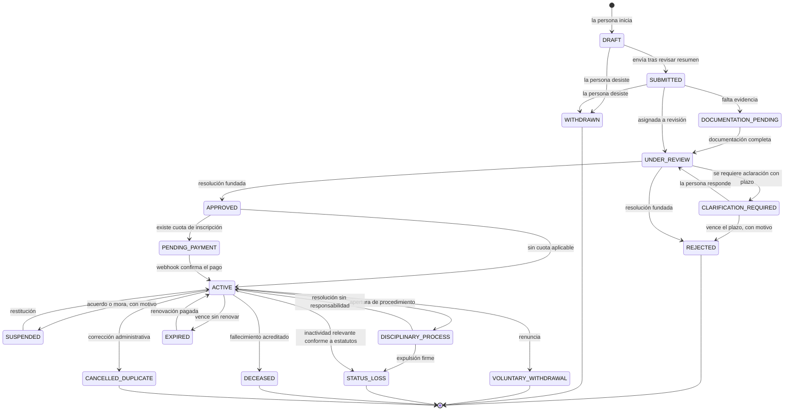

Correspondencia con los quince estados del PRD §3.6: borrador → `DRAFT`; enviada → `SUBMITTED`; documentación pendiente → `DOCUMENTATION_PENDING`; en revisión → `UNDER_REVIEW`; entrevista o aclaración requerida → `CLARIFICATION_REQUIRED`; aprobada → `APPROVED`; rechazada con motivo → `REJECTED`; activa → `ACTIVE`; suspendida → `SUSPENDED`; vencida → `EXPIRED`; en proceso disciplinario → `DISCIPLINARY_PROCESS`; baja voluntaria → `VOLUNTARY_WITHDRAWAL`; pérdida de calidad → `STATUS_LOSS`; fallecimiento → `DECEASED`; cancelada por duplicidad o error → `CANCELLED_DUPLICATE`. Se añaden `WITHDRAWN` (desistimiento antes de resolver) y `PENDING_PAYMENT` (resolución favorable con cobro pendiente), ambos necesarios para no fingir estados.

Toda transición exige motivo, actor y fecha, y produce una fila de `MembershipStatusEvent`. Las transiciones con efecto jurídico no son alcanzables mediante edición directa desde la interfaz.

### 16.2 Caso (PRD §10.2)

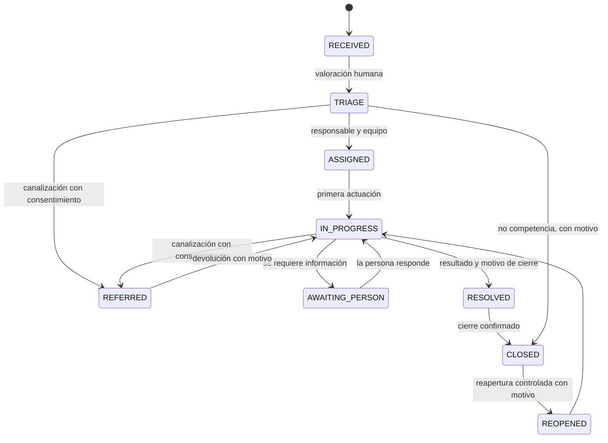

### 16.3 Pago (PRD §11.4)

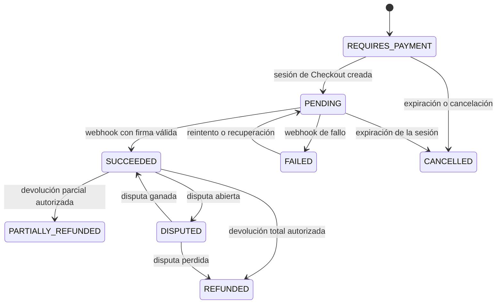

Ningún derecho se activa fuera de la transición a `SUCCEEDED` originada por un webhook verificado; el regreso del navegador solo muestra información.

### 16.4 Asamblea, votación y certificación CENI

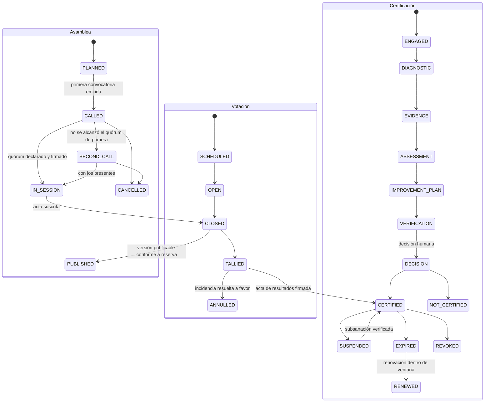

---

## 17. Datos semilla (no sensibles)

La semilla es idempotente, versionada y libre de datos personales reales (PRD §24 Fase 1).

**Lo que siembra hoy, en la Fase 1:** dos `LegalEntity`; el árbol `TerritorialUnit` nacional con entidades federativas; los 19 `Role` con su conjunto de `Permission`; el `NormativeRuleSet` inicial **en borrador**, con los valores que el PRD §9.3 y §9.4 enuncian de forma expresa y con la lista declarada de los que remite a los estatutos; las `RetentionPolicy` base; las `NotificationTemplate` de la fase; el `SpecialtyCatalog` inicial de oficios, profesiones y disciplinas clínicas; y las filas de `Actor` del Superadmin raíz, de migración y de cada tipo de trabajo programado.

**Lo que sembrará al habilitarse su módulo:** los `MembershipType` de agremiado y afiliación honoraria y las `ConsentVersion` iniciales por entidad, en la Fase 4; los `DocumentTemplate` mínimos, en la Fase 2; y las tres `ToolDefinition` —NeuroPlan, ADIA y NEXO—, en la Fase 7. Esta separación no es un detalle de redacción: la versión anterior de este apartado enumeraba todo junto como si ya existiera, y describía una semilla que el repositorio no tenía (`D-F1-018`).

La semilla **no** crea ninguna persona ni ninguna cuenta. Las personas de prueba solo existen en el entorno de pruebas, con datos manifiestamente ficticios.

---

## 18. Trazabilidad

| Requisito del PRD | Dónde se cumple |
|---|---|
| §3.1 Registro único de persona | §4 `Person`, `mergedIntoPersonId`; §5 relaciones sobre la misma persona |
| §3.3 Honorario sin derechos políticos | §5 `MembershipType` con invariante verificada en pruebas |
| §3.4 Beneficiario sin afiliación ni cuota | §5 `ProtectedBeneficiary` |
| §3.6 Estados de membresía | §16.1 con correspondencia uno a uno |
| §7.3 Directorio público revocable | §5 `DirectoryPreference` y `DirectoryPublication` |
| §7.4 QR sin datos personales | §5 `MemberCredential.publicCode`, `CredentialVerification` agregado |
| §9.4 Padrón congelado | §6 `AssemblyRosterSnapshot` inmutable con huella |
| §9.5 Secreto del voto | §6 `Ballot` sin identidad, §14 justificación |
| §11.2 Separación por entidad | `legalEntityId` en catálogo, pagos, libro auxiliar y patrimonio |
| §11.4 Webhooks como fuente de verdad | §8 `StripeWebhookEvent` persistido antes de procesar |
| §13.3 Notas clínicas restringidas | §11 `CianClinicalNote.visibility` y separación de expedientes |
| §15.3 Prompts administrables | §13 `AiPrompt` y `AiPromptVersion` |
| §17.4 Archivos privados con retención | §9 `FileObject`, `RetentionPolicy`, `LegalHold` |
| §18.11 Reglas del esquema | §3 y §15 |
| §20.4 Auditoría anexable | §13 `AuditEvent` encadenado |
