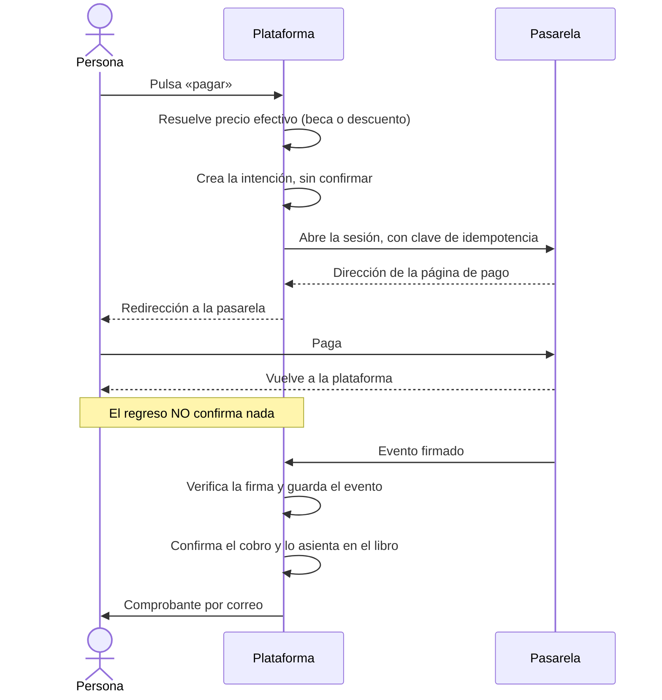

# Modelo financiero

> Cómo entra, se registra y sale el dinero en la plataforma. Contratado por el PRD §11 y §24 Fase 3. El modelo de datos entero vive en [`DATA_MODEL.md`](DATA_MODEL.md) §8; aquí se explica **cómo funciona** y, sobre todo, por qué funciona así.

---

## 1. La regla que ordena todo lo demás

**El webhook firmado es la única fuente de verdad del estado financiero** (PRD §11.4). No lo es el regreso del navegador, que cualquiera puede provocar sin haber pagado; ni la respuesta de la pasarela al abrir la sesión de cobro, que solo dice que la página se creó.

De ahí salen casi todas las demás decisiones de este módulo. Si el webhook manda, entonces:

- un cobro nace **sin confirmar** y ahí se queda hasta que llegue el evento (ADR-0053);
- el evento se guarda **íntegro antes de mirarlo**, para que un fallo del procesamiento no pierda lo que llegó;
- el procesamiento es idempotente, porque la pasarela reenvía;
- y un evento adelantado no es un error: se marca sin conciliar y se reintenta (ADR-0056).

---

## 2. El dinero como entero

Ningún importe de este sistema es de coma flotante. Todas las columnas de dinero son enteros en **unidades menores** —centavos— y de tipo `BigInt`.

`0.1 + 0.2` no es `0.3`. En una pantalla eso es una curiosidad; en un libro de cuentas es un descuadre que nadie sabe explicar seis meses después.

La conversión de «pesos con centavos» a centavos ocurre **en un solo sitio**: `platform/i18n`. Se hace con aritmética sobre cadenas, nunca multiplicando por cien (ADR-0049). El control `C-F3-04` comprueba que ninguna otra parte del código lo haga.

**El punto es siempre el separador decimal.** Es la convención de México, que es donde se captura. Leerlo alguna vez como separador de millares haría que «150.005» valiera ciento cincuenta mil cinco pesos: un error de mil veces, silencioso, en un cobro que sale de verdad.

---

## 3. Dos entidades, dos cuentas

Fuerza Índigo y Alianza Índigo son personas morales distintas. Cada una cobra por su cuenta, con su clave y su secreto de webhook, y **cada movimiento de dinero conserva a qué entidad pertenece** desde el primer día, aunque al principio se opere una sola cuenta (PRD §11.2).

Hay **una dirección de webhook por cuenta** y no una compartida. Con una sola habría que probar la firma contra los dos secretos para saber de quién viene el evento, y eso significa que un evento firmado por una entidad se aceptaría como si fuera de la otra.

La correspondencia entre entidad y cuenta vive en `platform/payments/accounts.ts`, en un solo sitio. Una entidad sin cuenta asignada devuelve nulo y el cobro no sale: si algún día se añade una tercera, quien la añada tiene que decidir de forma explícita a qué cuenta cobra.

---

## 4. El catálogo: qué se cobra y cuánto

Ningún precio vive en una pantalla. Se administran en el catálogo, y **un precio no se edita: se versiona** (ADR-0049). Añadir un precio cierra el anterior en el mismo instante en que empieza el nuevo, así que nunca hay dos vigencias solapadas y un pago de marzo sigue apuntando al precio de marzo.

Una cuota extraordinaria exige declarar de qué acuerdo de asamblea sale (PRD §9.4). Sin esa declaración, el concepto no se crea.

**La semilla no siembra ningún importe.** Una cuota sindical es una cantidad que acuerda la organización, y sembrar un número plausible sería el mismo error que inventar un valor estatutario (ADR-0040). Lo que sí siembra es la configuración de cobro de las dos entidades, que es estructura, y nace desactivada.

---

## 5. Cuánto paga de verdad una persona

Antes de mandar a nadie a pagar, `pricing.ts` resuelve el importe efectivo:

1. Si hay **beca** vigente para el programa del concepto, decide la beca.
2. Si no, se elige el **descuento más favorable** a la persona, no el primero que devuelva la consulta.
3. El importe nunca baja de cero.

Beca y descuento **no se acumulan** (ADR-0059): el motivo por el que alguien paga menos tiene que ser una sola cosa explicable.

Cuando el importe final es cero, no se manda a nadie a una página de pago de cero pesos: el cobro se registra como **exento** y no pasa por la pasarela.

---

## 6. El cobro, paso a paso

**Pulsar dos veces no abre dos cobros** (ADR-0054). Un segundo intento sobre el mismo concepto, dentro de dos horas y todavía sin pagar, reutiliza la intención con su misma clave de idempotencia, y la pasarela devuelve la sesión que ya existía.

---

## 7. Lo que se recibe fuera de la plataforma

Una transferencia o un efectivo entregado en una asamblea son pagos reales que ninguna pasarela vio. Sin esa puerta, quien pagó así no consta y el libro no cuadra nunca.

Es también la puerta más peligrosa del módulo, y por eso lleva **doble control de verdad** (ADR-0058):

- Registrar y aprobar son **dos permisos**, y en la semilla los tienen dos carteras distintas.
- Además, **quien aprueba no puede ser quien registró**. Los permisos por sí solos no bastan: un nombramiento puede acumularse, y con las dos carteras el control desaparecería sin que nadie tocara una línea.
- Hace falta **comprobante**. Un pago manual sin respaldo es una afirmación, no un pago.

Hasta que se aprueba, el pago está pendiente y **el dinero no cuenta**: no entra en ningún total ni en el libro.

Las devoluciones llevan el mismo doble control, por la misma razón: quien pide no aprueba.

---

## 8. El libro auxiliar

Es un catálogo auxiliar **interno**. No pretende ser un plan contable autorizado: la plataforma vincula comprobantes, no sustituye a un sistema contable (PRD §26).

**Un asiento no se edita ni se borra.** La migración de la fase le revocó a la aplicación `UPDATE` y `DELETE` sobre `ledger_entry`, y solo le devolvió la columna que lo enlaza con un corte de conciliación, que no altera el hecho asentado. No es una convención: es el motor, y hay pruebas que lo intentan y reciben `permission denied`.

**Una corrección es un asiento nuevo.** El de reversión apunta al original y lleva su motivo; los dos quedan a la vista. Un asiento no se puede revertir dos veces: la columna que apunta al original es única.

Todo lo que mueve dinero deja su asiento **en la misma transacción** que el hecho que lo origina —un cobro confirmado, un pago manual aprobado, una devolución ejecutada—, de modo que no puede existir un cobro sin su asiento ni al revés.

**Una exención no deja asiento** (ADR-0061): el libro registra movimientos de dinero, y ahí no se movió ninguno.

---

## 9. Conciliar

Un corte compara, por entidad y periodo, lo que el libro dice con lo que la pasarela confirmó. Lo que no cuadra **se nombra**, una excepción por cada cosa, con su referencia y su importe: nunca se redondea ni se esconde.

Un corte con diferencias **sí se puede cerrar** (ADR-0060). Obligar a cuadrar antes de cerrar empuja a inventar un ajuste que cuadre, y un libro con un ajuste inventado es peor que un corte cerrado que dice la verdad. Lo que se exige es que quien cierra escriba qué encontró.

Después de cerrar, un asiento de ese periodo ya no se revierte dentro de él: la corrección va al periodo abierto.

---

## 10. Patrimonio

El patrimonio de un sindicato es de sus agremiados, así que lo que hay que poder responder no es qué hay, sino **quién autorizó cada cambio**.

Transferir, asignar, disponer o dar de baja exigen las dos cosas: acuerdo declarado por escrito y documento que lo respalde. El alta de un bien es su primer movimiento, para que nunca tenga un momento del que nadie responde. Y los movimientos tampoco se editan ni se borran: lo impide el motor.

---

## 11. Rendir cuentas

Rendir cuentas es **un derecho de quien está afiliado**, no una concesión de la administración (ADR-0062). El reporte semestral lo alcanza cualquier persona agremiada: totales por cuenta, sin un solo dato de una persona identificable.

Informa además **cuánto se dejó de cobrar** (ADR-0063). Las becas no están en el libro porque no movieron dinero, pero callarlas daría una imagen de la organización más pobre y menos verdadera que la real.

Exportar el libro con su detalle es otra cosa y lleva otro permiso: sale del sistema en un archivo que ya nadie controla, así que el asiento de auditoría se escribe **antes** de entregarlo, y no hay dirección de descarga reutilizable.

---

## 12. Lo que esta fase deliberadamente no hace

No activa membresías ni derechos de servicio. El PRD §24 ordena resolver los pagos **antes** de conectar activaciones, y las membresías son de la Fase 4. El modelo deja preparadas las referencias —`Subscription.membershipId`, `Payment.appliesToKind`— sin escribirlas, de modo que la fase siguiente conecte sin reconstruir nada.
