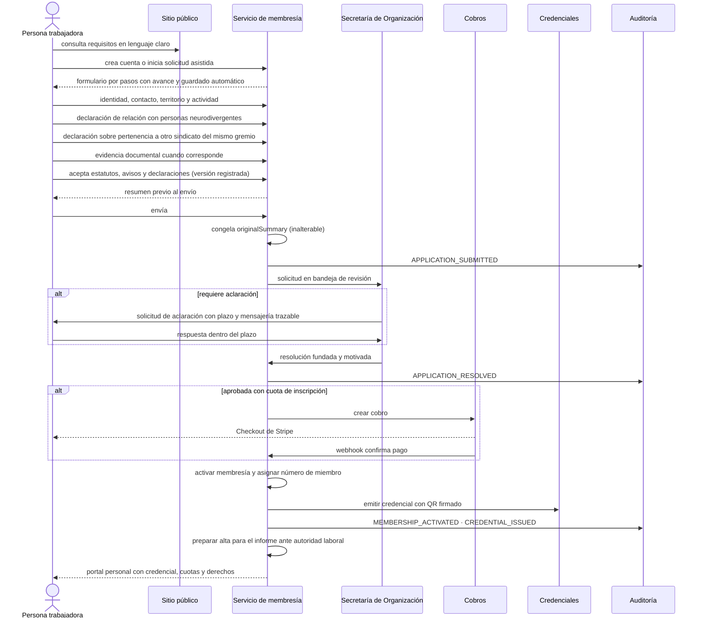
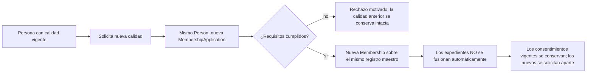
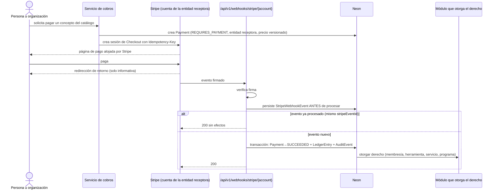
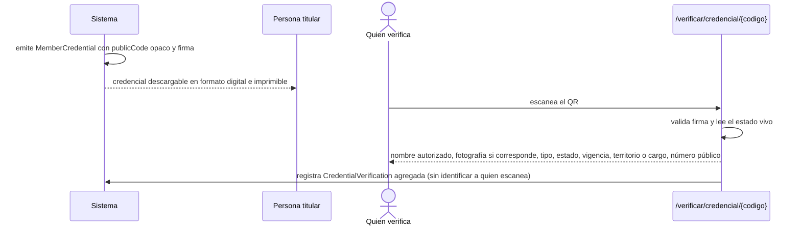
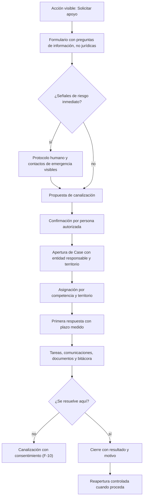
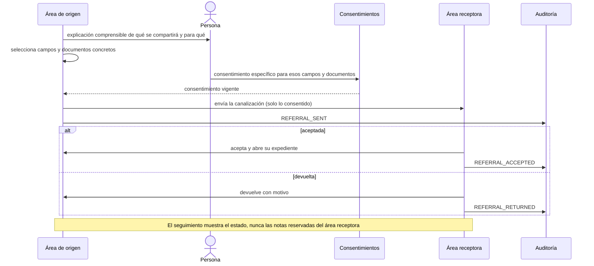
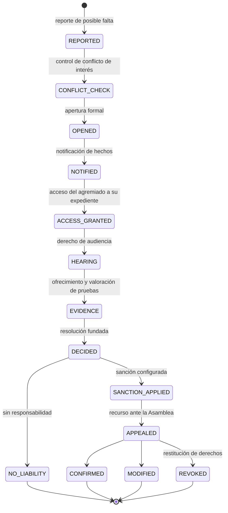
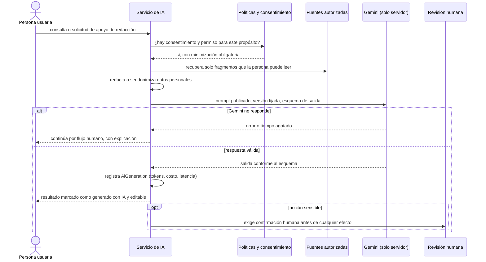

# Flujos funcionales

> Entregable de la **Fase 0** (PRD §24). Especifica los flujos normales, alternos, vacíos, de error, de autorización, de cancelación y de auditoría exigidos por el PRD §0.3 y §25. Cada flujo indica su fase propietaria y los eventos de auditoría que produce.

Convención de las tablas de cada flujo: **Camino** describe la desviación; **Comportamiento** describe lo que el sistema hace; ningún camino queda sin resolver.

---

## Índice

| Flujo | PRD | Fase |
|---|---|---|
| [F-01 Afiliación de agremiado](#f-01-afiliación-de-agremiado) | §8.1 | 4 |
| [F-02 Afiliación honoraria](#f-02-afiliación-honoraria) | §8.2 | 4 |
| [F-03 Alta de beneficiario protegido](#f-03-alta-de-beneficiario-protegido) | §8.3 | 4 |
| [F-04 Conversión de calidad sin duplicidad](#f-04-conversión-de-calidad-sin-duplicidad) | §8.4 | 4 |
| [F-05 Cobro con Stripe y activación por webhook](#f-05-cobro-con-stripe-y-activación-por-webhook) | §11.3, §11.4 | 3 |
| [F-06 Pago fallido, reintento y conciliación](#f-06-pago-fallido-reintento-y-conciliación) | §11.3, §11.4 | 3 |
| [F-07 Credencial y verificación pública](#f-07-credencial-y-verificación-pública) | §7.4 | 4 |
| [F-08 Directorio público: publicación y retiro](#f-08-directorio-público-publicación-y-retiro) | §7.3 | 4 |
| [F-09 Solicitar apoyo y apertura de caso](#f-09-solicitar-apoyo-y-apertura-de-caso) | §10.1, §10.2 | 6 |
| [F-10 Canalización entre entidades](#f-10-canalización-entre-entidades) | §10.4 | 6 |
| [F-11 Asamblea: convocatoria, quórum y acta](#f-11-asamblea-convocatoria-quórum-y-acta) | §9.4 | 5 |
| [F-12 Elección con voto secreto](#f-12-elección-con-voto-secreto) | §9.5 | 5 |
| [F-13 Consulta de contrato colectivo](#f-13-consulta-de-contrato-colectivo) | §9.6 | 5 |
| [F-14 Procedimiento disciplinario](#f-14-procedimiento-disciplinario) | §9.8 | 5 |
| [F-15 Acceso a herramientas y revocación](#f-15-acceso-a-herramientas-y-revocación) | §12 | 7 |
| [F-16 CIAN: admisión, plan y seguimiento](#f-16-cian-admisión-plan-y-seguimiento) | §13 | 8 |
| [F-17 CENI: contratación, certificado y renovación](#f-17-ceni-contratación-certificado-y-renovación) | §14 | 9 |
| [F-18 Asistencia con Gemini y revisión humana](#f-18-asistencia-con-gemini-y-revisión-humana) | §15 | 10 |
| [F-19 Eventos, asistencia y constancias](#f-19-eventos-asistencia-y-constancias) | §16.3 | 11 |
| [F-20 Retención, bloqueo legal y derechos de datos](#f-20-retención-bloqueo-legal-y-derechos-de-datos) | §20.3, §17.4 | 1 y 12 |

---

## F-01 Afiliación de agremiado

**Fase 4.** Implementa íntegramente los catorce pasos del PRD §8.1.



| Camino | Comportamiento |
|---|---|
| Borrador abandonado | Se guarda automáticamente; la persona retoma desde el mismo paso y ve cuánto falta. A los 90 días sin actividad se notifica; a los 180 se archiva conservando el borrador. |
| Documento ilegible o de tipo no admitido | Se rechaza el documento con explicación junto al campo; la solicitud sigue viva en `DOCUMENTATION_PENDING`. |
| Plazo de aclaración vencido | Transición automática a `REJECTED` con motivo `PLAZO_VENCIDO`, notificación previa a la persona y posibilidad de presentar una solicitud nueva. |
| Persona menor de quince años | El dominio impide continuar y ofrece la vía de beneficiario protegido o afiliación honoraria, explicando por qué. |
| Pertenencia declarada a otro sindicato del mismo gremio | La solicitud no se bloquea: se marca para revisión reforzada y exige aclaración documental antes de resolver. |
| Duplicidad detectada | Si el correo o los datos coinciden con una persona existente, se vincula al registro maestro; nunca se crea una persona nueva. |
| Pago no completado | La membresía permanece en `PENDING_PAYMENT`; el acceso a derechos sindicales no se abre. Un recordatorio programado avisa antes de expirar la sesión de cobro. |
| Rechazo | Se notifica con fundamento y motivo, se conserva el expediente y se informa la vía de reconsideración. |
| La persona cancela | Transición a `WITHDRAWN` con motivo; los documentos quedan sujetos a retención, no se borran de inmediato. |
| Revisor con conflicto de interés | El revisor puede excusarse; la solicitud se reasigna y ambos actos quedan auditados. |

**Auditoría:** `APPLICATION_SUBMITTED`, `APPLICATION_ASSIGNED`, `APPLICATION_INFORMATION_REQUESTED`, `APPLICATION_RESOLVED`, `PAYMENT_SUCCEEDED`, `MEMBERSHIP_ACTIVATED`, `CREDENTIAL_ISSUED`, `AUTHORITY_FILING_PREPARED`.

---

## F-02 Afiliación honoraria

**Fase 4.** Activa desde el lanzamiento (PRD §2.1).

1. La persona elige perfil: neurodivergente, familiar o cuidadora.
2. Se registra la persona y, cuando aplica, sus relaciones de cuidado con alcance, vigencia y consentimiento.
3. Elige tipo de membresía y ve con claridad qué incluye y qué **no** incluye.
4. Otorga los consentimientos aplicables, versionados.
5. Si la política lo exige, hay revisión institucional; si no, continúa.
6. Paga mediante Stripe cuando existe costo.
7. Se activa la membresía, se emite credencial **visualmente diferenciada** y se abren los beneficios.

| Camino | Comportamiento |
|---|---|
| Intento de acceder a votación o quórum | Denegado por dominio, no por interfaz: el afiliado honorario nunca aparece en `VoteEligibility` ni computa para el quórum. La pantalla explica la diferencia entre calidades sin lenguaje paternalista. |
| Familiar que registra a una persona menor de edad | Exige `MINOR_REPRESENTATION` con evidencia de la relación; la persona menor no es publicable en el directorio. |
| Membresía vencida | Pierde beneficios al vencer, conserva su historial y puede renovar; la credencial pasa a `EXPIRED` y el verificador lo refleja de inmediato. |
| Solicitud de convertirse en agremiado | Es un trámite **separado** (F-04), nunca una promoción automática. |

**Auditoría:** `HONORARY_APPLICATION_SUBMITTED`, `CONSENT_GRANTED`, `PAYMENT_SUCCEEDED`, `MEMBERSHIP_ACTIVATED`, `CREDENTIAL_ISSUED`.

---

## F-03 Alta de beneficiario protegido

**Fase 4.** Puede iniciarla la propia persona, un familiar o cuidador autorizado, un agremiado, un delegado, personal de Alianza Índigo, CIAN o una canalización externa (PRD §8.3).

El sistema registra origen, necesidad inicial, consentimiento, nivel de urgencia, territorio y entidad responsable. **La persona recibe apoyo sin pagar ni afiliarse.**

| Camino | Comportamiento |
|---|---|
| Persona sin correo ni dispositivo | Se registra sin cuenta digital; la comunicación se realiza por el medio declarado y queda registrada en el caso. |
| Persona menor de edad o que requiere representación | Exige persona responsable con relación acreditada; el registro nace con privacidad reforzada. |
| Urgencia declarada | Se muestra de inmediato el protocolo humano y los contactos de emergencia configurados. La plataforma **no** se presenta como servicio de emergencia ni la IA atiende la urgencia. |
| Quien registra no es la persona beneficiaria | Se distingue `registeredById` de `personId`; el consentimiento lo otorga quien tiene facultad para hacerlo. |
| Cierre | Requiere motivo; la persona conserva su registro y puede reabrir o solicitar apoyo nuevamente. |

**Auditoría:** `BENEFICIARY_REGISTERED`, `CONSENT_GRANTED`, `EMERGENCY_PROTOCOL_SHOWN`, `BENEFICIARY_CLOSED`.

---

## F-04 Conversión de calidad sin duplicidad

**Fase 4.** Una persona pasa de beneficiaria protegida a afiliada honoraria o a agremiada conservando registro, consentimientos vigentes, relaciones y expedientes permitidos (PRD §8.4).



**Regla dura:** la conversión no fusiona información reservada entre entidades ni entre módulos. Un expediente social no se vuelve visible para el área sindical por el hecho de que la persona se afilie.

---

## F-05 Cobro con Stripe y activación por webhook

**Fase 3.** El webhook es la única fuente de verdad del estado financiero (PRD §11.4).



| Camino | Comportamiento |
|---|---|
| La persona regresa del navegador antes del webhook | Se muestra "estamos confirmando tu pago" con actualización automática. **Ningún derecho se activa por la página de retorno.** |
| Webhook con firma inválida | Se rechaza con 400, se registra `WEBHOOK_SIGNATURE_INVALID` y no se persiste como evento válido. |
| Webhook repetido | La unicidad de `stripeEventId` lo vuelve inocuo; no duplica pagos, asientos ni membresías. |
| Webhook fuera de orden | El procesamiento es por estado final, no por secuencia de llegada; un evento antiguo no revierte uno más reciente. |
| Evento sin pago local correspondiente | Queda `UNRECONCILED` y genera alerta; nunca se descarta en silencio. |
| Falla la base al procesar | La transacción se revierte y el trabajo de reintento reprocesa desde el evento persistido. |
| Cuenta Stripe equivocada | La ruta incluye la cuenta; un evento de una cuenta no puede afectar registros de la otra entidad jurídica. |
| Pago manual | Lo registra Finanzas con evidencia adjunta y lo aprueba una segunda persona; sin doble control no produce activación. |

**Auditoría:** `PAYMENT_CREATED`, `PAYMENT_SUCCEEDED`, `PAYMENT_FAILED`, `ENTITLEMENT_GRANTED`, `LEDGER_ENTRY_CREATED`, `WEBHOOK_UNRECONCILED`.

---

## F-06 Pago fallido, reintento y conciliación

**Fase 3.**

1. Stripe informa el fallo; el `Payment` pasa a `FAILED` con `failureCode`.
2. La persona recibe una notificación con explicación comprensible y un enlace para reintentar; la suscripción entra en periodo de gracia configurable, sin cortar derechos de inmediato.
3. Stripe reintenta según su política; cada intento produce un evento persistido.
4. Si el pago prospera, el derecho se activa y el periodo de gracia se cierra.
5. Si se agota la recuperación, la suscripción pasa a `UNPAID`, el derecho se suspende con motivo y la persona conserva acceso a su historial y a sus datos.
6. La conciliación periódica compara el libro auxiliar con la cuenta de cada entidad y abre una `Reconciliation` con las diferencias.

| Camino | Comportamiento |
|---|---|
| Diferencia detectada en la conciliación | El corte queda `WITH_DIFFERENCES` con la lista de eventos sin pareja; no puede cerrarse hasta resolver o justificar cada uno con motivo. |
| Reembolso | Lo solicita una persona y lo aprueba otra distinta; genera asiento de reversión, nunca edición del asiento original. |
| Disputa | El pago pasa a `DISPUTED`, se congela el derecho asociado y se notifica a Finanzas; la resolución vuelve a `SUCCEEDED` o a `REFUNDED`. |
| Beca o exención total | Produce un `Payment` con método `EXEMPTION` e importe cero documentado, para que el libro auxiliar refleje el apoyo otorgado. |

---

## F-07 Credencial y verificación pública

**Fase 4.**



| Camino | Comportamiento |
|---|---|
| Credencial revocada hace un instante | El verificador muestra `REVOCADA` de inmediato: la consulta lee el estado vivo, sin caché que sobreviva a la revocación. |
| Código inexistente o alterado | Muestra "credencial no válida", sin revelar si el código existió alguna vez ni datos de nadie. |
| Credencial vencida | Muestra `VENCIDA` con la fecha de vigencia; no muestra datos adicionales. |
| Abuso automatizado del verificador | Límite de tasa por origen y detección de enumeración; la medición sigue siendo agregada y no construye perfiles de quien escanea. |
| Persona sin fotografía autorizada | Se muestra la credencial sin fotografía; nunca se sustituye por una imagen genérica que induzca a error. |

---

## F-08 Directorio público: publicación y retiro

**Fase 4.**

1. La persona elige entre no aparecer, aparecer con nombre y territorio, o mostrar perfil profesional; y decide por separado fotografía, contacto profesional e indexación por buscadores.
2. Al guardar, se registra el `Consent` con su versión y se crea la `DirectoryPublication` con **solo** los campos autorizados.
3. Al retirar la autorización, la publicación se marca retirada, la caché se invalida, la ruta deja de responder y se emite la señal de no indexación.

| Camino | Comportamiento |
|---|---|
| Persona beneficiaria protegida | No es publicable por omisión; requiere base y autorización específicas aprobadas institucionalmente. |
| Persona menor de edad | No puede publicarse sin base y autorización específicas; la interfaz lo explica y no ofrece la opción. |
| Baja de membresía con publicación vigente | La publicación se retira automáticamente al perder la calidad que la sustentaba. |
| Búsqueda sin resultados | Estado vacío que distingue "aún no hay personas publicadas" de "ningún resultado para estos filtros", con acción para limpiar filtros. |

---

## F-09 Solicitar apoyo y apertura de caso

**Fase 6.** Puerta única de ayuda (PRD §10.1).



**Regla dura:** la persona no necesita saber qué área le corresponde. La propuesta automática de canalización **nunca** sustituye la confirmación humana (PRD §24 Fase 6).

| Camino | Comportamiento |
|---|---|
| Solicitud sin cuenta | Se acepta con datos de contacto; si más adelante crea cuenta, la solicitud se vincula a su registro maestro. |
| Asunto fuera de competencia | Se cierra con motivo y se entrega orientación sobre la vía adecuada, sin dejar a la persona sin respuesta. |
| Solicitud duplicada | Se detecta por persona y ventana temporal; se vincula al caso vivo en lugar de abrir otro. |
| Sin personal disponible en el territorio | Escala al nivel superior conforme a la jerarquía territorial, con alerta y plazo. |
| Persona pide retirar su solicitud | Cierre con motivo `WITHDRAWN_BY_PERSON`; la evidencia queda bajo retención. |

---

## F-10 Canalización entre Fuerza Índigo y Alianza Índigo

**Fase 6.** Los seis requisitos del PRD §10.4 son obligatorios y verificados por el dominio.



| Camino | Comportamiento |
|---|---|
| Sin consentimiento | La canalización se queda en `AWAITING_CONSENT`. No existe forma de enviarla desde la interfaz ni desde la API. |
| Consentimiento revocado antes de aceptar | La canalización se cancela y se notifica a ambas áreas con el motivo. |
| Persona representada | El consentimiento lo otorga quien tiene la relación de representación vigente y acreditada. |
| Documento no incluido en la selección | No viaja. La selección es una lista blanca explícita, no un filtro por omisión. |

---

## F-11 Asamblea: convocatoria, quórum y acta

**Fase 5.**

1. La autoridad convocante emite la **primera convocatoria** con la anticipación mínima de la versión normativa vigente.
2. Se publica orden del día y documentos previos según el nivel de reserva.
3. Antes de la sesión se **congela el padrón** con las reglas de elegibilidad aplicadas y su huella verificable.
4. Se registra la asistencia (QR de credencial, manual o sesión remota) distinguiendo voz y voto.
5. El sistema **calcula** el quórum; una persona autorizada lo **declara y firma**.
6. Se delibera, se registran propuestas y se resuelven los puntos, con la mayoría exigida por cada tipo de punto.
7. Se levanta el acta, se anexan documentos y firmas, y se publica la versión que corresponda al nivel de reserva.
8. Los acuerdos quedan con responsable, plazo y estado de seguimiento.

| Camino | Comportamiento |
|---|---|
| No se alcanza el quórum de primera convocatoria | Se habilita la **segunda convocatoria**, que sesiona con los agremiados presentes conforme a la versión normativa. Ambas quedan registradas. |
| Padrón modificado después de la sesión | Imposible: el padrón congelado es inmutable y la asamblea concluida conserva el suyo. |
| Punto que exige mayoría calificada | El sistema exige el umbral de la versión normativa y no permite declarar aprobado un punto que no lo alcanza. |
| Asistencia registrada dos veces | Único `(assemblyId, membershipId)`; el segundo intento actualiza la hora de llegada, no duplica el conteo. |
| Asamblea cancelada | Requiere motivo y notificación; los documentos y convocatorias se conservan. |
| Acta con datos personales | La versión publicable excluye datos personales y anexos reservados; la íntegra queda con acceso restringido. |

---

## F-12 Elección con voto secreto

**Fase 5.** El diseño garantiza simultáneamente que se pruebe **quién tenía derecho y quién votó**, y que **nadie pueda saber qué votó cada quien**.

```mermaid
sequenceDiagram
    actor E as Persona electora
    participant AUTH as Elegibilidad
    participant BOX as Urna
    participant REC as Acuses
    participant TAL as Escrutinio

    E->>AUTH: solicita votar
    AUTH->>AUTH: verifica padrón congelado, membresía y pleno goce de derechos
    alt no elegible
        AUTH-->>E: motivo explicado (sin exponer datos de terceros)
    else elegible y sin voto previo
        AUTH->>AUTH: marca ballotIssuedAt y emite testigo ciego de un solo uso
        AUTH-->>E: boleta
        E->>BOX: emite el voto con el testigo
        BOX->>BOX: guarda Ballot SIN identidad, con hora truncada
        BOX->>AUTH: consume el testigo (transacción separada)
        BOX->>REC: acuse con código que prueba que votó, no qué votó
        REC-->>E: acuse descargable
    end
    TAL->>BOX: cierra la urna y cuenta
    TAL->>TAL: acta de resultados verificable
```

| Camino | Comportamiento |
|---|---|
| Intento de votar dos veces | El testigo ya consumido lo impide; se registra `SecurityEvent` y la persona ve que su voto ya fue emitido. |
| Afiliado honorario o beneficiario | Nunca aparece como elegible; el intento se deniega y se audita. |
| Persona con derechos suspendidos | No elegible, con motivo `SUSPENDED` visible solo para ella y para la Comisión Electoral. |
| Caída durante la emisión | El testigo no consumido permite reintentar; la boleta solo existe si la transacción de urna concluyó. |
| Solicitud de correlacionar persona y sentido | Imposible desde la interfaz y desde la base operativa: la tabla de boletas no contiene identidad, ni IP, ni agente de usuario, ni orden reconstruible. |
| Impugnación | Se registra como `ElectionIncident` con evidencia y resolución; puede anular el proceso mediante decisión humana, nunca automática. |

---

## F-13 Consulta de contrato colectivo

**Fase 5.** Expediente separado con padrón específico congelado (PRD §9.6).

1. Se abre el `BargainingFile` con su tipo y contraparte.
2. Se integra la comisión negociadora con nombramientos vigentes.
3. Se versionan las propuestas y sus documentos.
4. Se congela el padrón **específico** de agremiados afectados.
5. Se abre la consulta con voto personal, libre, secreto y directo (mismo mecanismo de F-12).
6. Se levanta acta y resultado.
7. Se registran emplazamiento, conciliación y, cuando corresponda, el procedimiento de huelga, siempre con el acuerdo de Asamblea y la mayoría aplicable adjuntos.

**Regla dura:** ningún expediente de huelga puede abrirse sin `enablingResolutionId`; ninguna automatización lo inicia. La plataforma apoya cálculos y conserva evidencia, pero **no declara** la validez jurídica de una consulta, contrato o huelga.

---

## F-14 Procedimiento disciplinario

**Fase 5.**



| Camino | Comportamiento |
|---|---|
| Instructor con conflicto de interés | El control lo detecta y exige sustitución antes de abrir; el intento queda registrado. |
| Falta de notificación o de audiencia | El dominio impide emitir resolución: sin `notifiedAt` y sin `hearingHeldAt` (o constancia de renuncia expresa a la audiencia) la transición a `DECIDED` no existe. |
| Expediente consultado por alguien no asignado | Denegado y auditado; el régimen disciplinario es siempre reservado. |
| Recurso presentado fuera de plazo | Se admite el registro con `INADMISSIBLE` y motivo; nunca se descarta sin dejar constancia. |
| Sugerencia de IA sobre culpabilidad | Prohibida por diseño: ningún prompt del catálogo puede producir recomendaciones de sanción o culpabilidad. |

---

## F-15 Acceso a herramientas y revocación

**Fase 7.**

1. El panel recomienda herramientas con base en perfil y necesidades **declaradas**, sin inferir ni exhibir diagnósticos.
2. La persona ve por qué tiene acceso, hasta cuándo y qué ocurrirá al terminar la vigencia.
3. Si la modalidad exige intercambio de identidad, se solicita consentimiento específico.
4. El lanzamiento emite un enlace firmado de corta duración y de un solo uso; no viajan datos sensibles en la URL.
5. Al vencer o revocarse el derecho, el acceso cesa; los datos se tratan conforme a la política de conservación, no se borran de inmediato.

| Camino | Comportamiento |
|---|---|
| Herramienta caída | El portal central sigue operando; la tarjeta muestra el estado operativo `DEGRADED` o `MAINTENANCE` y ofrece la vía de soporte. |
| Enlace expirado o reutilizado | Se rechaza y se registra `DENIED`; se ofrece generar uno nuevo. |
| Derecho revocado durante la sesión externa | El siguiente lanzamiento se deniega; la plataforma no puede cerrar sesiones dentro de la herramienta externa y lo indica con claridad. |
| Herramienta nueva | Se agrega por catálogo y configuración, sin tocar el núcleo de membresías. |

---

## F-16 CIAN: admisión, plan y seguimiento

**Fase 8.**

1. Admisión y entrevista inicial con consentimiento informado.
2. Valoración de necesidades **sin diagnóstico**.
3. Triage **humano** con prioridad y, en su caso, lista de espera.
4. Asignación profesional según disciplina, capacidad y modalidad.
5. Agenda y citas presenciales o remotas, con recordatorios.
6. Apertura del episodio y del expediente de atención.
7. Plan individual o familiar versionado, con objetivos, actividades y seguimiento.
8. Notas profesionales de acceso restringido.
9. Canalización a neurología u otra especialidad cuando se requiere evaluación diagnóstica.
10. Coordinación con familia o cuidadores **autorizados**.
11. Becas, pagos y comprobantes.
12. Derivación a NeuroPlan u otras herramientas cuando corresponde.
13. Encuestas de experiencia y resultados.
14. Cierre, alta o canalización externa.

| Camino | Comportamiento |
|---|---|
| Ausencia a la cita | Estado `NO_SHOW` con política de reprogramación; la lista de espera avanza. |
| Cancelación por el centro | Se notifica, se ofrece reprogramación prioritaria y se registra el motivo. |
| Traslape de agenda | Restricción de exclusión por profesional: la base impide dos citas superpuestas. |
| Familiar solicita el expediente | Accede exclusivamente a lo autorizado por el consentimiento; las notas clínicas no forman parte de lo autorizado por omisión. |
| Rol sindical intenta ver notas clínicas | Denegado por compartimento y auditado. |
| Persona sin capacidad de pago | Beca o programa gratuito; la afiliación **no** condiciona la atención urgente ni los programas gratuitos definidos. |
| Corrección de una nota | Se crea una nota nueva que referencia la anterior; el contenido original nunca se sobrescribe. |

---

## F-17 CENI: contratación, certificado y renovación

**Fase 9.** Los trece pasos del ciclo del PRD §14.3.

```mermaid
flowchart LR
    A["Prospección o solicitud"] --> B["Alta de organización y responsables"]
    B --> C["Selección de línea CENI"]
    C --> D["Contratación y pago"]
    D --> E["Diagnóstico inicial"]
    E --> F["Carga y validación de evidencias"]
    F --> G["Evaluación con instrumento versionado"]
    G --> H["Plan de mejora con responsables y fechas"]
    H --> I["Capacitación y acompañamiento"]
    I --> J["Verificación de cumplimiento"]
    J --> K["Decisión humana de certificación"]
    K --> L["Certificado y distintivo QR"]
    L --> M["Seguimiento y renovación"]
    M --> F
```



| Camino | Comportamiento |
|---|---|
| Evidencia insuficiente | Se solicita corrección con comentario del evaluador; la respuesta pasa a `CORRECTIONS_REQUESTED` sin perder lo cargado. |
| Intento de alterar una evaluación cerrada | Imposible: una reevaluación crea una respuesta nueva sobre la versión vigente y conserva la anterior con su evidencia. |
| Conflicto de interés del evaluador | Se declara y se reasigna; la decisión de certificación registra la declaración. |
| No certificación | Resultado fundado, plan de mejora vigente y posibilidad de reevaluar; la organización conserva su expediente. |
| Incumplimiento posterior | Suspensión del certificado con motivo; el verificador público lo refleja de inmediato. |
| Vencimiento | Estado `EXPIRED` y ventana de renovación configurada por programa. |
| Reporte agregado | Los datos individuales no se usan sin autorización y anonimización; los indicadores respetan umbrales de privacidad. |
| Certificación sugerida por IA | Prohibida: la decisión es humana y queda firmada por una persona identificada. |

---

## F-18 Asistencia con Gemini y revisión humana

**Fase 10.**



| Camino | Comportamiento |
|---|---|
| Documento con instrucciones incrustadas | El filtro las detecta, marca `injectionSuspected` y no ejecuta instrucciones provenientes del contenido. |
| Salida que no cumple el esquema | Se rechaza (`SCHEMA_REJECTED`) y no se muestra como resultado válido. |
| Límite de costo o de peticiones alcanzado | Se degrada al flujo humano con mensaje claro; nunca se bloquea el trámite. |
| Petición de una decisión reservada | Denegada por política: admisiones, sanciones, elegibilidad, votos, conflictos, representación, diagnósticos, certificación, pagos, accesos y publicación de datos personales son siempre humanos. |
| Fuente fuera del alcance del usuario | No se recupera; la separación de fuentes por permisos es parte del recuperador, no un filtro posterior. |

---

## F-19 Eventos, asistencia y constancias

**Fase 11.**

1. Publicación del evento con elegibilidad, capacidad y, si aplica, costo.
2. Registro con lista de espera cuando se agota el cupo.
3. Pago cuando corresponde (F-05).
4. Registro de asistencia.
5. Evaluación cuando el evento la contempla.
6. Emisión de constancia verificable con código QR.

| Camino | Comportamiento |
|---|---|
| Cupo agotado | Lista de espera con avance automático al liberarse un lugar y aviso a la persona. |
| Evento cancelado | Notificación, reembolso cuando hubo pago y conservación del registro histórico. |
| Constancia revocada | El verificador la muestra como revocada; la revocación exige motivo y queda auditada. |
| Persona no elegible | Se explica el requisito faltante sin exponer datos de terceros. |

---

## F-20 Retención, bloqueo legal y derechos de datos

**Fases 1 y 12.**

1. Cada objeto y expediente queda asociado a una `RetentionPolicy` con fundamento y acción al vencer.
2. Un trabajo programado identifica lo vencido y aplica anonimización, eliminación o archivo en frío.
3. Un `LegalHold` activo **suspende** cualquiera de esas acciones mientras esté vigente.
4. Las solicitudes de acceso, rectificación, cancelación u oposición entran por el canal de derechos de datos, se atienden con plazo y quedan auditadas.

| Camino | Comportamiento |
|---|---|
| Solicitud de cancelación sobre datos con obligación de conservar | Se explica la base de la conservación, se cancela lo cancelable y se registra la respuesta; nunca se ignora la solicitud. |
| Archivo referenciado por un expediente vivo | No se elimina; el trabajo detecta la referencia y pospone la acción con registro. |
| Bloqueo legal levantado | La retención se reanuda desde la fecha de levantamiento, no retroactivamente. |
| Persona fallecida | Se conservan padrón histórico, pagos, actos válidos y votos ya emitidos; se cierran accesos y se aplica la política de conservación (PRD §9.9). |

---

## Trazabilidad

| Requisito del PRD | Flujo |
|---|---|
| §8.1 Flujo de agremiado (14 pasos) | F-01 |
| §8.2 Afiliación honoraria | F-02 |
| §8.3 Beneficiario protegido | F-03 |
| §8.4 Conversión sin duplicidad | F-04 |
| §11.3 y §11.4 Cobro y webhooks | F-05, F-06 |
| §7.4 Credenciales QR | F-07 |
| §7.3 Directorio público | F-08 |
| §10.1 y §10.2 Entrada única y expediente | F-09 |
| §10.4 Canalización con consentimiento | F-10 |
| §9.4 Asambleas | F-11 |
| §9.5 Elecciones | F-12 |
| §9.6 Contratos colectivos | F-13 |
| §9.8 Régimen disciplinario | F-14 |
| §12 Herramientas | F-15 |
| §13 CIAN | F-16 |
| §14 CENI | F-17 |
| §15 Inteligencia artificial | F-18 |
| §16.3 Eventos y capacitación | F-19 |
| §9.9 y §20.3 Conservación y derechos | F-20 |
