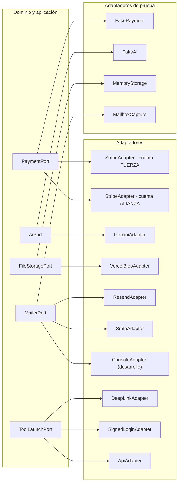

# Integraciones y contratos externos

> Entregable de la **Fase 0** (PRD §24). Contrata la integración con Stripe por entidad jurídica (PRD §11), Gemini (PRD §15), Vercel Blob (PRD §17.4), correo (PRD §16.2), las herramientas ADIA, NEXO y NeuroPlan (PRD §12), y los trabajos programados (PRD §17.5).

---

## 1. Principio: puertos y adaptadores

Ningún módulo de dominio conoce a un proveedor. Cada integración se expresa como un **puerto** (interfaz del dominio) con uno o más **adaptadores** (implementaciones). Esto hace posible tres cosas que el PRD exige: probar sin tocar el proveedor real (§22.1), degradar con dignidad cuando el proveedor falla (§15.5, §24 Fase 7) y sustituir un proveedor sin reescribir el núcleo.



Regla transversal: **ningún secreto vive en la base de datos**. Las claves están únicamente en variables de entorno; la tabla `IntegrationCredentialReference` guarda el *nombre* de la variable y una huella para detectar rotaciones, jamás el valor.

---

## 2. Stripe

### 2.1 Separación por entidad jurídica (PRD §11.2)

| Cuenta | Entidad receptora | Conceptos | Variables |
|---|---|---|---|
| `FUERZA` | Sindicato Fuerza Índigo | Cuota de inscripción, cuotas ordinarias y extraordinarias autorizadas, membresías sindicales | `STRIPE_FUERZA_SECRET_KEY`, `STRIPE_FUERZA_WEBHOOK_SECRET`, `NEXT_PUBLIC_STRIPE_FUERZA_PUBLISHABLE_KEY` |
| `ALIANZA` | Alianza Índigo Neurodivergente A.C. | Membresías honorarias con destino social, servicios CIAN, programas y certificaciones CENI, cursos, aportaciones | `STRIPE_ALIANZA_SECRET_KEY`, `STRIPE_ALIANZA_WEBHOOK_SECRET`, `NEXT_PUBLIC_STRIPE_ALIANZA_PUBLISHABLE_KEY` |

Cada cuenta tiene **su propio secreto de webhook** y su propia ruta: `/api/v1/webhooks/stripe/fuerza` y `/api/v1/webhooks/stripe/alianza`. Un evento de una cuenta no puede modificar registros atribuidos a la otra: el manejador compara la entidad receptora del `Payment` con la cuenta del evento y rechaza el cruce.

Si al inicio se opera una sola cuenta autorizada, el modelo ya guarda `legalEntityId` y `stripeAccountKey` en cada movimiento; la separación posterior es configuración, no reconstrucción del historial.

### 2.2 Catálogo (PRD §11.1)

Los precios **no** están codificados en el frontend. `CatalogProduct` y `CatalogPrice` son la fuente; los identificadores de Stripe se guardan como referencia. Al publicar un precio nuevo se crea una **versión**, nunca se edita la anterior: un pago histórico conserva el precio con el que se cobró.

Las cuotas extraordinarias exigen `requiresAuthorizingResolutionId`: sin acuerdo institucional adjunto, el producto no puede activarse.

### 2.3 Operaciones del puerto de pagos

```ts
interface PaymentPort {
  createCheckoutSession(input: {
    accountKey: 'FUERZA' | 'ALIANZA';
    priceRef: CatalogPriceRef;
    billingAccountRef: BillingAccountRef;
    idempotencyKey: string;
    successPath: string;      // Solo informativo: no activa derechos
    cancelPath: string;
    discountRef?: DiscountRef;
  }): Promise<{ sessionId: string; url: string }>;

  createCustomerPortalSession(input: { accountKey: AccountKey; customerRef: string; returnPath: string }): Promise<{ url: string }>;
  refund(input: { accountKey: AccountKey; paymentRef: string; amountMinor: bigint; reason: string; idempotencyKey: string }): Promise<RefundRef>;
  cancelSubscription(input: { accountKey: AccountKey; subscriptionRef: string; when: 'IMMEDIATE' | 'PERIOD_END' }): Promise<void>;
  verifyWebhookSignature(rawBody: string, signature: string, accountKey: AccountKey): WebhookVerification;
}
```

Funciones contratadas por el PRD §11.3 y su realización: Checkout alojado por Stripe; suscripciones recurrentes; pagos únicos; portal de cliente; cupones y precios especiales (`DiscountGrant`); periodos de gracia configurables (`Subscription.gracePeriodEndsAt`); reintentos y recuperación; cancelación inmediata o al final del periodo según el producto; reembolsos autorizados con doble control; comprobantes y facturas externas vinculables (`InvoiceReference`); conciliación (`Reconciliation`); becas y exenciones documentadas (`Scholarship`); y pagos manuales registrados por Finanzas con evidencia y aprobación de una segunda persona.

### 2.4 Webhooks (PRD §11.4)

Orden obligatorio del manejador:

1. Leer el cuerpo **crudo** y verificar la firma con el secreto de esa cuenta.
2. **Persistir** `StripeWebhookEvent` con el cuerpo íntegro, la cuenta y la versión de API, antes de cualquier procesamiento.
3. Responder 200 en cuanto el evento está persistido; el procesamiento posterior es idempotente y reintentable.
4. Procesar dentro de una transacción: actualizar `Payment`, escribir `LedgerEntry`, registrar auditoría y **publicar el evento de dominio en la bandeja de salida**. El derecho lo otorga el módulo correspondiente al recibir ese evento, de forma idempotente; `billing` no invoca a `membership`, `tools`, `cian` ni `ceni` (ver `ARCHITECTURE.md` §4.3 y ADR-0025).
5. Si el procesamiento falla, marcar `FAILED` y encolar el reintento; el evento persistido permite reprocesar sin depender de Stripe.

| Evento | Efecto |
|---|---|
| `checkout.session.completed` | Vincula la sesión con el `Payment` y espera la confirmación del cobro |
| `payment_intent.succeeded` | `Payment → SUCCEEDED`, asiento contable y publicación de `billing.payment.succeeded` en la bandeja de salida |
| `payment_intent.payment_failed` | `Payment → FAILED` con código, notificación y ruta de recuperación |
| `invoice.paid` | Renovación de suscripción y extensión de vigencia del derecho |
| `invoice.payment_failed` | Inicio del periodo de gracia y aviso comprensible |
| `customer.subscription.updated` / `.deleted` | Sincroniza estado, periodo y cancelación |
| `charge.refunded` | Registra `Refund` y el asiento de reversión |
| `charge.dispute.created` / `.closed` | `DISPUTED`, congelamiento del derecho y resolución |

Garantías verificadas por pruebas: firma inválida rechazada; evento repetido inocuo (unicidad de `stripeEventId`); evento fuera de orden no revierte un estado más reciente; evento sin pago local queda `UNRECONCILED` con alerta; ningún acceso se activa desde la página de retorno del navegador.

### 2.5 Conciliación y rendición de cuentas (PRD §11.5)

El libro auxiliar (`LedgerEntry`) es inmutable: una corrección es un asiento de reversión más uno nuevo, con motivo, actor, revisor y aprobador. Los cortes semestrales y los reportes se generan desde ese libro, por entidad jurídica, y quedan auditados al exportarse.

---

## 3. Gemini

### 3.1 Ejecución y configuración (PRD §15.1)

Único proveedor inicial de IA. Se integra mediante el SDK oficial de Google **ejecutado exclusivamente en servidor**. `GEMINI_API_KEY` nunca llega al navegador ni aparece en respuestas, registros o mensajes de error. El modelo por omisión y los límites viven en `GEMINI_DEFAULT_MODEL` y en `AiProviderConfiguration` (modelos permitidos, tokens por petición, peticiones por persona y día, costo mensual máximo).

### 3.2 Contrato del puerto

```ts
interface AiPort {
  generate(input: {
    promptCode: string;            // Resuelve a la versión PUBLISHED vigente
    variables: Record<string, string>;   // Solo las declaradas en allowedVariables
    sources?: KnowledgeSourceRef[];      // Filtradas por los permisos del actor
    outputSchema: ZodType<unknown>;      // La salida se valida antes de devolverse
    purpose: AiPurpose;
    actor: ActorContext;
  }): Promise<AiResult>;
}
```

Reglas de ejecución:

- El prompt **nunca** vive en el código: se resuelve desde `AiPromptVersion` con estado `PUBLISHED` (PRD §15.3). Publicar un prompt crítico exige revisión humana registrada.
- Solo se envían las variables declaradas; cualquier otra se descarta.
- Las fuentes se filtran por permisos **antes** de recuperar fragmentos: un fragmento nunca alcanza a quien no puede leer su origen.
- Se aplica minimización: redacción o seudonimización de datos personales antes de salir del servidor (PRD §15.5).
- La salida se valida contra el esquema; si no cumple, se rechaza como `SCHEMA_REJECTED` y no se presenta como resultado.
- Se registra `AiGeneration` con prompt, versión, modelo, persona, propósito, tokens, costo, latencia y resultado; nunca el contenido íntegro cuando incluye datos personales.
- Se activa el filtro contra **inyección de prompt** desde documentos: el contenido recuperado se trata como dato, jamás como instrucción.
- Se solicita, cuando el proveedor lo permite, la exclusión del uso de la información para entrenamiento externo.

### 3.3 Límites de decisión (PRD §15.4)

La IA **no** decide: admisión o rechazo de afiliaciones; suspensión o expulsión; elegibilidad electoral definitiva; sentido o validez de un voto; resolución de conflictos; otorgamiento de representación legal; diagnóstico médico o psicológico; certificación CENI; autorización de pagos o reembolsos; acceso a expedientes; publicación de datos personales. Estas acciones están en la lista `AI_FORBIDDEN_EFFECTS` y el servicio las rechaza aunque un prompt lo pida.

### 3.4 Degradación

Si Gemini no responde, agota el tiempo o supera un límite, la aplicación **continúa** por el flujo humano equivalente, con un mensaje que explica la situación sin culpar a la persona. Ninguna función esencial —afiliarse, pedir apoyo, pagar, votar, agendar— depende de la disponibilidad del modelo.

---

## 4. Vercel Blob

```ts
interface FileStoragePort {
  put(input: { logicalPath: string; body: ReadableStream; contentType: string; access: 'private' }): Promise<StoredRef>;
  createReadUrl(input: { ref: StoredRef; ttlSeconds: number }): Promise<string>;
  delete(ref: StoredRef): Promise<void>;
  head(ref: StoredRef): Promise<StoredMeta>;
}
```

- Todos los objetos se escriben con acceso **privado**. No existe un almacén público salvo recursos institucionales explícitamente marcados como públicos en el CMS.
- La ruta lógica es opaca y no deriva del nombre original del archivo.
- Las descargas pasan siempre por una ruta autenticada de la aplicación que reevalúa la política; la URL temporal se emite con vigencia corta y proporcional a la clasificación del archivo.
- Antes de almacenar se valida el tipo real del contenido, no solo la extensión ni la cabecera declarada, y se calcula el hash SHA-256.
- La eliminación verifica retención, bloqueo legal y referencias vivas.

| Clasificación | Vigencia de la URL | Vista previa en navegador | Motivo obligatorio |
|---|---|---|---|
| `PUBLIC` | 24 h | Sí | No |
| `INTERNAL` | 15 min | Sí | No |
| `RESTRICTED` | 5 min | Sí | No |
| `SENSITIVE_PERSONAL` | 2 min | No, descarga directa | Sí |
| `CLINICAL` | 2 min | No | Sí |
| `LEGAL_PRIVILEGED` | 2 min | No | Sí |

---

## 5. Correo transaccional

```ts
interface MailerPort {
  send(input: {
    to: string; templateCode: string; templateVersion: number;
    variables: Record<string, string>; locale: string;
    category: NotificationCategory; correlationId: string;
  }): Promise<{ providerMessageId: string | null }>;
}
```

Adaptadores: `resend` (producción), `smtp` (alternativa institucional) y `console` (desarrollo y pruebas, sin salida real). El adaptador se selecciona con `EMAIL_PROVIDER`; el remitente con `EMAIL_FROM` y la clave con `EMAIL_API_KEY`.

- Todo mensaje parte de una `NotificationTemplate` **versionada**; no existen textos incrustados en el código.
- Cada intento registra `DeliveryAttempt` con estado, error y siguiente reintento.
- Los rebotes marcan la dirección y disparan una vía alterna de contacto.
- Las comunicaciones obligatorias de gobierno sindical **no** se suprimen por preferencias promocionales.
- La arquitectura queda preparada para WhatsApp o SMS agregando un adaptador al mismo puerto, sin asumirlos como requisito inicial.

---

## 6. Herramientas tecnológicas

### 6.1 Modalidades (PRD §12.2)

| Modalidad | Cuándo se usa | Mecánica |
|---|---|---|
| `NATIVE_MODULE` | La herramienta vive dentro de la plataforma | Módulo propio; sin intercambio externo |
| `AUTHENTICATED_DEEP_LINK` | La herramienta tiene su propia sesión | Enlace a una ruta que exige autenticación en destino; sin datos en la URL |
| `SIGNED_SHORT_LIVED_LOGIN` | La herramienta acepta identidad delegada | Token firmado de corta duración y un solo uso, con `jti` registrado |
| `API_INTEGRATION` | Intercambio servidor a servidor | Credenciales por entorno, firma y `IntegrationEvent` |
| `EXTERNAL_NO_IDENTITY` | Recurso externo abierto | Enlace simple; no se comparte identidad |

**Prohibiciones:** iframes inseguros y datos sensibles en parámetros de URL.

### 6.2 Token de lanzamiento firmado

Contenido mínimo, sin datos personales más allá de lo indispensable: `iss` (la plataforma), `aud` (código de la herramienta), `sub` (identificador opaco de la persona, no su correo), `jti` (único, registrado en `ToolLaunch`), `entitlement` (código del derecho), `exp` (≤ 120 segundos) y `scope`. Se firma con `AUTH_SECRET` derivado por herramienta. El consumo marca `consumedAt`; un `jti` reutilizado se rechaza y se audita.

### 6.3 Herramientas iniciales

| Herramienta | Entidad responsable | Modalidad prevista | Origen típico del derecho |
|---|---|---|---|
| NeuroPlan | Alianza Índigo | `SIGNED_SHORT_LIVED_LOGIN` | Asignación CIAN, beca o membresía honoraria |
| ADIA | Alianza Índigo | `AUTHENTICATED_DEEP_LINK` | Beneficio sindical o programa social |
| NEXO | Fuerza Índigo | `API_INTEGRATION` | Membresía sindical activa |

La modalidad y la URL son configuración, no código: agregar una herramienta es un alta de catálogo (PRD §24 Fase 7).

---

## 7. Trabajos programados (Vercel Cron)

Las rutas viven bajo `/api/v1/cron/*` y exigen `CRON_SECRET` comparado en tiempo constante. Cada ruta solo **despacha**: toma un lote de `BackgroundJob` con bloqueo y ejecuta con clave de idempotencia.

| Trabajo | Frecuencia prevista | Qué hace |
|---|---|---|
| `reminders` | Cada hora | Recordatorios de citas, plazos de aclaración, cuotas y vencimientos |
| `renewals` | Diaria | Renovaciones de membresías, herramientas y certificados CENI |
| `payment-reconciliation` | Diaria | Cotejo del libro auxiliar contra cada cuenta de Stripe |
| `webhook-retry` | Cada 15 minutos | Reprocesa eventos persistidos con estado `FAILED` |
| `credential-expiry` | Diaria | Marca credenciales vencidas y notifica antes del vencimiento |
| `role-expiry` | Diaria | Revoca asignaciones cuyo nombramiento concluyó |
| `clarification-due` | Diaria | Recuerda, **una sola vez**, un plazo de aclaración vencido. No rechaza, no cierra y no resuelve: un plazo vencido hace visible una situación, no decide sobre nadie (ADR-0080) |
| `retention` | Diaria | Aplica políticas de conservación respetando bloqueos legales |
| `document-generation` | Cada 15 minutos | Genera documentos diferidos |
| `integration-health` | Cada hora | Verifica base de datos, Blob, Stripe por cuenta y disponibilidad de Gemini |
| `metrics-rollup` | Diaria | Recalcula indicadores agregados con umbrales de privacidad |

Cada trabajo tiene bloqueo, intentos, próxima ejecución, error, resultado y alerta al agotar reintentos (PRD §17.5).

---

## 8. Verificación pública

| Contrato | Entrada | Salida | Protección |
|---|---|---|---|
| `/api/v1/verify/credentials/{codigo}` | Código opaco firmado | Nombre autorizado, fotografía si corresponde, tipo, estado, vigencia, territorio o cargo, número público | Límite de tasa, respuesta uniforme para código inexistente o inválido, registro agregado sin identificar a quien consulta |
| `/api/v1/verify/ceni/{codigo}` | Código opaco firmado | Organización, línea, nivel, alcance, emisión, vigencia y estado (vigente, suspendido, vencido o revocado) | Igual que el anterior |

La verificación lee siempre el **estado vivo**: una revocación surte efecto de inmediato y ninguna caché la sobrevive.

---

## 9. Matriz de secretos

| Variable | Proveedor | Ámbito | Rotación |
|---|---|---|---|
| `AUTH_SECRET` | Interno | Servidor | Manual, con invalidación de sesiones |
| `DATABASE_URL` / `DIRECT_URL` | Neon | Servidor | Por proveedor |
| `BLOB_READ_WRITE_TOKEN` | Vercel Blob | Servidor | Por proveedor |
| `FILE_URL_SIGNING_SECRET` | Interno | Servidor | Manual; invalida las URL en vuelo |
| `STRIPE_*_SECRET_KEY` | Stripe | Servidor | Por proveedor, con periodo de solapamiento |
| `STRIPE_*_WEBHOOK_SECRET` | Stripe | Servidor | Por endpoint |
| `NEXT_PUBLIC_STRIPE_*_PUBLISHABLE_KEY` | Stripe | Navegador | Valor público por diseño |
| `GEMINI_API_KEY` | Google | Servidor | Por proveedor |
| `EMAIL_API_KEY` | Correo | Servidor | Por proveedor |
| `CRON_SECRET` | Interno | Servidor | Manual |
| `QR_SIGNING_SECRET` | Interno | Servidor | Manual; requiere reemisión planificada de credenciales |
| `SUPERADMIN_PASSWORD_HASH` | Interno | Servidor | Manual, con `SUPERADMIN_SESSION_VERSION` |

Ningún secreto lleva prefijo público. La ausencia de una variable obligatoria produce un error de arranque comprensible que **no** revela el valor esperado (PRD §21).

---

## 10. Trazabilidad

| Requisito del PRD | Sección |
|---|---|
| §11.1 Catálogo versionado | §2.2 |
| §11.2 Separación por entidad | §2.1 |
| §11.3 Funciones de cobro | §2.3 |
| §11.4 Webhooks idempotentes | §2.4 |
| §11.5 Rendición de cuentas | §2.5 |
| §12.2 Modalidades de integración | §6.1, §6.2 |
| §12.3 Derechos de acceso | §6.3 y `DATA_MODEL.md` §10 |
| §15.1 Proveedor y ejecución en servidor | §3.1 |
| §15.3 Prompts administrables | §3.2 |
| §15.4 Límites de decisión | §3.3 |
| §15.5 Privacidad y trazabilidad | §3.2, §3.4 |
| §16.2 Notificaciones | §5 |
| §17.4 Archivos | §4 |
| §17.5 Trabajos asíncronos | §7 |
| §21 Variables de entorno | §9 y `ENVIRONMENT.md` |
