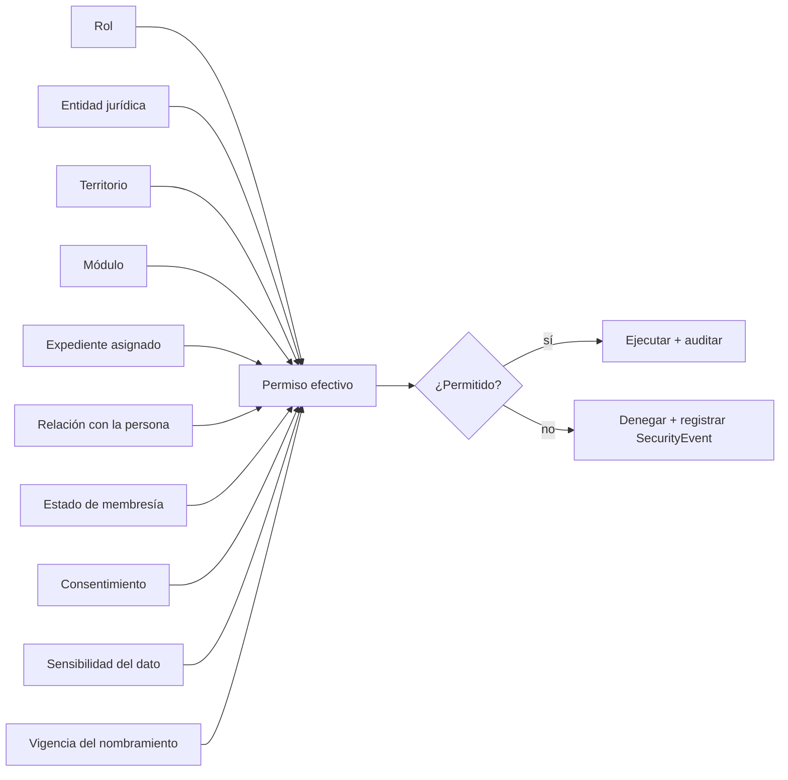

# Roles, atributos, permisos y consentimientos

> Entregable de la **Fase 0** (PRD §24). Define el modelo de control de acceso por roles y atributos exigido por el PRD §4, el catálogo de permisos, la matriz de roles, los alcances de aislamiento y el mapa de consentimientos del PRD §7.3, §10.4 y §15.5.

---

## 1. Principio de acceso

El permiso efectivo **nunca** depende solo del rol. Se calcula combinando (PRD §4.1):



Tres reglas absolutas:

1. **Ningún acceso transversal por pertenencia.** Trabajar en una entidad del ecosistema no concede acceso a sus expedientes; el acceso se concede por función, territorio, expediente y necesidad legítima (PRD §2.3).
2. **Ocultar un botón no es seguridad.** La política se evalúa en el servidor en cada lectura, mutación, descarga y generación, y limita filas y campos **antes** de devolver resultados (PRD §20.2).
3. **El nombre del cargo no concede acceso.** Cada facultad estatutaria se traduce en permisos concretos vinculados a un nombramiento vigente (PRD §9.2, §4.3).

---

## 2. Roles base (PRD §4.2)

| Código | Rol | Alcance | Origen del otorgamiento | Vigencia |
|---|---|---|---|---|
| `PUBLIC` | Público | Contenido público, directorio autorizado y verificación QR mínima | Implícito, sin sesión | Permanente |
| `APPLICANT` | Solicitante | Sus propias solicitudes | Automático al iniciar una solicitud | Mientras exista la solicitud |
| `PROTECTED_BENEFICIARY` | Beneficiario protegido | Sus servicios, solicitudes y expedientes autorizados | Automático al registrar la calidad | Mientras la calidad esté vigente |
| `HONORARY_AFFILIATE` | Afiliado honorario | Membresía, beneficios, herramientas y comunidad **sin derechos electorales** | Automático al activar la membresía | Vigencia de la membresía |
| `UNION_MEMBER` | Agremiado | Derechos sindicales, votación, directorio interno, cuotas y representación | Automático al activar la membresía sindical | Vigencia y pleno goce de derechos |
| `TERRITORIAL_DELEGATE` | Delegado o representante territorial | Su territorio y funciones delegadas | `OfficeTerm` + `RoleAssignment` con `TerritorialScope` | Periodo del nombramiento |
| `EXECUTIVE_SECRETARY` | Secretaría del Comité Ejecutivo | Facultades de su cartera | `OfficeTerm` de la cartera correspondiente | Periodo del nombramiento |
| `OVERSIGHT_COMMISSION` | Comisión de Vigilancia y Fiscalización | Revisión financiera y de administración, sin facultades operativas incompatibles | `OfficeTerm` | Periodo del nombramiento |
| `ELECTORAL_COMMISSION` | Comisión Electoral | Proceso electoral y padrón de electores | `OfficeTerm` temporal | Duración del proceso |
| `SOCIAL_STAFF` | Personal social de Alianza Índigo | Casos sociales asignados y programas autorizados | `RoleAssignment` administrativo | Mientras dure la designación |
| `CIAN_PROFESSIONAL` | Profesional CIAN | Agenda, expediente y plan de casos **asignados** | `RoleAssignment` + `CianProfessional` activo | Mientras esté activo |
| `CIAN_COORDINATION` | Coordinación CIAN | Operación, asignación, calidad y seguimiento de CIAN | `RoleAssignment` administrativo | Mientras dure la designación |
| `CENI_ORG_USER` | Usuario de organización CENI | Expediente y actividades de **su** organización | `OrganizationUser` | Mientras la autorización siga vigente |
| `CENI_ASSESSOR` | Evaluador CENI | Evaluaciones y evidencias expresamente asignadas | `RoleAssignment` + asignación en `CeniEngagement` | Por evaluación |
| `CENI_COORDINATION` | Coordinación CENI | Operación completa del programa CENI | `RoleAssignment` administrativo | Mientras dure la designación |
| `FINANCE` | Finanzas | Catálogo, conciliación, reportes y comprobantes **de su entidad jurídica** | `OfficeTerm` de Finanzas o `RoleAssignment` | Periodo o designación |
| `COMMUNICATIONS` | Contenidos y comunicación | CMS, eventos y comunicaciones autorizadas | `OfficeTerm` de Prensa o `RoleAssignment` | Periodo o designación |
| `AUDITOR` | Auditor | Lectura de evidencia y bitácoras dentro de un alcance definido | `RoleAssignment` con alcance explícito y temporal | Temporal, siempre acotada |
| `SUPERADMIN` | Superadmin | Configuración técnica integral **sin derechos sindicales** | Variables de entorno, no base de datos | Sesión corta y revocable |

Una persona acumula roles: un agremiado puede ser además delegado, profesional CIAN y responsable de una organización CENI. Los permisos se **suman**, pero cada uno conserva su alcance; ninguno amplía el alcance de otro.

---

## 3. Catálogo de permisos

Formato del código: `modulo.recurso.accion`. Cada permiso declara su sensibilidad y si exige motivo capturado por la persona.

| Módulo | Permisos | Sensibilidad |
|---|---|---|
| `identity` | `person.read`, `person.update`, `person.merge`, `person.read_sensitive` | Normal · Crítica en `merge` y `read_sensitive` |
| `access` | `role.assign`, `role.revoke`, `permission.read`, `session.revoke_other` | Crítica |
| `membership` | `application.create`, `application.read`, `application.review`, `application.resolve`, `membership.read`, `membership.suspend`, `membership.terminate`, `roster.export` | Sensible · Crítica en `resolve`, `terminate`, `roster.export` (exige motivo) |
| `beneficiary` | `beneficiary.create`, `beneficiary.read`, `beneficiary.update`, `beneficiary.close` | Sensible |
| `directory` | `directory.read_internal`, `directory.publish`, `directory.withdraw`, `directory.export` | Sensible · `export` exige motivo |
| `credentialing` | `credential.issue`, `credential.revoke`, `credential.read` | Crítica en `issue` y `revoke` |
| `territory` | `unit.create`, `unit.update`, `unit.dissolve`, `unit.read` | Normal · Crítica en `dissolve` |
| `governance` | `body.manage`, `office.appoint`, `office.end`, `power.grant`, `power.revoke` | Crítica |
| `assembly` | `assembly.convene`, `assembly.freeze_roster`, `attendance.register`, `quorum.declare`, `resolution.record`, `minutes.publish` | Crítica en `freeze_roster`, `quorum.declare`, `minutes.publish` |
| `voting` | `vote.process_manage`, `vote.cast`, `vote.tally`, `vote.certify` | Crítica |
| `election` | `election.manage`, `slate.validate`, `incident.resolve`, `roster.publish` | Crítica |
| `bargaining` | `file.manage`, `consultation.open`, `strike.file_open` | Crítica; `strike.file_open` exige acuerdo humano adjunto |
| `discipline` | `case.open`, `case.read`, `evidence.manage`, `decision.issue`, `appeal.resolve` | Crítica; siempre reservado |
| `support` | `request.create`, `request.read`, `request.triage`, `request.route` | Sensible |
| `cases` | `case.read`, `case.assign`, `case.update`, `case.message`, `case.close`, `case.reopen`, `case.refer`, `case.read_reserved_notes`, `case.export` | Sensible · Crítica en `read_reserved_notes` y `export` (exigen motivo) |
| `cian` | `intake.read`, `intake.triage`, `appointment.manage`, `episode.read`, `careplan.manage`, `clinicalnote.read`, `clinicalnote.write`, `outcome.read` | Crítica en todo lo clínico |
| `billing` | `catalog.manage`, `payment.read`, `payment.register_manual`, `payment.approve_manual`, `refund.request`, `refund.approve`, `ledger.read`, `ledger.adjust`, `reconciliation.close`, `asset.manage`, `report.export`, `accountability.read` | Crítica; ajustes y exportaciones exigen motivo. `accountability.read` es Normal |
| `tools` | `tool.manage`, `entitlement.grant`, `entitlement.revoke`, `tool.launch` | Sensible |
| `ceni` | `organization.manage`, `engagement.manage`, `assessment.respond`, `assessment.review`, `finding.manage`, `plan.manage`, `certification.decide`, `certificate.revoke` | Crítica en `certification.decide` y `certificate.revoke` |
| `content` | `page.create`, `page.review`, `page.publish`, `page.archive`, `redirect.manage` | Normal · Sensible en `publish` |
| `events` | `event.manage`, `registration.read`, `attendance.register`, `constancy.issue`, `constancy.revoke` | Normal |
| `notifications` | `template.manage`, `campaign.send`, `notification.read_own` | Sensible en `campaign.send` |
| `ai` | `prompt.read`, `prompt.edit`, `prompt.publish`, `generation.read`, `generation.review`, `provider.configure` | Crítica en `prompt.publish` y `provider.configure` |
| `files` | `file.upload`, `file.download`, `file.download_own`, `file.download_sensitive`, `file.delete`, `retention.manage`, `legalhold.manage` | Crítica; `download_sensitive` exige motivo. `download_own` es la `O` de la matriz: lo cubre la titularidad, no una asignación de expediente, y no exige motivo —nadie justifica abrir su propio expediente— |
| `audit` | `audit.read`, `security.read`, `audit.export` | Crítica; `export` exige motivo |
| `system` | `module.configure`, `job.manage`, `webhook.replay`, `health.read`, `integration.configure` | Crítica |

---

## 4. Matriz de roles y permisos

`P` = permitido dentro de su alcance · `A` = permitido solo sobre recursos **asignados** · `O` = permitido solo sobre lo **propio** · `L` = solo lectura · `—` = denegado.

| Permiso | PUBLIC | APPLICANT | PROTECTED_BENEFICIARY | HONORARY_AFFILIATE | UNION_MEMBER | TERRITORIAL_DELEGATE | EXECUTIVE_SECRETARY | OVERSIGHT_COMMISSION | ELECTORAL_COMMISSION | SOCIAL_STAFF | CIAN_PROFESSIONAL | CIAN_COORDINATION | CENI_ORG_USER | CENI_ASSESSOR | CENI_COORDINATION | FINANCE | COMMUNICATIONS | AUDITOR | SUPERADMIN |
|---|---|---|---|---|---|---|---|---|---|---|---|---|---|---|---|---|---|---|---|
| `person.read` | — | O | O | O | O | P | P | L | L | A | A | P | — | — | — | L | — | L | P |
| `person.read_sensitive` | — | — | O | O | O | — | P | — | — | A | A | P | — | — | — | — | — | L | — |
| `application.create` | — | O | O | O | O | P | P | — | — | P | — | — | — | — | — | — | — | — | — |
| `application.review` | — | — | — | — | — | P | P | — | — | — | — | — | — | — | — | — | — | L | — |
| `application.resolve` | — | — | — | — | — | — | P | — | — | — | — | — | — | — | — | — | — | — | — |
| `membership.read` | — | O | O | O | O | P | P | L | L | — | — | — | — | — | — | L | — | L | P |
| `membership.suspend` | — | — | — | — | — | — | P | — | — | — | — | — | — | — | — | — | — | — | — |
| `roster.export` | — | — | — | — | — | P | P | L | P | — | — | — | — | — | — | — | — | L | — |
| `beneficiary.create` | — | O | O | O | P | P | P | — | — | P | P | P | — | — | — | — | — | — | — |
| `beneficiary.read` | — | — | O | — | — | A | P | — | — | A | A | P | — | — | — | — | — | L | — |
| `directory.read_internal` | — | — | — | — | P | P | P | L | L | — | — | — | — | — | — | — | — | L | — |
| `directory.publish` | — | — | — | O | O | — | P | — | — | — | — | — | — | — | — | — | P | — | — |
| `credential.issue` | — | — | — | — | — | — | P | — | — | — | — | — | — | — | — | — | — | — | — |
| `credential.revoke` | — | — | — | — | — | — | P | — | — | — | — | — | — | — | — | — | — | — | — |
| `unit.create` | — | — | — | — | — | — | P | — | — | — | — | — | — | — | — | — | — | — | — |
| `office.appoint` | — | — | — | — | — | — | P | — | — | — | — | — | — | — | — | — | — | — | — |
| `assembly.convene` | — | — | — | — | — | P | P | P | — | — | — | — | — | — | — | — | — | — | — |
| `assembly.freeze_roster` | — | — | — | — | — | — | P | — | P | — | — | — | — | — | — | — | — | — | — |
| `quorum.declare` | — | — | — | — | — | P | P | — | — | — | — | — | — | — | — | — | — | — | — |
| `vote.cast` | — | — | — | — | O | O | O | O | — | — | — | — | — | — | — | — | — | — | — |
| `vote.tally` | — | — | — | — | — | — | — | L | P | — | — | — | — | — | — | — | — | L | — |
| `vote.certify` | — | — | — | — | — | — | — | — | P | — | — | — | — | — | — | — | — | — | — |
| `election.manage` | — | — | — | — | — | — | — | — | P | — | — | — | — | — | — | — | — | — | — |
| `slate.validate` | — | — | — | — | — | — | — | — | P | — | — | — | — | — | — | — | — | — | — |
| `file.manage` (bargaining) | — | — | — | — | — | — | P | L | — | — | — | — | — | — | — | — | — | L | — |
| `strike.file_open` | — | — | — | — | — | — | P | — | — | — | — | — | — | — | — | — | — | — | — |
| `discipline.case.open` | — | — | — | — | — | — | P | P | — | — | — | — | — | — | — | — | — | — | — |
| `discipline.case.read` | — | — | — | — | O | — | A | A | — | — | — | — | — | — | — | — | — | L | — |
| `decision.issue` | — | — | — | — | — | — | P | — | — | — | — | — | — | — | — | — | — | — | — |
| `request.triage` | — | — | — | — | — | P | P | — | — | P | — | P | — | — | — | — | — | — | — |
| `cases.case.read` | — | — | O | O | O | A | A | — | — | A | A | A | — | — | — | — | — | L | — |
| `cases.case.read_reserved_notes` | — | — | — | — | — | — | A | — | — | A | A | A | — | — | — | — | — | — | — |
| `case.refer` | — | — | — | — | — | A | A | — | — | A | A | A | — | — | — | — | — | — | — |
| `case.export` | — | — | — | — | — | — | A | — | — | A | — | A | — | — | — | — | — | L | — |
| `intake.triage` | — | — | — | — | — | — | — | — | — | — | — | P | — | — | — | — | — | — | — |
| `appointment.manage` | — | — | O | — | — | — | — | — | — | — | A | P | — | — | — | — | — | — | — |
| `clinicalnote.read` | — | — | — | — | — | — | — | — | — | — | A | A | — | — | — | — | — | — | — |
| `clinicalnote.write` | — | — | — | — | — | — | — | — | — | — | A | — | — | — | — | — | — | — | — |
| `catalog.manage` | — | — | — | — | — | — | — | — | — | — | — | — | — | — | — | P | — | — | P |
| `payment.read` | — | O | O | O | O | — | L | P | — | — | — | L | O | — | L | P | — | L | — |
| `payment.register_manual` | — | — | — | — | — | — | — | — | — | — | — | — | — | — | — | P | — | — | — |
| `payment.approve_manual` | — | — | — | — | — | — | P | — | — | — | — | — | — | — | — | — | — | — | — |
| `refund.approve` | — | — | — | — | — | — | P | — | — | — | — | — | — | — | — | — | — | — | — |
| `ledger.read` | — | — | — | — | — | — | L | P | — | — | — | — | — | — | — | P | — | L | — |
| `accountability.read` | — | — | — | — | L | L | L | P | — | — | — | — | — | — | — | P | — | L | — |
| `ledger.adjust` | — | — | — | — | — | — | — | — | — | — | — | — | — | — | — | P | — | — | — |
| `reconciliation.close` | — | — | — | — | — | — | — | L | — | — | — | — | — | — | — | P | — | — | — |
| `asset.manage` | — | — | — | — | — | — | P | L | — | — | — | — | — | — | — | P | — | L | — |
| `tool.launch` | — | — | O | O | O | O | O | — | — | — | O | — | O | — | — | — | — | — | — |
| `entitlement.grant` | — | — | — | — | — | — | P | — | — | P | — | P | — | — | P | — | — | — | P |
| `organization.manage` (CENI) | — | — | — | — | — | — | — | — | — | — | — | — | O | — | P | — | — | — | — |
| `assessment.respond` | — | — | — | — | — | — | — | — | — | — | — | — | O | — | — | — | — | — | — |
| `assessment.review` | — | — | — | — | — | — | — | — | — | — | — | — | — | A | P | — | — | — | — |
| `certification.decide` | — | — | — | — | — | — | — | — | — | — | — | — | — | — | P | — | — | — | — |
| `certificate.revoke` | — | — | — | — | — | — | — | — | — | — | — | — | — | — | P | — | — | — | — |
| `page.publish` | — | — | — | — | — | — | P | — | — | — | — | — | — | — | — | — | P | — | P |
| `event.manage` | — | — | — | — | — | P | P | — | — | P | — | P | — | — | P | — | P | — | — |
| `campaign.send` | — | — | — | — | — | P | P | — | — | — | — | — | — | — | — | — | P | — | — |
| `prompt.publish` | — | — | — | — | — | — | — | — | — | — | — | — | — | — | — | — | — | — | P |
| `generation.review` | — | — | — | — | — | P | P | — | — | P | A | P | — | A | P | — | P | — | — |
| `file.download_sensitive` | — | — | O | O | O | A | A | A | A | A | A | A | O | A | A | A | — | A | — |
| `file.download_own` | — | O | O | O | O | O | O | O | O | O | O | O | O | O | O | O | O | O | — |
| `audit.read` | — | — | — | — | — | L | L | P | L | — | — | — | — | — | — | L | — | P | P |
| `audit.export` | — | — | — | — | — | — | — | P | — | — | — | — | — | — | — | — | — | P | — |
| `module.configure` | — | — | — | — | — | — | — | — | — | — | — | — | — | — | — | — | — | — | P |
| `job.manage` | — | — | — | — | — | — | — | — | — | — | — | — | — | — | — | — | — | — | P |
| `webhook.replay` | — | — | — | — | — | — | — | — | — | — | — | — | — | — | — | P | — | — | P |

**Rendición de cuentas frente a libro auxiliar (defecto `D-F0-011`).** El PRD §9.7 pone a disposición de los agremiados los **informes financieros semestrales**, no el libro auxiliar. Son cosas distintas: un asiento individual de `LedgerEntry` puede revelar quién pagó qué y cuándo, dato que ningún agremiado necesita para fiscalizar y que expone a sus compañeras y compañeros. Por eso `ledger.read` queda reservado a Finanzas, a la Comisión de Vigilancia —cuyo mandato es precisamente la revisión detallada—, a la Secretaría General y a auditoría, mientras que `accountability.read` da acceso a los informes agregados de rendición de cuentas y es el permiso que corresponde al agremiado y al delegado.

Notas de lectura:

- `EXECUTIVE_SECRETARY` no es un rol único: cada cartera recibe **solo** los permisos de su `OfficeDefinition`. La columna muestra la unión de las carteras; la matriz por cartera está en §4.1.
- Los permisos marcados `A` exigen además una fila viva de asignación (`CaseAssignment`, `CianCareEpisode.leadProfessionalId`, `CeniEngagement.assignedAssessorIds`).
- `SUPERADMIN` **no** aparece con `P` en votación, admisiones, resoluciones disciplinarias, certificaciones ni notas clínicas: su calidad técnica no le concede actos sustantivos (PRD §4.4).

### 4.1 Permisos por cartera del Comité Ejecutivo (PRD §9.2)

| Cartera | Permisos que confiere |
|---|---|
| Secretaría General | `assembly.convene`, `minutes.publish`, `power.grant`, `power.revoke`, `office.appoint`, lectura transversal sin acceso clínico |
| Secretaría de Organización | `application.review`, `application.resolve`, `membership.*`, `roster.export`, `credential.issue`, `credential.revoke`, `unit.*` |
| Secretaría de Trabajo y Conflictos | `cases.*` en dominio `UNION_DEFENSE`, `bargaining.file.manage`, `bargaining.consultation.open`, `strike.file_open` |
| Secretaría de Finanzas y Tesorería | `catalog.manage`, `payment.*`, `refund.*`, `ledger.*`, `reconciliation.close`, `asset.manage`, `report.export`, `accountability.read` |
| Secretaría de Actas y Acuerdos | `resolution.record`, `minutes.publish`, `document.certify_copy`, archivo histórico |
| Secretaría de Neuroinclusión y Enlace Familiar | `beneficiary.*`, `cases.*` en dominio `SOCIAL_ATTENTION`, `case.refer`, `entitlement.grant` |
| Secretaría de Equidad y Género | Lectura de composición agregada, `policy.manage`, `complaint.read` en su protocolo |
| Secretaría de Prensa y Propaganda | `page.*`, `event.manage`, `campaign.send` |
| Comisión de Vigilancia y Fiscalización | `ledger.read`, `payment.read`, `reconciliation` lectura, `audit.read`, `audit.export`, `assembly.convene`; **sin** facultades operativas de finanzas |
| Comisión Electoral | `election.manage`, `slate.validate`, `roster.publish`, `vote.tally`, `vote.certify`, `incident.resolve` |

Incompatibilidades verificadas por el dominio: quien integra la Comisión de Vigilancia no puede tener permisos operativos de Finanzas; quien integra la Comisión Electoral no puede ser candidato en el proceso que califica; ambas comisiones se integran por tres agremiados que no forman parte del Comité Ejecutivo Nacional (PRD §9.3).

---

## 5. Alcances de aislamiento

| Alcance | Qué acota | Cómo se aplica |
|---|---|---|
| **Entidad jurídica** | Expedientes, pagos, documentos, consentimientos, contenidos | Toda consulta añade `legalEntityId IN ctx.legalEntityScope`. Un permiso sin entidad en el contexto no lee nada. |
| **Territorio** | Padrón, casos, actividades, indicadores | `TerritorialScope` con `includesDescendants`; la consulta usa el `path` materializado de `TerritorialUnit`. |
| **Expediente** | Casos, episodios CIAN, evaluaciones CENI, procedimientos disciplinarios | Requiere fila viva de asignación; la ausencia de asignación denega aunque el rol tenga el permiso. |
| **Organización** | Todo lo CENI de una organización | `OrganizationUser` vigente. Una organización nunca alcanza a otra, ni por identificador conocido. |
| **Relación** | Datos de una persona representada | `CareRelationship` vigente **más** `Consent` vigente que cubra el propósito. |
| **Compartimento de sensibilidad** | Notas clínicas, notas reservadas, datos de menores | Compartimentos disjuntos: `UNION`, `SOCIAL`, `CLINICAL`, `DISCIPLINARY`. Un permiso de un compartimento no habilita otro. |

### 5.1 Algoritmo de decisión

**Regla estructural (corrige D-F0-001):** no existe una vía rápida para ningún actor. El tipo de actor determina **de dónde salen sus permisos**, nunca **cuántas verificaciones atraviesa**. Todo actor —incluido el Superadmin raíz— recorre las mismas siete comprobaciones, en el mismo orden.

```ts
function can(ctx: ActorContext, permission: PermissionCode, resource: Resource): Decision {
  // 1. Origen de los permisos. Es lo ÚNICO que depende del tipo de actor.
  const grants = resolveGrants(ctx);
  if (!grants.some((g) => g.permissions.has(permission))) return deny('SIN_PERMISO');

  // 2. Entidad jurídica.
  if (!matchesLegalEntity(grants, resource)) return deny('FUERA_DE_ENTIDAD');

  // 3. Territorio.
  if (!matchesTerritory(grants, resource)) return deny('FUERA_DE_TERRITORIO');

  // 4. Asignación viva sobre el expediente.
  if (needsAssignment(permission) && !hasLiveAssignment(ctx, resource)) return deny('SIN_ASIGNACION');

  // 5. Consentimiento vigente para el propósito.
  if (needsConsent(permission) && !hasValidConsent(ctx, resource, purposeOf(permission)))
    return deny('CONSENTIMIENTO_REQUERIDO');

  // 6. Compartimento de sensibilidad.
  if (isCompartmented(resource) && !ctx.compartments.has(resource.compartment))
    return deny('COMPARTIMENTO_AJENO');

  // 7. Motivo capturado por la persona.
  if (requiresReason(permission) && !ctx.reason) return deny('MOTIVO_REQUERIDO');

  return allow({ fieldMask: fieldMaskFor(ctx, resource) });
}

function resolveGrants(ctx: ActorContext): Grant[] {
  switch (ctx.actorKind) {
    case 'PERSON':
      // Solo nombramientos vigentes: startsAt ≤ ahora < coalesce(endsAt, revokedAt, ∞)
      return ctx.roles.filter(isCurrentlyEffective);
    case 'ROOT_SUPERADMIN':
      // Lista CERRADA de concesión, no lista de prohibiciones.
      return [{ permissions: SUPERADMIN_GRANTED, legalEntities: 'ALL', territories: 'ALL' }];
    case 'SYSTEM':
      // Un trabajo programado solo puede lo que su tipo declara.
      return [jobGrantFor(ctx.jobType)];
  }
}
```

**Por qué la lista cerrada.** Una lista de prohibiciones concede por omisión: cada permiso nuevo que se agregue al sistema queda automáticamente disponible para el actor raíz salvo que alguien recuerde vetarlo. Una lista de concesión deniega por omisión, que es la única postura compatible con el objetivo de cero incidentes de acceso indebido del PRD §1.3.

**Contenido de `SUPERADMIN_GRANTED`.** Exclusivamente permisos de configuración técnica y de operación del sistema:

```
system.module.configure   system.job.manage        system.webhook.replay
system.health.read        system.integration.configure
access.permission.read    access.session.revoke_other
billing.catalog.manage    ai.provider.configure    ai.prompt.publish
content.page.publish      tools.tool.manage        tools.entitlement.grant
files.retention.manage    files.legalhold.manage
audit.audit.read          audit.security.read
identity.person.read      identity.person.merge
```

Todo lo demás le está **denegado por no figurar en la lista**: admisiones, resoluciones, votos, sanciones, certificaciones, autorización de pagos, expedientes de casos, notas clínicas, padrones y directorios.

**Compartimentos del actor raíz.** `ctx.compartments` es el **conjunto vacío**. En consecuencia, la comprobación 6 deniega cualquier recurso de los compartimentos `UNION`, `SOCIAL`, `CLINICAL` o `DISCIPLINARY`, aunque un permiso concedido pareciera alcanzarlo. Esta es la salvaguarda que impide que una lectura de soporte se convierta en acceso a información clínica o disciplinaria.

**Lecturas sensibles del actor raíz.** `identity.person.read` está concedido, pero `identity.person.read_sensitive` no. Además, el motor aplica al actor raíz un límite de volumen: las consultas que devolverían más de un registro de datos personales se deniegan con `LECTURA_MASIVA_PROHIBIDA`. No existe exportación masiva para este actor.

**Trazabilidad.** Toda denegación produce un `SecurityEvent` con el motivo. Toda concesión sobre datos sensibles produce un `AuditEvent`. Cada acción del actor raíz produce además `SUPERADMIN_ACTION` con su motivo obligatorio. El `fieldMask` se aplica **en la consulta**, no en la vista: los campos no autorizados nunca salen de la base.


---

## 6. Mapa de consentimientos

| Propósito (`Consent.purpose`) | Cuándo se pide | Qué habilita | Efecto de la revocación |
|---|---|---|---|
| `MEMBERSHIP` | Al enviar una solicitud | Tratamiento de datos para admisión, padrón y credencial | Detiene la solicitud viva; el padrón histórico se conserva por obligación documental |
| `DIRECTORY_PUBLICATION` | Al elegir aparecer en el directorio público | Publicación de los campos autorizados y, por separado, la indexación | Retira la publicación de inmediato, invalida la caché y emite la señal de no indexación |
| `CASE_PROCESSING` | Al crear una solicitud de apoyo | Apertura y gestión del expediente | Cierra el caso con motivo; la evidencia se conserva bajo retención |
| `INTER_ENTITY_REFERRAL` | Antes de canalizar entre Fuerza Índigo y Alianza Índigo | Transferencia **de los campos y archivos listados**, nada más | La canalización no avanza; lo ya transferido queda registrado y se marca la revocación |
| `CIAN_CARE` | En la admisión CIAN | Atención, agenda, plan y expediente | Cierra el episodio; las notas se conservan bajo retención clínica |
| `CLINICAL_DATA_SHARING` | Antes de compartir datos clínicos fuera del equipo tratante | Compartición puntual y acotada | Cesa la compartición futura |
| `AI_ASSISTANCE` | Antes de usar Gemini sobre datos de la persona | Envío minimizado o seudonimizado al modelo | El flujo continúa por vía humana |
| `TOOL_IDENTITY_EXCHANGE` | Antes del primer lanzamiento con intercambio de identidad | Emisión de enlace firmado y vínculo de identidad externa | Revoca el vínculo; los datos se tratan según la política de conservación |
| `MARKETING_COMMUNICATIONS` | En preferencias de notificación | Comunicaciones promocionales | Cesan las promocionales; **nunca** suprime avisos obligatorios de gobierno sindical |
| `EVENT_PARTICIPATION` | Al inscribirse a un evento | Registro, asistencia y constancia | Cancela la inscripción futura |
| `MINOR_REPRESENTATION` | Al registrar a una persona menor de edad o representada | Actuación de la persona representante en los alcances declarados | Termina la representación digital; exige designar otra vía |

**Reglas transversales:** el consentimiento es granular, versionado y revocable (PRD §7.3); se conserva el texto exacto aceptado y su versión; la revocación surte efecto hacia el futuro sin borrar la evidencia; y ningún consentimiento genérico sustituye a uno específico —compartir un expediente exige el consentimiento de canalización, aunque exista el de membresía.

---

## 7. Separación de cargo y acceso

```mermaid
sequenceDiagram
    participant ASM as Asamblea o Elección
    participant GOV as Gobernanza
    participant AZ as Autorización
    participant JOB as Trabajo programado
    participant AUD as Auditoría

    ASM->>GOV: crea OfficeTerm (startsOn, endsOn, documento probatorio)
    GOV->>AZ: crea RoleAssignment ligada al OfficeTerm
    AZ->>AUD: PRIVILEGE_GRANTED
    Note over AZ: El permiso efectivo exige nombramiento vigente
    JOB->>AZ: al llegar endsOn revoca la asignación
    AZ->>AUD: PRIVILEGE_REVOKED (motivo: término del periodo)
    Note over GOV,AZ: El historial permanece; la sustitución no transfiere credenciales ni sesiones
```

Cuando una persona sustituye a otra se crea un `OfficeTerm` nuevo con su propia `RoleAssignment`. Las sesiones de la persona saliente no se heredan: se revocan por `SESSION_VERSION_BUMP` (PRD §4.3).

---

## 8. Superadmin (PRD §4.4)

| Regla | Materialización |
|---|---|
| No depende de un registro editable en base | Se define por `SUPERADMIN_EMAIL` y `SUPERADMIN_PASSWORD_HASH`; no existe fila en `User` |
| No aparece en padrones ni directorios | Ninguna consulta de padrón, directorio o asamblea considera al actor raíz |
| No vota ni ejecuta actos sindicales | Su conjunto de concesión `SUPERADMIN_GRANTED` (§5.1) es **cerrado** y no contiene admisiones, resoluciones, votos, sanciones, certificaciones ni autorización de pagos. Lo no listado queda denegado por omisión, incluidos los permisos que se agreguen en el futuro |
| Sesión firmada, corta y revocable | Cookie propia, duración limitada, invalidación masiva vía `SUPERADMIN_SESSION_VERSION` |
| Límite de intentos, alertas y auditoría | `SecurityEvent` `SUPERADMIN_LOGIN` y alerta operativa en cada acceso |
| Motivo obligatorio en acciones críticas de soporte | El motor exige `ctx.reason` en la comprobación 7 de la tubería; sin él, deniega |
| Sin acceso a compartimentos | `ctx.compartments` es el conjunto vacío, de modo que la comprobación 6 deniega todo recurso sindical, social, clínico o disciplinario |
| Sin vía rápida en el motor | Recorre las siete comprobaciones de §5.1 igual que cualquier actor; el tipo de actor solo determina el **origen** de sus permisos, nunca cuántas verificaciones atraviesa |
| Sin acceso masivo a datos sensibles | `identity.person.read_sensitive` no está concedido; además el motor deniega con `LECTURA_MASIVA_PROHIBIDA` toda consulta que devolvería más de un registro con datos personales. No existe exportación masiva para este actor |

Los administradores ordinarios **sí** existen como personas y reciben permisos mediante nombramientos; ninguno puede asignarse a sí mismo permisos superiores a los que ya posee (verificación explícita en `role.assign`).

---

## 9. Pruebas de autorización obligatorias

Cada permiso se prueba en positivo y en negativo (PRD §25.4). Estas pruebas negativas son obligatorias en toda fase que toque el módulo correspondiente:

1. Acceso horizontal: una persona con identificador conocido de otro expediente recibe `NOT_FOUND`.
2. Escalamiento vertical: un administrador ordinario intenta otorgarse un rol superior y es denegado.
3. Territorio ajeno: un delegado consulta el padrón de otra delegación y es denegado.
4. Compartimento clínico: un rol sindical intenta leer `CianClinicalNote` y es denegado.
5. Nombramiento vencido: una persona con `OfficeTerm` concluido pierde el acceso sin intervención manual.
6. Organización ajena: un `CENI_ORG_USER` consulta el expediente de otra organización y es denegado.
7. Consentimiento ausente: una canalización sin consentimiento vigente no avanza de `AWAITING_CONSENT`.
8. Honorario y voto: un `HONORARY_AFFILIATE` no aparece como elegible en ningún `VoteProcess` ni computa para el quórum.
9. Superadmin acotado: el actor raíz intenta emitir un voto, resolver una admisión y certificar CENI, y es denegado en los tres casos con `SIN_PERMISO`, por ausencia en la lista de concesión.
10. Superadmin sin compartimentos: el actor raíz intenta leer una nota clínica, un expediente disciplinario y un caso social, y es denegado con `COMPARTIMENTO_AJENO`.
11. Superadmin sin lectura masiva: el actor raíz intenta listar personas con datos sensibles y es denegado con `LECTURA_MASIVA_PROHIBIDA`.
12. Permiso nuevo: se agrega un permiso al catálogo sin tocar `SUPERADMIN_GRANTED` y el actor raíz **no** lo obtiene. Esta prueba es la que hace verificable la elección de lista cerrada frente a lista de vetos.
13. Archivo privado: la URL persistente de un archivo sensible no entrega contenido sin evaluación de política.

---

## 10. Trazabilidad

| Requisito del PRD | Dónde se cumple |
|---|---|
| §4.1 Principio de acceso | §1, §5.1 |
| §4.2 Roles base | §2, §4 |
| §4.3 Separación de cargo y acceso | §7 |
| §4.4 Superadmin por variables de entorno | §8 |
| §7.3 Consentimiento granular y revocable | §6 |
| §9.2 Facultades por cartera | §4.1 |
| §9.3 Incompatibilidades e integración de comisiones | §4.1 |
| §10.3 Seguridad de casos y compartimentos | §5, §3 |
| §10.4 Canalización con consentimiento | §6 |
| §13.3 Límites de CIAN | §4, §5 |
| §20.2 Autorización en servidor | §1, §5.1 |
| §25.4 Pruebas positivas y negativas | §9 |
