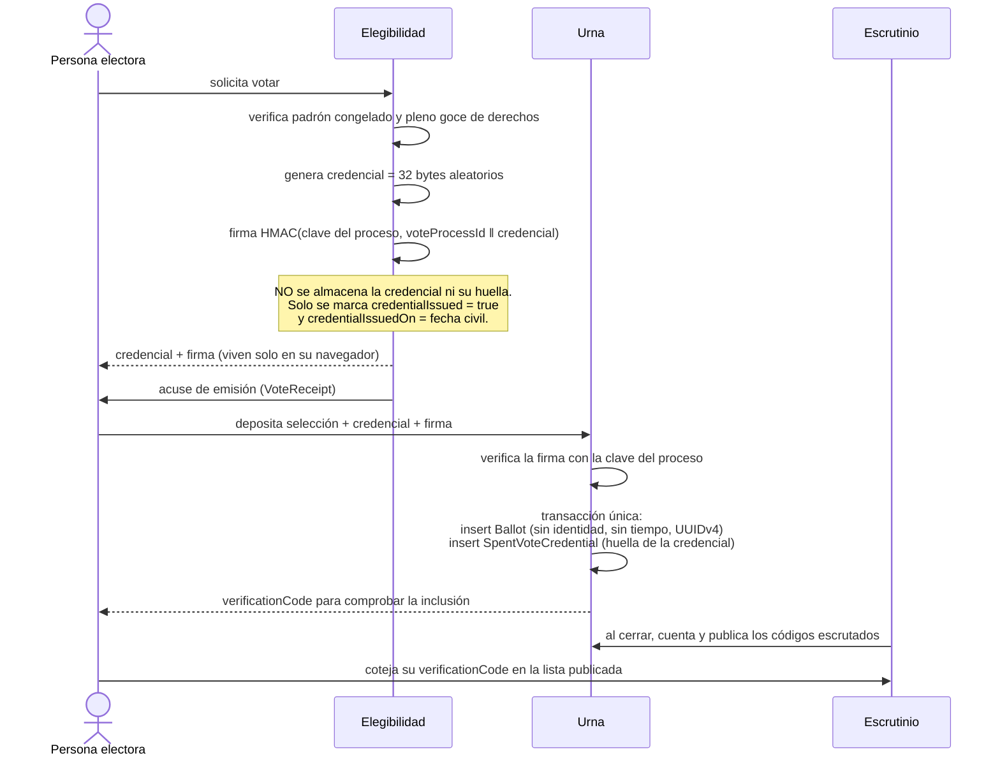

# Seguridad, privacidad y auditoría

> Entregable de la **Fase 0** (PRD §24). Materializa el PRD §20 completo, el acceso de Superadmin del PRD §4.4, la protección de expedientes del PRD §10.3, el secreto del voto del PRD §9.5 y el control de cumplimiento del PRD §0.2.

---

## 1. Qué protege esta plataforma

No custodia datos ordinarios. Custodia información sobre personas neurodivergentes, personas menores de edad, personas representadas, conflictos laborales, procedimientos disciplinarios, notas clínicas y el sentido de votos individuales. La consecuencia de una fuga no es un inconveniente: es un daño a personas en situación de vulnerabilidad y la pérdida de la confianza que sostiene al sindicato.

De ahí los dos objetivos declarados por el PRD §1.3: **cero incidentes de acceso indebido a datos sensibles** y **cero errores críticos en producción**.

Activos y su clasificación:

| Activo | Clasificación | Consecuencia de su compromiso |
|---|---|---|
| Notas clínicas CIAN | Crítica | Daño directo a la persona atendida y a su familia |
| Expedientes disciplinarios | Crítica | Afectación al debido proceso y represalias |
| Sentido individual del voto | Crítica | Destrucción de la garantía democrática |
| Datos de personas menores de edad y representadas | Crítica | Daño a personas sin capacidad plena de defenderse |
| Padrón sindical | Alta | Exposición ante empleadores; represalias laborales |
| Casos de defensa y protección | Alta | Exposición de conflictos vivos |
| Datos financieros y libro auxiliar | Alta | Fraude y pérdida de rendición de cuentas |
| Contenido público y catálogo | Media | Desinformación institucional |

---

## 2. Autenticación (PRD §20.1)

| Control | Materialización |
|---|---|
| Contraseña segura | Mínimo 12 caracteres, comparación contra listas de contraseñas comprometidas, sin reglas de composición que empeoren la usabilidad; medidor de fortaleza con lenguaje claro |
| Hash resistente | **Argon2id** con parámetros documentados en `DECISIONS.md` (ADR-0003) y almacenados junto al hash para permitir su elevación futura sin invalidar credenciales |
| Activación de cuenta | Por invitación o verificación de correo; nunca por autoservicio silencioso con privilegios |
| Recuperación segura | Token de un solo uso, con vigencia corta, invalidado al usarse o al cambiar la contraseña; la respuesta al solicitante es **idéntica** exista o no la cuenta |
| Rotación de sesión | Identificador de sesión nuevo tras autenticarse, tras cambiar la contraseña y tras elevar privilegios |
| Cookies | `HttpOnly`, `Secure`, `SameSite=Lax` para la sesión ordinaria y `SameSite=Strict` para la sesión de Superadmin; sin datos en el valor, solo un identificador opaco cuyo hash vive en la base |
| Revocación | Por cierre de sesión, cambio de contraseña, acción administrativa o incremento de `User.sessionVersion`; efecto inmediato en todas las sesiones |
| Sesiones propias | La persona ve sus sesiones activas con dispositivo aproximado y última actividad, y puede cerrarlas individualmente o todas |
| Límite de intentos | Progresivo por cuenta y por origen; bloqueo temporal con desbloqueo por recuperación, y `SecurityEvent` en cada umbral |
| Protección contra abuso | Límite de tasa en autenticación, recuperación, verificación pública y formularios anónimos |

No se registra jamás la contraseña, el token de sesión, el token de recuperación ni su valor parcial (PRD §20.3).

---

## 3. Superadmin (PRD §4.4)

Ruta independiente `/superadmin/login`, con sesión, cookie y ciclo de vida propios, separados de la sesión ordinaria.

| Regla | Control |
|---|---|
| Definido por entorno, no por base | `SUPERADMIN_EMAIL` y `SUPERADMIN_PASSWORD_HASH`; no existe fila editable que pueda alterarse desde la aplicación |
| Invalidación masiva | `SUPERADMIN_SESSION_VERSION`; incrementarlo cierra toda sesión raíz de inmediato |
| Sesión limitada | Duración corta, sin renovación silenciosa indefinida, revocable |
| Sin derechos sustantivos | Su conjunto de concesión `SUPERADMIN_GRANTED` es **cerrado**: solo contiene permisos de configuración técnica y operación. Admisiones, resoluciones, votos, sanciones, certificaciones y autorización de pagos quedan denegados por no figurar en él, igual que cualquier permiso futuro que nadie recuerde vetar (`PERMISSIONS.md` §5.1) |
| Invisible institucionalmente | No aparece en padrones, directorios, asambleas ni reportes |
| Motivo obligatorio | Las acciones críticas de soporte exigen `reason` capturado por la persona; sin él, la acción se deniega |
| Sin acceso a compartimentos | `ctx.compartments` es el conjunto vacío: toda lectura de expedientes sindicales, sociales, clínicos o disciplinarios se deniega con `COMPARTIMENTO_AJENO` |
| Sin lectura masiva de datos sensibles | `identity.person.read_sensitive` no está concedido, y el motor deniega con `LECTURA_MASIVA_PROHIBIDA` toda consulta que devolvería más de un registro con datos personales. No existe exportación masiva para este actor |
| Sin vía rápida en el motor | Recorre las siete comprobaciones de la tubería como cualquier actor. El tipo de actor determina el origen de sus permisos, nunca cuántas verificaciones atraviesa |
| Alertas | Cada inicio de sesión raíz produce `SecurityEvent` `SUPERADMIN_LOGIN` y una alerta operativa |

Generación del hash sin almacenar la contraseña original, mediante el comando documentado del repositorio (Fase 1):

```bash
npm run auth:hash-password
# Solicita la contraseña por entrada oculta, imprime únicamente el hash Argon2id
# y no la escribe en el historial del intérprete, en archivos ni en registros.
```

Los administradores ordinarios **sí** existen como personas y reciben permisos mediante nombramientos; ninguno puede otorgarse permisos que no posee.

---

## 4. Autorización (PRD §20.2)

La política se evalúa en el servidor en **cada** lectura, mutación, descarga y generación. El detalle del motor, los alcances y la matriz están en [`PERMISSIONS.md`](PERMISSIONS.md). Reglas de implementación que hacen verificable esa promesa:

1. **Filtrado en la consulta, no en la vista.** El alcance por entidad, territorio, asignación y compartimento se traduce en cláusulas de la consulta; los registros ajenos nunca se cargan en memoria.
2. **Máscara de campos.** El permiso de pantalla no basta: la proyección devuelta omite los campos no autorizados, de modo que ninguna respuesta de API los contenga (PRD §19.1).
3. **Identificadores no confiables.** Todo identificador recibido del cliente se resuelve contra el alcance del actor antes de usarse. Conocer un identificador nunca concede acceso.
4. **Respuestas que no filtran existencia.** En superficies públicas y de portal, un recurso ajeno responde `NOT_FOUND`. En superficies internas responde `FORBIDDEN` con motivo auditado, porque ahí la existencia del expediente ya es conocida legítimamente.
5. **Acciones sensibles con confirmación.** Revocaciones, exportaciones, cierres y decisiones institucionales exigen confirmación explícita y, cuando el permiso lo marca, motivo escrito.

---

## 5. Datos sensibles (PRD §20.3)

| Control | Materialización |
|---|---|
| Minimización | Cada formulario justifica por qué pide cada dato; no se recopila lo que no se usa |
| Propósito visible | La persona ve para qué se usa cada dato antes de entregarlo |
| Consentimiento versionado | Se conserva el texto exacto aceptado y su versión (mapa completo en `PERMISSIONS.md` §6) |
| Acceso por expediente | La asignación viva es condición necesaria; el rol por sí solo no abre expedientes |
| Descargas controladas | URL temporales, vigencia proporcional a la clasificación, motivo obligatorio en material sensible y clínico |
| Marca de agua | Las exportaciones sensibles llevan actor, fecha y correlación visibles cuando corresponde (PRD §10.3) |
| Cifrado | En tránsito por TLS; en reposo, mediante las protecciones del proveedor de base de datos y de almacenamiento |
| Secretos | Solo en variables de entorno; nunca en base de datos, código o repositorio |
| Registros limpios | Prohibido registrar contraseñas, tokens, diagnósticos, contenido documental o datos de personas menores. El serializador de registros aplica una lista de campos vetados y trunca lo desconocido |
| Separación de ambientes | Desarrollo, vista previa y producción con bases y almacenes distintos. **Nunca** se copian datos reales de producción a otro ambiente |
| Respaldo y restauración | Procedimiento documentado y **ejercitado** en la Fase 12, no solo descrito |
| Derechos de datos | Canal de acceso, rectificación, cancelación y oposición, con plazo, respuesta registrada y auditoría (F-20 en `FLOWS.md`) |
| Personas menores y representadas | Privacidad reforzada por omisión, publicación pública vedada sin base y autorización específicas, y consentimiento otorgado por quien tiene la representación acreditada |

### 5.1 Compartimentos

Cuatro compartimentos disjuntos: `UNION`, `SOCIAL`, `CLINICAL` y `DISCIPLINARY`. Un permiso de uno **no** habilita otro, aunque se trate de la misma persona titular. En particular, los diagnósticos y datos clínicos permanecen ocultos a roles sindicales sin autorización expresa y consentimiento específico (PRD §10.3, §13.3).

---

## 6. Auditoría (PRD §20.4)

Se auditan como mínimo: accesos privilegiados; consulta y descarga de expedientes sensibles; cambios de roles; admisiones, rechazos, bajas y sanciones; pagos, ajustes y reembolsos; publicación de directorio; emisión y revocación de credenciales; convocatorias, padrones congelados y resultados; publicación de prompts; decisiones CENI; cambios de consentimiento; exportaciones; y todas las acciones del Superadmin.

| Propiedad | Cómo se garantiza |
|---|---|
| Anexable, no editable | Ninguna ruta permite actualizar o borrar eventos; el usuario de base de datos de la aplicación carece de `UPDATE` y `DELETE` sobre `AuditEvent` y `SecurityEvent`, concedido así en la migración inicial |
| Transaccional | El evento se escribe en la misma transacción que el acto: si el acto ocurre, la evidencia existe; si se revierte, no queda rastro de un acto inexistente |
| Encadenada | Cada evento guarda el hash del anterior en su partición lógica, lo que hace evidente cualquier supresión |
| Completa | Actor, acción, objeto, fecha, resultado, motivo, alcance y correlación |
| Minimizada | Identificadores y códigos, no contenido personal innecesario |
| Consultable con permisos | El visor filtra por el alcance del actor; un auditor ve su ámbito definido, nunca todo el sistema |

---

## 7. Configuración de plataforma

| Control | Valor |
|---|---|
| `Content-Security-Policy` | `default-src 'self'`; sin `unsafe-inline` en scripts (se usan nonces); `frame-ancestors 'none'`; `form-action 'self'`; conexiones limitadas a los orígenes declarados de Stripe |
| `Strict-Transport-Security` | `max-age=63072000; includeSubDomains; preload` |
| `X-Content-Type-Options` | `nosniff` |
| `Referrer-Policy` | `strict-origin-when-cross-origin` |
| `Permissions-Policy` | Denegación por omisión de cámara, micrófono, geolocalización y sensores |
| `X-Frame-Options` | `DENY`; la plataforma nunca se embebe ni embebe herramientas en iframes inseguros |
| Protección CSRF | Server Actions con verificación de origen y token por sesión; las rutas de mutación rechazan solicitudes de origen cruzado |
| Límite de tasa | Por origen y por cuenta en autenticación, recuperación, verificación pública, formularios anónimos y exportaciones |
| Carga de archivos | Tamaño máximo por tipo, validación del contenido real, nombres saneados y almacenamiento fuera del alcance de rutas estáticas |

---

## 8. Amenazas que deberán probarse (PRD §20.5)

Cada amenaza tiene control, prueba automatizada y fase propietaria. La ausencia de cualquiera de estas pruebas bloquea el cierre de su fase.

| # | Amenaza | Control | Prueba | Fase |
|---|---|---|---|---|
| 1 | Acceso horizontal a registros de otra persona | Resolución de identificadores contra el alcance; filtrado en consulta | E2E-14 y pruebas negativas por módulo | 1 y cada fase |
| 2 | Escalamiento vertical de privilegios | Verificación explícita en `role.assign`: nadie otorga lo que no tiene | Integración: administrador ordinario intenta autoasignarse `SUPERADMIN` | 1 |
| 3 | Manipulación de identificadores | Identificadores opacos; toda resolución pasa por política | Integración con identificadores válidos de otro alcance | 1 |
| 4 | Carga de archivos maliciosos | Validación de tipo real, tamaño, saneamiento y almacenamiento privado | Integración con archivo de tipo falseado y con carga desproporcionada | 1 |
| 5 | Fuga mediante URL de Blob | Descarga por ruta autenticada; URL temporal corta; sin nombres predecibles | Integración: URL vencida y URL de otro actor | 1 |
| 6 | Replay de webhooks | Firma verificada; unicidad de `stripeEventId`; persistir antes de procesar | Integración: mismo evento tres veces produce un solo efecto | 3 |
| 7 | Doble pago o doble activación | Claves de idempotencia; unicidad de membresía activa; transacciones | Integración con concurrencia real sobre el mismo pago | 3 |
| 8 | Voto duplicado o correlación persona-sentido | Credencial firmada que nunca se almacena al emitirse; urna sin identidad, sin columna temporal y con identificadores UUIDv4; huella de la credencial registrada solo al consumirse | E2E-07 con prueba adversaria de no correlación sobre el volcado completo con tres personas electoras | 5 |
| 9 | Inyección de prompt desde documentos | Contenido tratado como dato; filtro de instrucciones; validación de esquema | Contractual con documento hostil | 10 |
| 10 | Exportación masiva no autorizada | Motivo obligatorio, alcance del actor, marca temporal y auditoría | Integración: exportación fuera de alcance denegada y auditada | 4 |
| 11 | Secuestro de sesión | Cookies endurecidas, rotación, revocación, listado propio | Integración: cookie robada tras cambio de contraseña deja de servir | 1 |
| 12 | Enumeración de miembros o beneficiarios | Respuestas uniformes, límite de tasa, detección de patrones | Integración sobre verificación, recuperación y directorio | 1, 4 |
| 13 | Abuso de recuperación de contraseña | Respuesta uniforme, límite por cuenta y origen, token de un solo uso | Integración con ráfaga de solicitudes | 1 |
| 14 | Modificación retrospectiva de registros históricos | Inmutabilidad de bitácoras, padrones congelados, evaluaciones cerradas y asientos contables | Integración: intento de alterar cada uno falla en base, no solo en la interfaz | 3, 4, 5, 9 |

---

## 9. Secreto del voto (PRD §9.5)

Es el control más delicado del sistema. Esta sección enuncia **lo que el diseño demuestra y lo que no**, porque una garantía afirmada de más es peor que una garantía ausente: induce a confiar en una protección inexistente.

### 9.1 Mecanismo



La clave HMAC es **por proceso**, se deriva de `AUTH_SECRET` y se destruye al certificar los resultados, de modo que después del escrutinio nadie —ni siquiera con la clave maestra— puede fabricar credenciales válidas retroactivamente.

### 9.2 Lo que el diseño garantiza

1. **Se puede probar** que una persona era elegible y que se le emitió su credencial (`VoteEligibility`, `VoteReceipt`).
2. **No existe en ninguna tabla** el vínculo entre una persona y una boleta. No es que esté cifrado o disperso: **no se escribe nunca**. La credencial se genera, se firma, se entrega al navegador y el servidor la olvida; solo reaparece como huella al consumirse, en una fila que no identifica a nadie.
3. **No hay vía de correlación temporal.** `Ballot` y `SpentVoteCredential` carecen de toda columna temporal y usan UUIDv4, que no codifica el instante. `VoteEligibility` guarda la fecha civil de emisión, no la hora.
4. **No hay doble voto.** La unicidad de `SpentVoteCredential.credentialHash` lo impide, y la de `VoteEligibility(voteProcessId, membershipId)` impide la doble emisión.
5. **El escrutinio es verificable por la persona votante.** Su `verificationCode` aparece en la lista de códigos contados. La lista **no** publica el sentido asociado a cada código, de modo que la persona verifica la inclusión de su voto sin poder demostrar ante un tercero por quién votó: sin esa prueba, la coacción pierde su instrumento.
6. **La auditoría demuestra el proceso sin revelar el contenido:** número de personas elegibles, credenciales emitidas, credenciales consumidas y boletas contadas deben cuadrar, y esas cuatro cifras no dicen nada sobre nadie en particular.

### 9.3 Lo que el diseño **no** garantiza

Se enuncia explícitamente para que nadie construya sobre una expectativa falsa:

| Límite | Consecuencia | Mitigación |
|---|---|---|
| Quien obtiene su credencial y se abstiene es indistinguible de quien depositó | El sistema no puede acreditar el acto de depósito de una persona concreta, solo la emisión de su credencial | Es una consecuencia **deseada** del secreto: acreditar el depósito por persona exigiría el vínculo que se decidió no crear. Los conteos agregados detectan la diferencia |
| El orden físico de las filas de `Ballot` refleja el orden de depósito | Quien tenga acceso directo al almacenamiento puede conocer la secuencia de depósitos | Irrelevante por sí sola: esa secuencia no es enlazable con personas, porque el lado identificado no registra hora. Aun así, el escrutinio lee la urna en orden aleatorio y el acta publica los resultados sin secuencia |
| Una persona con acceso al navegador de la votante durante la sesión ve su credencial | Podría depositar por ella | Fuera del alcance de una plataforma web; se mitiga con sesión corta, aviso visible y la posibilidad de reportar incidencia electoral |
| La coacción presencial no se resuelve con criptografía | Alguien puede obligar a votar en su presencia | El acta registra incidencias; la modalidad remota se decide por acuerdo del órgano competente, que pondera este riesgo |

### 9.4 Prueba

`E2E-07` incluye una verificación adversaria: sobre un volcado completo de la base tras una votación con **tres** personas electoras, ninguna consulta puede asociar una fila de `Ballot` con una de `VoteEligibility`. El volumen bajo es deliberado: es el escenario donde cualquier fuga temporal residual sería más fácil de explotar.

---

## 10. Respuesta a incidentes

1. **Detectar:** alertas por webhooks sin conciliar, trabajos fallidos, picos de acceso denegado, intentos contra expedientes ajenos y firmas de webhook inválidas.
2. **Contener:** revocación de sesiones por incremento de versión, revocación de credenciales y accesos, y desactivación de la integración afectada.
3. **Evaluar:** reconstrucción por `correlationId` a través de auditoría, registros y bitácora de casos.
4. **Notificar:** a las personas afectadas y a las autoridades que correspondan, conforme al régimen aplicable.
5. **Corregir:** causa raíz, prueba de regresión que reproduzca el incidente y entrada en `DECISIONS.md`.
6. **Aprender:** el incidente se convierte en una prueba permanente del plan de pruebas.

---

## 11. Control de cumplimiento del PRD §0.2

El PRD prohíbe de forma absoluta el uso de Supabase en cualquiera de sus servicios: base de datos, autenticación, almacenamiento, funciones, tiempo real, SDK cliente o servidor, paquetes, adaptadores o tipos, variables de entorno, referencias en documentación y código o configuración heredada.

**Cómo se verifica.** El control automatizado `C-REPO-03` de `npm run phase:verify` busca la cadena en todo archivo de texto del repositorio, sin distinguir mayúsculas y minúsculas, y falla si aparece fuera de la lista de cumplimiento. Esa lista contiene exclusivamente los archivos que **explican la prohibición**: el propio PRD, el registro de la decisión (ADR-0018), esta sección y el verificador. Cualquier otra aparición —en `package.json`, en el esquema de Prisma, en una variable de entorno, en un comentario o en cualquier documento— hace fallar la verificación de fase y, por lo tanto, impide cerrarla.

La prohibición no se sustituye por una alternativa equivalente: la persistencia es **Neon PostgreSQL con Prisma**, la autenticación es **propia** (§2), el almacenamiento es **Vercel Blob** (§5) y las funciones son rutas y Server Actions de Next.js en Vercel.

---

## 12. Trazabilidad

| Requisito del PRD | Sección |
|---|---|
| §0.2 Prohibición absoluta | §11 |
| §4.4 Superadmin por variables de entorno | §3 |
| §9.5 Secreto del voto | §9 |
| §10.3 Seguridad de casos | §5, §5.1 |
| §13.3 Límites de CIAN | §5.1 |
| §20.1 Autenticación | §2 |
| §20.2 Autorización | §4 |
| §20.3 Datos sensibles | §5 |
| §20.4 Auditoría | §6 |
| §20.5 Amenazas | §8 |
| §21 Variables de entorno | `ENVIRONMENT.md` y `INTEGRATIONS.md` §9 |
